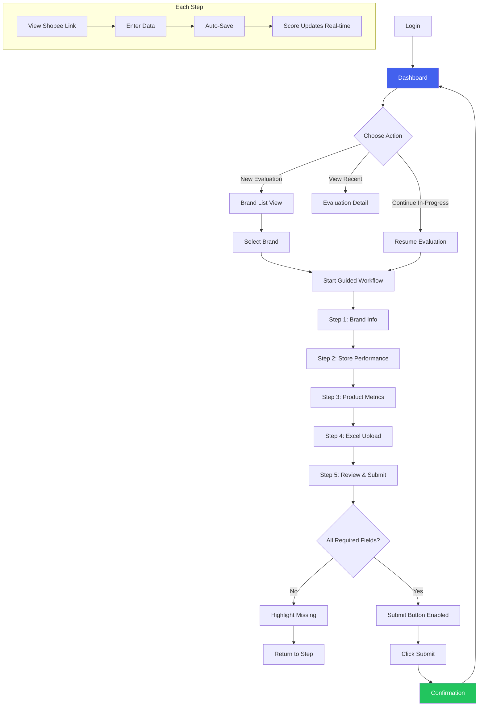
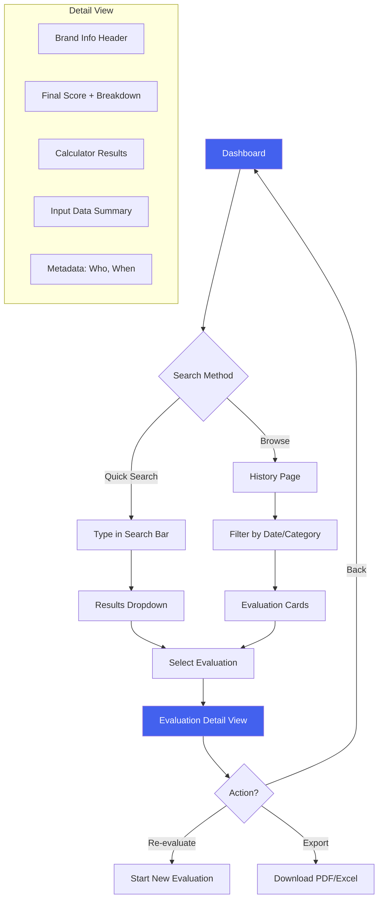
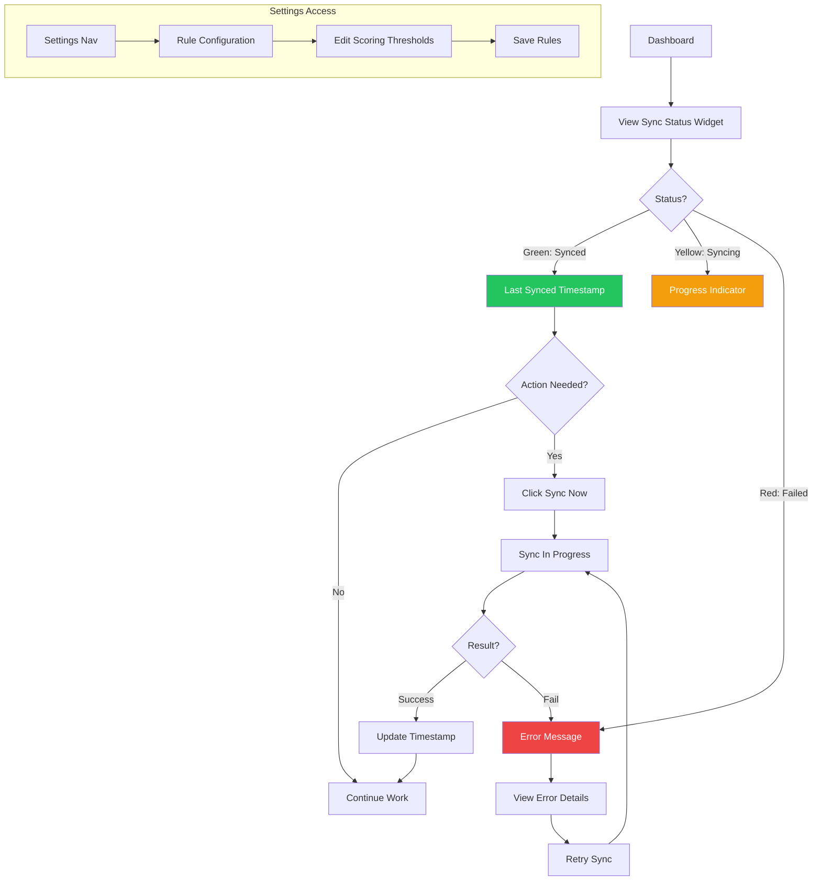

# UX Design Specification Store ICU

**Author:** Mr. Door
**Date:** 2026-02-04

---

## Executive Summary

### Project Vision

Store ICU (Store Internal Check Up) modernizes the BD team's brand qualification workflow by replacing fragmented Google Sheets with a professional, persistent web application. The core promise is **"Same trusted process, properly built"** — preserving the exact calculation logic the team already trusts while solving data management chaos.

The application serves a small, focused internal team (4 people) who evaluate 5-10 brands daily. Success is measured simply: the BD team uses Store ICU instead of Google Sheets, and they can find any past evaluation instantly.

### Target Users

| User | Role | Primary Needs |
|------|------|---------------|
| **BD Team Leader** | Reviews evaluations, makes final decisions | Quick historical lookup, team visibility |
| **BD Team Members (3)** | Daily brand evaluations | Efficient data entry, reliable calculations |
| **System Owner** | Technical oversight | Sync health monitoring, rule configuration |

**User Characteristics:**
- Intermediate tech proficiency (spreadsheet-native, not developers)
- Desktop-first workflow (1024px+ viewport)
- Already deeply familiar with the evaluation logic
- Primary pain is data management, not calculation complexity

### Key Design Challenges

1. **High-Volume Manual Data Entry**
   - 40+ manual input fields per brand evaluation
   - Data sourced from Shopee Seller Center via external links
   - One link often provides 3+ related data points
   - Must support partial progress saving across sessions

2. **Multi-Source Data Integration**
   - Three input sources: Google Sheets sync, Excel upload, manual entry
   - Users need clarity on what data comes from where
   - Stale data indicators when recalculation is required

3. **Trust & Migration Fidelity**
   - Calculations must match original spreadsheets exactly
   - Any perceived discrepancy = immediate loss of user confidence
   - UX must communicate trustworthiness and allow verification

4. **Familiarity vs. Improvement Balance**
   - UX must feel familiar enough to adopt quickly
   - But improved enough to justify switching from spreadsheets

### Design Opportunities

1. **Grouped Data Entry with Shared Links**
   - Organize 40+ fields into logical sections
   - One "View in Shopee" link per section (not per field)
   - Reduces context-switching friction

2. **Progress Tracking & Auto-Save**
   - Visual progress indicators across sections
   - Auto-save on field changes
   - Clear resume capability for partial evaluations

3. **Dashboard as Command Center**
   - Single view: sync status, recent evaluations, quick actions
   - Replaces chaos of multiple spreadsheet tabs

4. **Progressive Calculator Transparency**
   - Show final score prominently
   - Expandable breakdown for verification
   - Builds trust through transparency

## Core User Experience

### Defining Experience

**Core User Action:** Manual data entry of 40+ fields per brand evaluation, sourced from Shopee Seller Center via external links.

This is the heart of Store ICU. Users spend most of their time:
1. Opening Shopee Seller Center links
2. Finding the relevant data
3. Entering values into Store ICU fields
4. Repeating across multiple sections

The entire UX must optimize for this workflow. Every other feature supports this core loop.

### Platform Strategy

| Aspect | Decision |
|--------|----------|
| **Platform** | Web application (SPA) |
| **Hosting** | Firebase Hosting |
| **Primary Viewport** | Desktop (1024px+ width) |
| **Input Method** | Mouse and keyboard |
| **Browser Support** | Chrome, Firefox (latest) |
| **Offline Support** | Not required |
| **Touch/Mobile** | Not required for MVP |

**Rationale:** BD team works at desks with computers. Data entry requires keyboard efficiency. Desktop-first ensures optimal form interactions.

### Effortless Interactions

These interactions must feel completely natural and require zero friction:

1. **Resume Partial Progress**
   - User closes browser mid-evaluation
   - Returns hours/days later
   - Picks up exactly where they left off
   - No manual "save" needed — auto-save always active

2. **Shopee ↔ Store ICU Context Switching**
   - Click link → Shopee opens in new tab
   - View data in Shopee
   - Return to Store ICU → cursor in right field
   - Field groupings match Shopee data structure

3. **Real-Time Calculation Feedback**
   - Enter data → see impact on scores immediately
   - No "calculate" button needed for intermediate feedback
   - Final score updates as inputs change
   - Calculator breakdowns always accessible

4. **Historical Lookup**
   - Search by partial brand name
   - Filter by date, category
   - Find any past evaluation in seconds
   - Faster than searching old spreadsheets

### Critical Success Moments

These moments determine whether users adopt Store ICU or return to spreadsheets:

| Moment | Success Criteria | Failure = Back to Sheets |
|--------|------------------|--------------------------|
| **First Calculation** | Results match spreadsheet exactly | Any discrepancy = lost trust |
| **First Resume** | All data intact, right where they left off | Lost progress = "unreliable" |
| **First Historical Search** | Find 3-month-old evaluation instantly | Can't find it = "useless" |
| **Daily Data Entry** | Feels faster than spreadsheet workflow | Slower/more tedious = "why bother" |
| **System Reliability** | Zero crashes, zero data loss | Any incident = "not ready" |

### Experience Principles

These principles guide ALL UX decisions for Store ICU:

1. **Data Entry is King**
   - The 40+ field experience IS the product
   - Every design decision optimizes for efficient, error-free data entry
   - Form UX is the highest priority

2. **Zero Friction Context Switching**
   - Moving between Shopee Seller Center and Store ICU feels seamless
   - Links, field groupings, and navigation support the external data lookup flow

3. **Always Resumable**
   - Users can stop anytime, return anytime
   - Progress is never lost
   - Auto-save on every field change

4. **Calculation Trust**
   - Results must match original spreadsheets exactly
   - Show the math, allow verification
   - Transparency builds confidence

5. **Instant Recall**
   - Finding any past evaluation must be faster than spreadsheet searching
   - Search is forgiving (partial match, filters)

6. **Rock Solid Reliability**
   - No crashes, no lost data, no unexplained slowdowns
   - Users must trust the system completely before they'll abandon spreadsheets

## Desired Emotional Response

### Primary Emotional Goals

**Core Emotion: CONFIDENCE**

Store ICU users should feel confident at three levels:

1. **System Confidence** — "I trust this tool completely. My data is safe, calculations are accurate, nothing will be lost."

2. **Professional Confidence** — "I can present this to executives without hesitation. The tool reflects the quality of my work."

3. **Situational Confidence** — "Even when something goes wrong, I understand what happened and know what to do."

### Emotional Journey Map

| Stage | Emotion | Design Implication |
|-------|---------|-------------------|
| **First Visit** | Curious → Relieved | Clean, professional UI. Familiar patterns. No learning curve. |
| **Data Entry (Core Loop)** | Focused & In Control | Progress indicators, auto-save confirmations, minimal distractions |
| **Viewing Results** | Validated & Confident | Transparent calculations, expandable breakdowns, matches expectations |
| **Presenting to Others** | Proud & Professional | Executive-ready UI, instant data retrieval, polished appearance |
| **Returning Users** | Trusting & Comfortable | Seamless resume, everything intact, predictable behavior |
| **Error States** | Informed, Not Panicked | Clear explanations, actionable guidance, data safety assurance |

### Micro-Emotions

**Cultivate:**
- **Trust** — System reliability, visible auto-save, data persistence
- **Competence** — Professional appearance, efficient workflows
- **Control** — Transparent processes, clear feedback, predictable behavior
- **Accomplishment** — Progress tracking, completion indicators
- **Relief** — Fast search, instant historical lookup

**Prevent:**
- **Anxiety** — Unclear save states, missing confirmations
- **Embarrassment** — Unprofessional UI, broken features in front of stakeholders
- **Confusion** — Unclear actions, hidden functionality
- **Frustration** — Slower workflows than spreadsheets
- **Panic** — Lost data, unfindable evaluations

### Emotional Design Implications

| Emotion Goal | UX Design Approach |
|--------------|-------------------|
| **Build Trust** | Visible auto-save indicator ("Saved just now"), calculation transparency, consistent behavior |
| **Enable Professionalism** | Clean, minimal UI. No flashy colors. Executive-presentation ready. |
| **Maintain Control** | Clear progress indicators, explicit state changes, undo capabilities |
| **Prevent Anxiety** | Confirmation messages, clear error states, "your data is safe" messaging |
| **Support Focus** | Minimal distractions, logical field grouping, keyboard-friendly navigation |

### Emotional Design Principles

1. **Confidence Through Transparency**
   - Always show what the system is doing
   - Make save states visible and obvious
   - Explain calculations, don't hide them

2. **Professional Enough for Executives**
   - UI must look credible in presentations
   - Clean, polished appearance over flashy features
   - Data displays should be impressive, not embarrassing

3. **Calm in Crisis**
   - Errors inform, never alarm
   - Always provide next steps
   - Reassure about data safety during issues

4. **Trust Through Consistency**
   - Same actions always produce same results
   - Predictable behavior builds confidence
   - No surprises, no hidden functionality

## UX Pattern Analysis & Inspiration

### Inspiring Products Analysis

**Primary Inspiration: Google Sheets**

The BD team's current tool is also our primary UX inspiration. Users find Google Sheets "easy to use" — Store ICU should preserve this ease while fixing data management problems.

**What Makes Google Sheets Easy:**

| Pattern | User Benefit |
|---------|--------------|
| Click and type | Zero friction data entry |
| Tab navigation | Keyboard-efficient workflows |
| Auto-save | No save anxiety |
| Visible data structure | Context always available |
| Copy/paste support | Works with external sources |
| Immediate feedback | See changes instantly |
| Familiar controls | No learning curve |

**Secondary Inspiration: Enterprise Data Tools**

Patterns from tools like Airtable, Notion databases, and admin dashboards:

| Tool Category | Relevant Pattern |
|---------------|------------------|
| **Airtable** | Structured data with form views, linked records |
| **Admin Dashboards** | Clean data tables, status indicators, action buttons |
| **CRM Systems** | Record detail views, activity history, search/filter |

### Transferable UX Patterns

**Navigation Patterns:**
- **Sectioned Forms** — Group 40+ fields into logical collapsible sections (like spreadsheet tabs)
- **Sticky Headers** — Keep brand name and progress visible while scrolling
- **Breadcrumb Context** — Always show where user is in the workflow

**Interaction Patterns:**
- **Tab-Through Fields** — Keyboard navigation matches spreadsheet muscle memory
- **Inline Editing** — Click field, type value, auto-save (no edit mode toggle)
- **Paste-Friendly Inputs** — Support pasting values copied from Shopee Seller Center
- **Real-Time Totals** — Scores update as data is entered (like spreadsheet formulas)

**Visual Patterns:**
- **Data-Dense Layouts** — Show more information, less whitespace (spreadsheet users expect density)
- **Clear Field Labels** — Every field obviously labeled (no guessing)
- **Status Indicators** — Visible save state, sync status, calculation freshness
- **Professional Minimal** — Clean appearance suitable for executive presentations

### Anti-Patterns to Avoid

| Anti-Pattern | Why Avoid | What To Do Instead |
|--------------|-----------|-------------------|
| **Wizard-style multi-page forms** | Breaks context, feels slow | Single-page with sections |
| **Modal-heavy interactions** | Interrupts flow | Inline editing, slide-out panels |
| **Hidden auto-save** | Creates anxiety | Visible "Saved" indicator |
| **Fancy animations** | Distracting, slows perception | Instant, functional feedback |
| **Mobile-first responsive** | Desktop is primary; mobile layouts waste space | Desktop-optimized density |
| **Trendy UI patterns** | Unfamiliar = learning curve | Conservative, proven patterns |
| **Dark mode by default** | Spreadsheet users expect light UI | Light mode, professional appearance |

### Design Inspiration Strategy

**Adopt Directly:**
- Tab navigation between fields (spreadsheet muscle memory)
- Auto-save with visible confirmation
- Real-time calculation updates
- Data-dense layouts
- Copy/paste support for field values

**Adapt for Store ICU:**
- Spreadsheet grid → Sectioned form with grouped fields
- Multiple tabs → Single page with collapsible sections
- Cell references → Linked Shopee data with external links
- Manual formula entry → Automated calculator execution

**Avoid Completely:**
- Wizard flows (multi-step forms)
- Heavy animations or transitions
- Mobile-first responsive patterns
- Unfamiliar interaction patterns
- Excessive whitespace
- Hidden functionality

**Core Principle:** *If Google Sheets does it and users like it, preserve that pattern. Only change what's broken.*

## Design System Foundation

### Design System Choice

**Selected:** shadcn/ui + Tailwind CSS

**What is shadcn/ui?**
A collection of reusable, accessible components built on Radix UI primitives and styled with Tailwind CSS. Unlike traditional component libraries, you copy the component code into your project and own it completely.

### Rationale for Selection

| Factor | Why shadcn/ui |
|--------|---------------|
| **Form Excellence** | Best-in-class form components for 40+ field data entry |
| **Professional Appearance** | Clean, minimal design suitable for executive presentations |
| **Code Ownership** | Components live in your codebase — full control, no dependency lock-in |
| **Accessibility** | Built on Radix UI primitives with ARIA compliance |
| **Tailwind Native** | Seamless integration with existing Tailwind CSS setup |
| **Data Tables** | TanStack Table integration for evaluation history |
| **Active Ecosystem** | Well-documented, community-supported, regularly updated |
| **Cost** | Free and open source |

### Implementation Approach

**Component Installation Strategy:**
1. Initialize shadcn/ui in the frontend project
2. Install components as needed (not all at once)
3. Components copied to `src/components/ui/` directory
4. Customize to match Store ICU visual identity

**Core Components Needed:**

| Component | Use Case |
|-----------|----------|
| `Button` | Actions, form submission |
| `Input` | Text fields (40+ manual inputs) |
| `Select` | Dropdowns (category, template selection) |
| `Table` | Evaluation history, brand list |
| `Card` | Calculator results, score display |
| `Badge` | Status indicators (sync status, save state) |
| `Dialog` | Confirmations, detail views |
| `Tabs` | Section organization (if needed) |
| `Toast` | Notifications (auto-save confirmation, errors) |
| `Progress` | Section completion tracking |
| `Collapsible` | Expandable form sections |
| `Tooltip` | Field help text, Shopee link hints |

### Customization Strategy

**Visual Customizations:**
- **Color Palette:** Professional, muted tones (no flashy colors)
- **Typography:** System fonts for speed, clear hierarchy
- **Spacing:** Data-dense layouts (less whitespace than default)
- **Border Radius:** Subtle rounding (professional, not playful)

**Functional Customizations:**
- Form inputs optimized for keyboard navigation (Tab support)
- Auto-save integration on input blur
- External link styling for Shopee links
- Status indicators with clear visual states

**Design Tokens:**

| Token | Value | Purpose |
|-------|-------|---------|
| `--primary` | Blue (trust, professional) | Primary actions |
| `--success` | Green | Save confirmations, good scores |
| `--warning` | Amber | Stale data, attention needed |
| `--error` | Red | Errors, sync failures |
| `--muted` | Gray | Secondary text, borders |

**Light Mode Only:** No dark mode for MVP (matches spreadsheet familiarity, simpler implementation)

## Defining Experience

### The Core Interaction

**Defining Experience:** "This is our tool for brand evaluation."

Unlike consumer products with flashy signature interactions, Store ICU's defining experience is **ownership and reliability**. When BD team members describe it, they don't highlight a feature — they claim it as their own professional tool.

**What This Means for UX:**
- The tool should feel like it was built *for them* (because it was)
- No unnecessary features or complexity
- Everything works exactly as expected
- Professional enough to represent their work

### User Mental Model

**How Users Think About Store ICU:**

| Mental Model | Design Implication |
|--------------|-------------------|
| "This is our internal tool" | No onboarding needed, no marketing speak |
| "It's like our spreadsheet, but better" | Familiar patterns, improved reliability |
| "I know how this works" | Predictable, consistent behavior |
| "My data is safe here" | Trust through transparency and reliability |

**Coming From Google Sheets:**
- Users bring spreadsheet mental models (cells, tabs, formulas)
- They expect click-and-type data entry
- They assume auto-save (like Google Sheets)
- They want to see their data, not navigate menus

**Key Expectation:** The tool should feel like an upgrade to their spreadsheet workflow, not a replacement that requires relearning.

### Success Criteria

**Users Know It's Working When:**

| Indicator | What It Looks Like |
|-----------|-------------------|
| **Instant feedback** | Enter a value → see score update immediately |
| **Visible save state** | "Saved just now" appears after every change |
| **Data persistence** | Return tomorrow → everything is exactly as left |
| **Fast search** | Type brand name → find evaluation in seconds |
| **Calculation match** | Results match what spreadsheet would produce |

**The "It Just Works" Test:**
- Can a user complete an evaluation without asking for help? ✓
- Can they find last month's evaluation in under 10 seconds? ✓
- Do calculations match the old spreadsheet exactly? ✓
- Is their data still there after closing the browser? ✓

### Pattern Analysis

**Approach: Established Patterns with Reliability Focus**

Store ICU does NOT need novel UX patterns. The goal is to execute familiar patterns flawlessly.

| Pattern Type | Store ICU Approach |
|--------------|-------------------|
| **Data Entry** | Standard form inputs (established) |
| **Navigation** | Sidebar + main content (established) |
| **Tables** | Sortable, filterable data tables (established) |
| **Search** | Top-bar search with filters (established) |
| **Status** | Badge indicators (established) |

**Innovation Through Execution:**
- Not *what* we build, but *how well* it works
- Reliability is the innovation
- "Boring" UX done perfectly

**No Novel Patterns Needed:**
- Users shouldn't need to learn anything new
- Every interaction should feel familiar
- The value is in reliability, not novelty

### Experience Mechanics

**Core Flow: Brand Evaluation**

```
1. INITIATION
   ├── User logs in → sees dashboard
   ├── Dashboard shows: recent evaluations, sync status, brand list
   └── User clicks "Evaluate" on a brand OR searches for brand

2. DATA ENTRY (Core Loop)
   ├── Brand info displayed at top (from Google Sheets sync)
   ├── Form sections organized by data source:
   │   ├── Section: [Shopee Link A] → Fields 1-5
   │   ├── Section: [Shopee Link B] → Fields 6-12
   │   ├── Section: [Excel Upload] → Upload button + parsed preview
   │   └── Section: [Manual Notes] → Free-form fields
   ├── Each section has "View in Shopee" link at header
   ├── User enters values → auto-save on blur
   └── Progress indicator shows completion %

3. CALCULATION & FEEDBACK
   ├── Real-time: scores update as data entered
   ├── Calculator cards show individual results
   ├── Final score prominently displayed
   ├── "Expand" reveals calculation breakdown
   └── Template selector (Fashion/Non-Fashion) affects scoring

4. COMPLETION
   ├── User clicks "Save Evaluation"
   ├── Confirmation: "Evaluation saved"
   ├── Evaluation appears in history
   └── User can start next brand or exit
```

**Error Recovery:**
- Sync fails → "Last synced 2 hours ago. Sync now?" (not blocking)
- Upload fails → "File format not supported. Try .xlsx" (specific, actionable)
- Save fails → "Couldn't save. Your data is safe locally. Retry?" (reassuring)

## Visual Design Foundation

### Color System

**Brand Alignment:** Derived from AHA Commerce corporate identity

| Role | Color | Hex | Usage |
|------|-------|-----|-------|
| **Primary** | AHA Blue | #4361EE | Headers, primary buttons, navigation, links |
| **Primary Dark** | Deep Blue | #3651D4 | Hover states, active elements |
| **Accent** | Golden Yellow | #FFC107 | Success indicators, high scores, achievements |
| **Secondary** | Vivid Purple | #7C3AED | Secondary actions, filter tags, status badges |
| **Success** | Green | #22C55E | Passed checks, positive results |
| **Warning** | Amber | #F59E0B | Threshold warnings, attention needed |
| **Error** | Red | #EF4444 | Failed checks, validation errors, sync failures |
| **Neutral 50** | Near White | #FAFAFA | Page backgrounds |
| **Neutral 100** | Light Gray | #F4F4F5 | Card backgrounds, table alternating rows |
| **Neutral 200** | Border Gray | #E4E4E7 | Borders, dividers |
| **Neutral 700** | Text Gray | #3F3F46 | Body text |
| **Neutral 900** | Near Black | #18181B | Headings, emphasis |

**Semantic Color Mapping:**
- Calculator results: Primary blue background with white text
- Final scores: Golden yellow highlight for qualified brands
- Sync status: Green (synced), Amber (syncing), Red (failed)
- Form validation: Red for errors, subtle gray for hints

### Typography System

**Font Stack:** Inter (primary) — ships with shadcn/ui, excellent for data-heavy UIs

| Level | Size | Weight | Line Height | Usage |
|-------|------|--------|-------------|-------|
| **H1** | 24px | 600 | 1.2 | Page titles ("Brand Evaluation") |
| **H2** | 20px | 600 | 1.3 | Section headers ("Calculator Results") |
| **H3** | 16px | 600 | 1.4 | Card titles, subsections |
| **Body** | 14px | 400 | 1.5 | General text, descriptions |
| **Body Small** | 13px | 400 | 1.5 | Table cells, form labels |
| **Caption** | 12px | 400 | 1.4 | Timestamps, helper text, metadata |
| **Mono** | 13px | 400 | 1.4 | Numbers, scores, calculations (font-mono) |

**Typography Principles:**
- Monospace for all numerical data (scores, calculations, dates) — improves scannability
- Consistent 14px base for form fields — matches Google Sheets familiarity
- Bold (600) reserved for headings and emphasis only
- No decorative fonts — pure utility

### Spacing & Layout Foundation

**Base Unit:** 4px (allows precise alignment while maintaining 8px grid compatibility)

| Token | Value | Usage |
|-------|-------|-------|
| **xs** | 4px | Tight gaps, icon padding |
| **sm** | 8px | Form field gaps, compact spacing |
| **md** | 16px | Standard component padding, card gaps |
| **lg** | 24px | Section spacing |
| **xl** | 32px | Page margins, major section breaks |

**Layout Principles:**
1. **Dense but not cramped** — 8px gaps between form fields (spreadsheet efficiency)
2. **Clear visual grouping** — 24px between logical sections
3. **Consistent card padding** — 16px internal padding
4. **Fixed sidebar** — Navigation always visible, content scrolls
5. **Maximum content width** — 1400px to prevent excessive line lengths on wide monitors

**Grid System:**
- 12-column grid for flexibility
- Main content: 8-9 columns
- Sidebar/panels: 3-4 columns
- Form layouts: 2-column for related fields, single column for complex inputs

### Accessibility Considerations

| Requirement | Implementation |
|-------------|----------------|
| **Color Contrast** | All text meets WCAG AA (4.5:1 for body, 3:1 for large text) |
| **Focus States** | Visible focus rings on all interactive elements (2px primary blue) |
| **Color Independence** | Never rely on color alone — icons/text accompany status colors |
| **Keyboard Navigation** | Full Tab navigation support, spreadsheet-style arrow keys in tables |
| **Touch Targets** | Minimum 44px for clickable elements |
| **Readable Numbers** | Monospace font prevents digit ambiguity (0 vs O, 1 vs l) |

## Design Direction Decision

### Design Directions Explored

Six distinct visual directions were generated and evaluated:

1. **Spreadsheet Native** — Maximum density, tab navigation, minimal chrome
2. **Dashboard First** — Command center with metrics, dark sidebar, activity feed
3. **Card-Based** — Visual cards with completion indicators, scannable layout
4. **Sidebar + Canvas** — Icon navigation, master-detail, floating panels
5. **Compact Professional** — Enterprise density, horizontal tabs, always-visible results
6. **Guided Workflow** — Step-by-step progress, clear stages, structured flow

Interactive mockups available at: `_bmad-output/planning-artifacts/ux-design-directions.html`

### Chosen Direction

**Hybrid: "Dashboard Command Center with Guided Data Entry"**

Combines elements from three directions:

| Component | Source Direction | Rationale |
|-----------|------------------|-----------|
| **Navigation & Home** | Dashboard First (#2) | Command center overview, team visibility, professional dark sidebar |
| **Brand Cards** | Card-Based (#3) | Visual completion indicators, progress %, scannable at a glance |
| **Data Entry Flow** | Guided Workflow (#6) | Step-by-step structure for 40+ fields, clear progress, reduces overwhelm |

### Design Rationale

1. **Dashboard for Context** — BD team needs quick overview of today's work, team activity, and sync status. Dashboard First provides this command center feel.

2. **Cards for Scannability** — With multiple brands in progress, card layout with completion percentages helps users quickly identify where to focus.

3. **Guided Steps for Data Entry** — 40+ fields across multiple Shopee links is complex. Breaking into guided steps (Store Data → Products → Upload → Review) prevents overwhelm while maintaining progress visibility.

4. **Blue + White Palette** — Simplified color scheme for professional, clean appearance. Reduces visual noise, emphasizes AHA Commerce brand color.

### Implementation Approach

**Color System (Refined):**

| Role | Color | Hex | Usage |
|------|-------|-----|-------|
| **Primary** | AHA Blue | #4361EE | Navigation active, buttons, links, progress |
| **Primary Dark** | Deep Blue | #3651D4 | Hover states |
| **Background** | White | #FFFFFF | Main content areas, cards |
| **Page Background** | Light Gray | #F4F4F5 | Page background |
| **Sidebar** | Near Black | #18181B | Navigation background |
| **Text Primary** | Near Black | #18181B | Headings, body text |
| **Text Muted** | Gray | #71717A | Secondary text, labels |
| **Border** | Border Gray | #E4E4E7 | Card borders, dividers |
| **Success** | Green | #22C55E | Completion states, good scores (subtle use) |
| **Error** | Red | #EF4444 | Errors only (minimal use) |

**Layout Structure:**

```
┌─────────────────────────────────────────────────────────────┐
│  DASHBOARD VIEW                                             │
├──────────┬──────────────────────────────────────────────────┤
│          │  Metrics Cards (Today, Pending, Avg Score)       │
│  Dark    ├──────────────────────────────────────────────────┤
│  Sidebar │  Recent Evaluations (Cards with completion %)    │
│  (240px) │                                                  │
│          ├──────────────────────────────────────────────────┤
│          │  Activity Feed                                   │
└──────────┴──────────────────────────────────────────────────┘

┌─────────────────────────────────────────────────────────────┐
│  DATA ENTRY VIEW (Guided Workflow)                          │
├──────────┬────────┬─────────────────────────┬───────────────┤
│          │Progress│  Form Cards             │  Score Panel  │
│  Dark    │Steps   │  (with Shopee links)    │  (Real-time)  │
│  Sidebar │Sidebar │                         │               │
│          │(200px) │  [Step content area]    │  Final: 82    │
│          │        │                         │  Ads: 78      │
│          │        │  Back | Continue        │  Disc: 85     │
└──────────┴────────┴─────────────────────────┴───────────────┘
```

**Component Patterns:**

| Component | Style |
|-----------|-------|
| **Dashboard metrics** | White cards, blue accent on key numbers |
| **Brand cards** | White with subtle border, blue progress bar, score badge |
| **Form sections** | White cards with section headers, "Open in Shopee" links |
| **Progress bar** | Blue fill (#4361EE) on light gray track (#E4E4E7) |
| **Buttons primary** | Blue background, white text, 8px radius |
| **Buttons secondary** | White background, gray border, dark text |
| **Navigation active** | Blue background highlight on dark sidebar |

**User Flow:**

```
1. LOGIN → DASHBOARD
   ├── Metrics: Today's evaluations, pending, avg score
   ├── Recent evaluations as cards with completion %
   └── Quick actions: "New Evaluation", "Sync Now"

2. SELECT BRAND → CARD VIEW
   ├── Brand cards showing name, category, progress %
   ├── Score preview on completed evaluations
   └── "Continue" or "Start" buttons

3. DATA ENTRY → GUIDED WORKFLOW
   ├── Progress bar at top showing current step
   ├── Step sidebar: Brand Info → Store Data → Products → Upload → Review
   ├── Form cards with "Open in Shopee" links
   ├── Auto-save indicator
   └── Real-time score panel (visible throughout)

4. COMPLETION → BACK TO DASHBOARD
   └── Evaluation appears in recent list with final score
```

## User Journey Flows

### Journey 1: Daily Brand Evaluation

**User:** Rina (BD Team Member)
**Goal:** Complete brand evaluations efficiently (5-10 per day)
**Entry Point:** Dashboard → Pick brand → Guided workflow → Submit



**Key Interactions:**

| Interaction | Behavior |
|-------------|----------|
| **Auto-save** | Silent save on every field blur, subtle "Saved" indicator |
| **Real-time scores** | Score panel updates immediately as data entered |
| **Progress tracking** | Progress bar shows completion %, step indicator |
| **Submit trigger** | Button enabled when all required fields complete |
| **Brand switching** | Seamless switch, auto-save, no warning dialogs |

**Step Breakdown:**

| Step | Content | Shopee Link |
|------|---------|-------------|
| 1. Brand Info | Basic brand details (from sync) | — |
| 2. Store Performance | Revenue, orders, ratings | Yes |
| 3. Product Metrics | SKUs, pricing, inventory | Yes |
| 4. Excel Upload | Upload data file, view parsed results | — |
| 5. Review & Submit | Final score, breakdown, submit button | — |

### Journey 2: Historical Lookup & Review

**User:** Pak Budi (BD Team Leader)
**Goal:** Find past evaluations quickly for follow-up conversations
**Entry Point:** Dashboard → Search or Browse → View details



**Key Interactions:**

| Interaction | Behavior |
|-------------|----------|
| **Search** | Partial brand name match, results as-you-type |
| **Filters** | Date range, category (Fashion/Non-Fashion), evaluator |
| **Detail view** | Complete evaluation with all inputs and scores |
| **Re-evaluate** | Start new evaluation for same brand (preserves history) |

### Journey 3: Sync & Health Check

**User:** Mr. Door (System Owner)
**Goal:** Ensure system is healthy and data is synced
**Entry Point:** Dashboard → Check status → Manual sync if needed



**Key Interactions:**

| Interaction | Behavior |
|-------------|----------|
| **Status visibility** | Always visible on dashboard (color-coded) |
| **Manual sync** | One-click "Sync Now" button |
| **Error handling** | Actionable messages with "Retry" option |
| **Rule configuration** | Accessed via Settings, separate from daily workflow |

### Journey Patterns

**Navigation Patterns:**

| Pattern | Implementation |
|---------|----------------|
| **Dashboard as Home** | Always return to dashboard after completing actions |
| **Breadcrumb Context** | Show path: Dashboard > Brands > Brand ABC > Step 2 |
| **Persistent Sidebar** | Navigation always accessible, never hidden |
| **Back Navigation** | Predictable back behavior, no data loss |

**Data Entry Patterns:**

| Pattern | Implementation |
|---------|----------------|
| **Silent Auto-Save** | Save on field blur, subtle "Saved just now" indicator |
| **Progressive Steps** | Break 40+ fields into 5 logical steps |
| **External Link Grouping** | "Open in Shopee" at section header, not per-field |
| **Real-time Feedback** | Scores update immediately, no refresh needed |
| **Field Validation** | Inline errors, highlight missing required fields |

**Feedback Patterns:**

| Pattern | Implementation |
|---------|----------------|
| **Status Colors** | Green (success/synced), Yellow (in progress), Red (error/failed) |
| **Toast Notifications** | Brief, non-blocking (bottom-right, auto-dismiss) |
| **Inline Validation** | Errors shown next to fields, not in modals |
| **Completion Detection** | Auto-detect when ready, enable submit button |
| **Progress Indicators** | Step progress bar, field completion % per section |

**Error Recovery Patterns:**

| Pattern | Implementation |
|---------|----------------|
| **Non-Blocking Errors** | Sync failures don't block evaluation work |
| **Retry Actions** | Always provide "Retry" button for failed operations |
| **Data Safety Messaging** | "Your data is saved" during connection issues |
| **Graceful Degradation** | Continue working offline, sync when connected |

### Flow Optimization Principles

1. **Minimize Clicks to Value**
   - Dashboard → Brand → Start = 3 clicks to begin work
   - Search → Result → View = 2 clicks to find history
   - No unnecessary confirmation dialogs

2. **Reduce Context Switching Friction**
   - Shopee links open in new tab (preserve Store ICU state)
   - Score panel always visible during data entry
   - Brand switching is seamless (auto-save, no warnings)

3. **Trust the System Philosophy**
   - No "Are you sure?" dialogs for navigation
   - Auto-save eliminates manual save anxiety
   - Silent background operations (sync, save, calculate)

4. **Clear Progress Communication**
   - Step progress bar: "Step 2 of 5"
   - Field completion: "12 of 15 fields complete"
   - Visual completion % on brand cards in list view
   - Submit button state indicates readiness

## Component Strategy

### Design System Components (shadcn/ui)

**Foundation components used as-is with styling adjustments:**

| Component | Store ICU Usage |
|-----------|-----------------|
| `Button` | Actions, form submission, navigation |
| `Input` | Text fields (40+ manual inputs) |
| `Select` | Category dropdown, template selection (Fashion/Non-Fashion) |
| `Table` | Evaluation history, brand list |
| `Card` | Dashboard metrics, form sections, brand cards base |
| `Badge` | Status indicators, category tags |
| `Dialog` | Confirmation modals (submit evaluation) |
| `Toast` | Notifications (auto-save confirmation, sync status, errors) |
| `Progress` | Step completion bar, field completion indicator |
| `Tabs` | Section organization (if needed) |
| `Collapsible` | Expandable score breakdown |
| `Tooltip` | Field help text, Shopee link hints |
| `Separator` | Visual dividers between sections |
| `Avatar` | User indicators in activity feed |

### Custom Components

#### Score Panel

**Purpose:** Display real-time final score with calculator breakdown during data entry

**Usage:** Fixed panel on right side during guided workflow, always visible

**Anatomy:**
```
┌─────────────────────────┐
│  CALCULATOR RESULTS     │  ← Header
├─────────────────────────┤
│      ┌───────┐          │
│      │  82   │          │  ← Final Score (large, monospace)
│      └───────┘          │
│   Final Score (Fashion) │  ← Label + Template type
├─────────────────────────┤
│  Ads Keyword      78    │  ← Calculator result rows
│  Discount Check   85    │
│  Top SKU          72    │
├─────────────────────────┤
│  ▼ View Breakdown       │  ← Expandable detail (Collapsible)
└─────────────────────────┘
```

**States:**

| State | Appearance |
|-------|------------|
| **Calculating** | Score shows "—", subtle pulse animation |
| **Complete** | Score displayed in primary blue |
| **Incomplete** | Score shows "—", muted text, "Enter more data" hint |
| **High Score (≥80)** | Green accent on score |
| **Low Score (<60)** | Amber accent on score |

**Variants:**
- **Compact:** Score only (for brand cards)
- **Full:** Score + breakdown (for score panel)
- **Expanded:** Full breakdown with all contributing factors

**Accessibility:**
- `aria-live="polite"` for score updates (announces changes)
- Semantic headings for sections
- Keyboard-expandable breakdown

**Implementation:** Compose from Card + custom score display + Collapsible

---

#### Brand Card

**Purpose:** Display brand summary with completion status for selection and overview

**Usage:** Brand list view, dashboard recent evaluations, search results

**Anatomy:**
```
┌─────────────────────────────────────┐
│  Brand ABC Indonesia    [Fashion]   │  ← Name + Category badge
├─────────────────────────────────────┤
│  ┌─────────┐    ┌─────────┐        │
│  │   82    │    │   76%   │        │  ← Score + Completion metrics
│  │  Score  │    │Complete │        │
│  └─────────┘    └─────────┘        │
├─────────────────────────────────────┤
│  ████████████░░░░░  76%            │  ← Progress bar (blue fill)
├─────────────────────────────────────┤
│  Updated 10 min ago     [Continue] │  ← Timestamp + Action button
└─────────────────────────────────────┘
```

**States:**

| State | Appearance | Action Button |
|-------|------------|---------------|
| **Not Started** | No score, 0% progress | "Start" |
| **In Progress** | Partial score or "—", progress % | "Continue" |
| **Complete** | Final score, 100%, ready indicator | "Review" |
| **Submitted** | Final score, checkmark icon | "View" |
| **Hover** | Primary blue border highlight | — |
| **Selected** | Blue border, subtle shadow | — |

**Variants:**
- **List:** Horizontal layout for brand list page
- **Grid:** Square layout for dashboard cards
- **Compact:** Minimal info for search results dropdown

**Accessibility:**
- Entire card is clickable (`role="button"`)
- `aria-label` includes: brand name, category, status, score
- Visible focus ring on keyboard navigation

**Implementation:** Compose from Card + Badge + Progress + Button

---

#### Step Progress Sidebar

**Purpose:** Show guided workflow progress and enable step navigation

**Usage:** Left sidebar (200px) during data entry workflow

**Anatomy:**
```
┌──────────────────────────┐
│  EVALUATION STEPS        │  ← Section header (uppercase, small)
├──────────────────────────┤
│  ● 1. Brand Info     ✓   │  ← Completed step (green dot, checkmark)
│  ● 2. Store Data     ●   │  ← Active step (blue dot, highlighted bg)
│  ○ 3. Products           │  ← Pending step (gray empty circle)
│  ○ 4. Excel Upload       │
│  ○ 5. Review             │
└──────────────────────────┘
```

**Step States:**

| State | Visual | Interaction |
|-------|--------|-------------|
| **Completed** | Green filled circle + checkmark | Clickable (navigate back) |
| **Active** | Blue filled circle + blue background | Current location |
| **Pending** | Gray empty circle + muted text | Clickable if previous complete |
| **Error** | Red filled circle + warning icon | Clickable (return to fix) |

**Interactions:**
- Click completed step → navigate back (all data preserved)
- Click pending step → navigate forward (if previous step complete)
- Active step highlighted with light blue background

**Accessibility:**
- `role="navigation"` with `aria-label="Evaluation steps"`
- Each step is a button
- `aria-current="step"` on active step
- `aria-disabled="true"` on locked steps

**Implementation:** Custom navigation component with step state management

---

#### External Link Section

**Purpose:** Group form fields that share a common Shopee Seller Center data source

**Usage:** Repeated pattern in data entry forms (appears 5+ times per evaluation)

**Anatomy:**
```
┌─────────────────────────────────────────────┐
│  Store Performance        [Open in Shopee →]│  ← Header + external link
├─────────────────────────────────────────────┤
│                                             │
│  Monthly Revenue (IDR)    Total Orders      │  ← Form fields (2-column grid)
│  ┌─────────────────┐      ┌─────────────┐  │
│  │ 125,000,000     │      │ 3,240       │  │
│  └─────────────────┘      └─────────────┘  │
│                                             │
│  Store Rating             Response Rate     │
│  ┌─────────────────┐      ┌─────────────┐  │
│  │ 4.8             │      │ 98%         │  │
│  └─────────────────┘      └─────────────┘  │
│                                             │
└─────────────────────────────────────────────┘
```

**Props:**

| Prop | Type | Description |
|------|------|-------------|
| `title` | string | Section header text |
| `shopeeLink` | string | URL to open in Shopee Seller Center |
| `children` | ReactNode | Form fields rendered inside |
| `completedFields` | number | Count of completed fields (optional) |
| `totalFields` | number | Total fields in section (optional) |

**States:**

| State | Visual |
|-------|--------|
| **Default** | White card, subtle gray border |
| **All Complete** | Subtle green left border accent |
| **Has Errors** | Red left border, error count shown |
| **Focused Within** | Blue left border accent |

**Accessibility:**
- External link opens in new tab (`target="_blank"`)
- Link includes `rel="noopener noreferrer"`
- `aria-label` on link: "Open [section title] in Shopee Seller Center (opens new tab)"
- Section uses `<section>` with `aria-labelledby` pointing to header

**Implementation:** Compose from Card with custom header slot + children pass-through

### Component Implementation Strategy

**Layered Approach:**

| Layer | Components | Strategy |
|-------|------------|----------|
| **Foundation** | Button, Input, Select, Badge, Card, Toast, Progress, Dialog, Tooltip | Use shadcn/ui as-is, apply design tokens |
| **Composition** | Score Panel, Brand Card, Step Progress, External Link Section | Build from foundation components + custom logic |
| **Page** | Dashboard, Brand List, Evaluation Form, History | Compose from foundation + custom components |

**Styling Consistency:**
- All components use Tailwind CSS classes
- Follow design tokens from Visual Foundation
- Blue (#4361EE) + White dominant palette
- 8px border radius on cards and buttons
- Inter font family throughout

**State Management:**
- Score Panel: Receives calculated values as props, updates via real-time subscription
- Brand Card: Receives brand data + evaluation state as props
- Step Progress: Controlled by parent form, tracks completion state
- External Link Section: Stateless wrapper, children manage their own state

### Implementation Roadmap

**Phase 1 — Core (MVP Critical):**

| Component | Priority | Blocks |
|-----------|----------|--------|
| External Link Section | P0 | All data entry forms |
| Step Progress Sidebar | P0 | Guided workflow navigation |
| Score Panel | P0 | Real-time feedback during entry |
| Brand Card | P0 | Brand selection, dashboard |

**Phase 2 — Supporting:**

| Component | Priority | Enhances |
|-----------|----------|----------|
| Sync Status Widget | P1 | Dashboard health monitoring |
| Metric Card | P1 | Dashboard metrics display |
| Auto-Save Indicator | P1 | Trust-building feedback |

**Phase 3 — Enhancement:**

| Component | Priority | Adds |
|-----------|----------|------|
| Calculator Breakdown Modal | P2 | Detailed score verification |
| Export Button | P2 | PDF/Excel download |
| Advanced Filter Panel | P2 | History search refinement |

## UX Consistency Patterns

### Form Patterns

**Core of Store ICU — 40+ fields across 5 guided steps**

#### Field Layout

| Layout | When to Use |
|--------|-------------|
| **2-column grid** | Related fields (e.g., Revenue + Orders) |
| **Single column** | Complex fields, textareas, file uploads |
| **Inline** | Short related values (e.g., Min/Max range) |

#### Field Anatomy

```
┌────────────────────────────────────┐
│  Monthly Revenue (IDR) *           │  ← Label (* = required indicator)
│  ┌──────────────────────────────┐  │
│  │ 125,000,000                  │  │  ← Input (monospace for numbers)
│  └──────────────────────────────┘  │
│  From Shopee Seller Center         │  ← Helper text (optional)
└────────────────────────────────────┘
```

#### Field States

| State | Visual | Behavior |
|-------|--------|----------|
| **Default** | Gray border (#E4E4E7) | Ready for input |
| **Focused** | Blue border (#4361EE), subtle shadow | Active editing |
| **Filled** | Gray border, value displayed | Has content |
| **Error** | Red border (#EF4444), error message below | Invalid input |
| **Disabled** | Gray background (#F4F4F5), muted text | Not editable (calculated fields) |

#### Validation Rules

| Rule | Timing | Display |
|------|--------|---------|
| **Required field** | On blur + on submit attempt | Red border, "This field is required" |
| **Format error** | On blur | Red border, specific message (e.g., "Enter a valid number") |
| **Range error** | On blur | Red border, "Value must be between X and Y" |

#### Auto-Save Behavior

| Trigger | Action | User Feedback |
|---------|--------|---------------|
| Field blur | Save field to database | "Saved" indicator updates timestamp |
| 2-second idle | Save if value changed | Silent save (no interruption) |
| Navigation away | Save all pending fields | No confirmation dialog |
| Network error | Retry 3 times, then show error | "Save failed. Retry" message |

### Feedback Patterns

**Builds trust — users must know system state at all times**

#### Feedback Types

| Type | Visual | Duration | Use Case |
|------|--------|----------|----------|
| **Success** | Green text/icon (#22C55E), toast | 3 seconds auto-dismiss | Save confirmed, sync complete |
| **Error** | Red text/icon (#EF4444), toast | Until user dismisses | Save failed, sync failed, validation |
| **Warning** | Amber text/icon (#F59E0B) | Persistent until resolved | Stale data, incomplete required fields |
| **Info** | Blue text/icon (#4361EE) | 3 seconds auto-dismiss | Status updates, helpful tips |

#### Auto-Save Indicator

**Location:** Top-right of form area, always visible during data entry

| State | Display | Visual |
|-------|---------|--------|
| **Saved** | "Saved just now" | Gray text, checkmark icon |
| **Saving** | "Saving..." | Gray text, subtle spinner |
| **Saved X ago** | "Saved 2 min ago" | Gray text (updates each minute) |
| **Error** | "Save failed. Retry" | Red text, clickable retry link |

#### Sync Status Widget

**Location:** Dashboard header area or sidebar footer

| State | Visual | User Action |
|-------|--------|-------------|
| **Synced** | Green dot + "Synced 5 min ago" | None needed |
| **Syncing** | Yellow dot + "Syncing..." + spinner | Wait for completion |
| **Failed** | Red dot + "Sync failed" | Click "Retry" button |
| **Stale** | Amber dot + "Last synced 2 hours ago" | Click "Sync Now" button |

#### Score Update Feedback

| Event | Visual Feedback |
|-------|-----------------|
| Field value changed | Score recalculates immediately (< 500ms) |
| Score increased | Brief green flash on score number |
| Score decreased | Brief amber flash on score number |
| Calculation pending | Score shows "—" with subtle pulse animation |
| Calculation complete | Score number appears, flash indicates change |

#### Toast Notifications

**Location:** Bottom-right corner of viewport
**Behavior:** Stack vertically (max 3 visible), auto-dismiss success/info after 3 seconds

| Type | Style | Example Message |
|------|-------|-----------------|
| **Success** | Green left border, checkmark icon | "Evaluation saved successfully" |
| **Error** | Red left border, X icon, manual dismiss | "Failed to save. Check your connection." |
| **Info** | Blue left border, info icon | "Brand database synced — 12 new brands" |

### Button Hierarchy

**Clear actions — users always know what the primary action is**

#### Button Types

| Type | Style | Usage Rule |
|------|-------|------------|
| **Primary** | Blue bg (#4361EE), white text | Main action per view (limit: 1 per screen) |
| **Secondary** | White bg, gray border (#E4E4E7), dark text | Alternative/supporting actions |
| **Ghost** | Transparent bg, blue text (#4361EE) | Tertiary actions, inline links |
| **Destructive** | Red bg (#EF4444), white text | Delete, cancel (rare in Store ICU) |

#### Button Sizes

| Size | Padding | Font Size | Use Case |
|------|---------|-----------|----------|
| **Default** | 10px 20px | 14px | Standard buttons throughout app |
| **Small** | 6px 12px | 12px | Table row actions, compact areas |
| **Large** | 14px 28px | 16px | Hero CTAs (rarely needed) |

#### Button States

| State | Visual Change |
|-------|---------------|
| **Default** | Base style as defined |
| **Hover** | Background 10% darker |
| **Active/Pressed** | Background 20% darker |
| **Disabled** | 50% opacity, cursor not-allowed |
| **Loading** | Spinner icon replaces text, button disabled |

#### Button Placement Rules

| Context | Primary Position | Secondary Position |
|---------|------------------|-------------------|
| **Form footer** | Right-aligned | Left of primary |
| **Modal footer** | Right-aligned | Left of primary |
| **Card actions** | Bottom-right | — |
| **Table row** | Rightmost column | — |
| **Page header** | Right side of header | Left of primary |

#### Common Button Labels

| Action | Button Type | Label |
|--------|-------------|-------|
| Submit final evaluation | Primary | "Submit Evaluation" |
| Continue to next step | Primary | "Continue" |
| Go to previous step | Secondary | "Back" |
| Cancel current action | Ghost | "Cancel" |
| Trigger manual sync | Secondary | "Sync Now" |
| Upload data file | Secondary | "Upload Excel" |
| Open external resource | Ghost | "Open in Shopee →" |
| Start new evaluation | Primary | "+ New Evaluation" |

#### Disabled State Rules

| Condition | Button State | Hover Tooltip |
|-----------|--------------|---------------|
| Required fields incomplete | Disabled | "Complete all required fields to continue" |
| Form has validation errors | Disabled | "Fix errors before submitting" |
| Action currently in progress | Loading (spinner) | — |
| User lacks permission | Hidden (not shown) | — |

### Pattern Integration with shadcn/ui

| UX Pattern | shadcn/ui Component | Customization Applied |
|------------|---------------------|----------------------|
| Form fields | `Input`, `Select`, `Textarea` | Blue focus ring, monospace font for numbers |
| Field validation | Form primitives + `Input` | Red border + inline error text below field |
| Toast notifications | `Toast` + `Toaster` | Bottom-right position, 3-second auto-dismiss |
| Buttons | `Button` | Blue primary variant, ghost for text links |
| Loading states | `Button` loading prop | Built-in spinner, disabled state |
| Progress indicators | `Progress` | Blue fill on light gray track |

## Responsive Design & Accessibility

### Responsive Strategy

**Approach:** Desktop-only with graceful degradation

Store ICU is designed for desktop use by a 5-person BD team:
- 3 users on 1920×1080 monitors
- 2 users on 1366×768 laptops

| Resolution | Users | Support Level |
|------------|-------|---------------|
| **1920×1080+** | 60% | Optimal — spacious layout, all panels comfortable |
| **1366×768** | 40% | Full support — tighter spacing, complete experience |
| **<1366px width** | — | "Please use a larger screen" message |

### Breakpoints & Layout Adaptation

**Primary Breakpoint:** 1366px (minimum supported width)

#### Layout Dimensions by Resolution

| Element | At 1920px | At 1366px |
|---------|-----------|-----------|
| Dark Sidebar | 240px | 220px |
| Step Progress Sidebar | 200px | 180px |
| Score Panel | 280px | 240px |
| Main Form Area | ~920px | ~726px |

#### Responsive Behavior

| Component | 1920px+ | 1366px |
|-----------|---------|--------|
| **Sidebar** | Full width (240px), all labels visible | Compact (220px), labels visible |
| **Step Progress** | Full width (200px), descriptions shown | Compact (180px), titles only |
| **Score Panel** | Full width (280px), all details | Compact (240px), essential info |
| **Form Grid** | 2-column with generous spacing | 2-column with tighter spacing |
| **Dashboard Cards** | 4 columns | 3 columns |

#### Below Minimum (< 1366px)

Display friendly message:
```
"Store ICU is designed for desktop use.
Please use a screen at least 1366 pixels wide for the best experience."
```

### Accessibility Strategy

**Target Compliance:** WCAG 2.1 Level AA

| Requirement | Implementation | Priority |
|-------------|----------------|----------|
| **Color Contrast** | 4.5:1 for normal text, 3:1 for large text | Required |
| **Keyboard Navigation** | Full Tab support, Enter to submit | Required |
| **Focus Indicators** | 2px blue outline on all interactive elements | Required |
| **Form Labels** | All inputs have associated labels | Required |
| **Error Identification** | Errors announced, not just color-coded | Required |
| **Screen Reader** | Semantic HTML, ARIA labels where needed | Basic |

#### Keyboard Navigation Patterns

| Key | Action |
|-----|--------|
| `Tab` | Move to next interactive element |
| `Shift+Tab` | Move to previous interactive element |
| `Enter` | Activate button, submit form |
| `Escape` | Close modal, cancel action |
| `Arrow keys` | Navigate within components (tabs, menus) |

#### Color Accessibility

| Use Case | Implementation |
|----------|----------------|
| **Status indicators** | Color + icon (never color alone) |
| **Form errors** | Red border + error text + icon |
| **Score changes** | Flash + number change (visible without color) |
| **Links** | Underline on hover (not just color) |

#### Focus Management

| Scenario | Focus Behavior |
|----------|----------------|
| Page load | Focus on main content area |
| Modal open | Focus moves to modal, trapped inside |
| Modal close | Focus returns to trigger element |
| Form error | Focus moves to first error field |
| Step navigation | Focus moves to first field in new step |

### Testing Strategy

#### Browser Testing

| Browser | Version | Priority |
|---------|---------|----------|
| Chrome | Latest | Primary |
| Firefox | Latest | Primary |
| Edge | Latest | Secondary (Chromium-based) |
| Safari | — | Not required |

#### Resolution Testing

| Resolution | Device Type | Test Priority |
|------------|-------------|---------------|
| 1920×1080 | Desktop monitor | Primary |
| 1366×768 | Laptop | Primary |
| 1280×720 | Small laptop | Secondary |
| 2560×1440 | Large monitor | Secondary |

#### Accessibility Testing Checklist

| Test | Tool/Method | Frequency |
|------|-------------|-----------|
| Automated scan | axe DevTools, Lighthouse | Every build |
| Keyboard navigation | Manual testing | Every feature |
| Color contrast | Browser DevTools | Design review |
| Screen reader | NVDA (Windows) | Major releases |
| Focus indicators | Manual testing | Every feature |

### Implementation Guidelines

#### Responsive CSS Approach

```css
/* Base styles for 1366px (mobile-first within desktop) */
.sidebar { width: 220px; }
.step-progress { width: 180px; }
.score-panel { width: 240px; }

/* Enhanced styles for larger screens */
@media (min-width: 1600px) {
  .sidebar { width: 240px; }
  .step-progress { width: 200px; }
  .score-panel { width: 280px; }
}
```

#### Accessibility Implementation

| Element | Required Attributes |
|---------|---------------------|
| Form inputs | `id`, `name`, associated `<label>` |
| Buttons | Descriptive text or `aria-label` |
| Icons (functional) | `aria-label` or `aria-hidden` with text |
| Loading states | `aria-busy="true"`, status announcement |
| Error messages | `role="alert"` or `aria-live="polite"` |
| Modals | `role="dialog"`, `aria-modal="true"` |

#### Development Checklist

- [ ] All interactive elements focusable via keyboard
- [ ] Focus order follows visual order
- [ ] No keyboard traps (except modals)
- [ ] All images have alt text (or aria-hidden if decorative)
- [ ] Form inputs have visible labels
- [ ] Error messages are programmatically associated
- [ ] Color is not the only means of conveying information
- [ ] Text can be resized to 200% without loss of functionality
