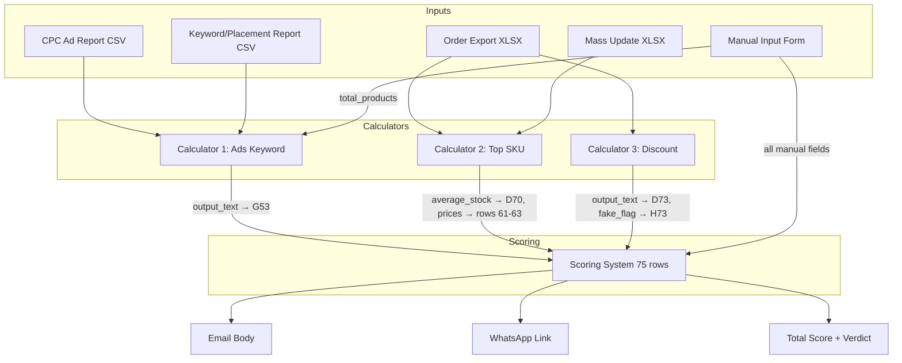
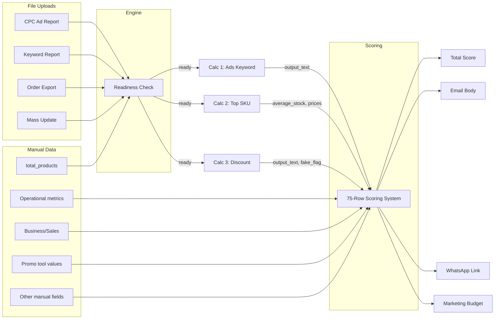

# Calculator Logic Reference

This document specifies the complete calculation logic for the AHA Store Internal Check Up (Store ICU) system. It covers three data calculators, a 75-row scoring system, and the orchestration engine that connects them. Every formula, threshold, and output format is documented to a level that allows exact reimplementation.

## Table of Contents

- [Architecture Overview](#architecture-overview)
- [Data Conventions](#data-conventions)
- [Calculator 1: Ads Keyword](#calculator-1-ads-keyword)
- [Calculator 2: Top SKU (Sales)](#calculator-2-top-sku-sales)
- [Calculator 3: Discount Check](#calculator-3-discount-check)
- [Scoring System](#scoring-system)
- [Orchestration Engine](#orchestration-engine)
- [Data Flow Summary](#data-flow-summary)

---

## Architecture Overview



All calculators are **pure functions** — they accept data in, return structured results out, and perform no I/O or database access. The I/O layer (`calculator_service.py`) handles data loading and result persistence separately.

---

## Data Conventions

### Indonesian Price Format

Shopee exports use Indonesian number formatting where `.` is the thousands separator:

| Raw String | Numeric Value |
|-----------|--------------|
| `"125.000"` | 125,000 |
| `"1.250.000"` | 1,250,000 |
| `"529.000"` | 529,000 |

**Conversion rule:** Strip all `.` characters, then parse as float.

### Safe Number Coercion

All numeric fields from parsed data use this coercion logic:

1. `None` → `0.0`
2. Already `int` or `float` → cast to `float`
3. String `""` or `"-"` → `0.0`
4. Other string → attempt `float()`, fallback `0.0`

### IDR Formatting

Display format: `IDR {integer:,}` — e.g., `IDR 26,433,781`

### Percentage Formatting

- **1 decimal place:** `fraction × 100` formatted as `"X.Y%"` (e.g., 0.235 → `"23.5%"`)
- **0 decimal places:** `fraction × 100` formatted as `"X%"` (e.g., 0.95 → `"95%"`)

### ROUNDUP Function

Round UP to N decimal places:

```text
ROUNDUP(value, decimals) = CEIL(value × 10^decimals) / 10^decimals
```

### ROUNDDOWN Function

Round DOWN to N decimal places:

```text
ROUNDDOWN(value, decimals) = FLOOR(value × 10^decimals) / 10^decimals
```

---

## Calculator 1: Ads Keyword

**Purpose:** Analyze Shopee advertising performance from two CSV reports and produce combined text output for the scoring system.

**Source:** `backend/app/calculators/ads_keyword.py`

### Inputs

| Parameter | Type | Description |
|-----------|------|-------------|
| `cpc_data` | `list[dict]` | Parsed CPC Ad Report CSV rows |
| `keyword_data` | `list[dict]` | Parsed Keyword/Placement Report CSV rows |
| `total_products` | `int` | Total products in store (manual input, AK1) |

### Result Structure

```python
@dataclass
class AdsKeywordResult:
    output_text: str            # Combined multi-section text for scoring G53
    details: dict[str, Any]     # Keys: ak2, ak3, ak4, al2, al3, al5, al6-al9, thresholds
```

### Sheet 1 Processing (CPC Ad Report)

#### Required Columns

| Column Name | Used For |
|------------|---------|
| `Status` | Ad status classification |
| `Jenis Iklan` | Ad type filtering |
| `Nama Iklan` | Product name extraction |
| `Penempatan Iklan` | Placement classification |
| `Mode Bidding` | Bidding mode classification |

#### CleanName Function

Removes text from the first `[` onward, then strips whitespace:

```text
"Product A [1]"     → "Product A"
"Product B [SKU-2]" → "Product B"
"Product C"         → "Product C"
""                  → ""
```

#### AK2: Ad Overview Summary

Count ads by status across ALL rows:

| Status Value | Counter |
|-------------|---------|
| `"Berjalan"` | count_active |
| `"Dijeda"` | count_paused |
| `"Berakhir"` | count_ended |

Count unique products (for product participation):

- **Filter:** `Status != "Berakhir"` AND `Jenis Iklan == "Iklan Produk"` AND `Nama Iklan` is not empty
- **Deduplication:** Apply `CleanName()` to `Nama Iklan`, collect into a set
- **unique_count** = size of that set
- **product_pct** = `unique_count / total_products` (0 if total_products is 0)

**Output format:**

```text
• Total Iklan: {count_active} Aktif, {count_paused} Dijeda dan {count_ended} Berakhir.
• Melibatkan {unique_count} ({product_pct formatted as X.Y%}) produk dari total jumlah produk: {total_products}.
```

#### AK3: Ad Type Breakdown

Count non-ended ads by placement type. **Filter all rows where** `Status != "Berakhir"`:

| Category | Filter | Counters |
|----------|--------|----------|
| Search Page | `Jenis Iklan == "Iklan Produk"` AND `Penempatan Iklan == "Halaman Pencarian"` | total, auto (`Mode Bidding == "Bidding Otomatis"`), manual (`Mode Bidding == "Bidding Manual"`) |
| Recommendation Page | `Jenis Iklan == "Iklan Produk"` AND `Penempatan Iklan == "Halaman Rekomendasi"` | total, auto, manual |
| All Placements | `Penempatan Iklan == "Semua Penempatan"` (NO Jenis filter) | total only |
| Shop Ads | `Jenis Iklan == "Iklan Toko"` | total, auto, manual |

**Output format:**

```text
• Jenis Iklan yang aktif digunakan:
  {search_total} Iklan Produk Halaman Pencarian ({search_auto} Otomatis & {search_manual} Manual).
  {reco_total} Iklan Produk Halaman Rekomendasi ({reco_auto} Otomatis & {reco_manual} Manual).
  {semua_total} Iklan Produk Otomatis Semua Halaman.
  {toko_total} Iklan Toko ({toko_auto} Otomatis & {toko_manual} Manual).
```

#### AK4: Seven Recommendation Flags

**active_ratio** = `count_active / total_ads` (total_ads = total row count; 0 if no rows)

| Flag # | Condition | Output |
|--------|-----------|--------|
| 1 | `product_pct < 0.5` | `📌 Jumlah produk yang dipartisipasikan ke dalam iklan kurang maksimal (saran >50%).` |
| 1 (else) | `product_pct >= 0.5` | `📌 Jumlah produk yang dipartisipasikan ke dalam iklan sudah cukup baik.` |
| 2 | `active_ratio < 0.5` | `📌 Jumlah iklan dengan status aktif kurang maksimal (saran >50%).` |
| 2 (elif) | `active_ratio >= 0.5` AND `product_pct >= 0.5` | `📌 Jumlah iklan dengan status aktif sudah cukup baik.` |
| 2 (else) | `active_ratio >= 0.5` AND `product_pct < 0.5` | **(suppressed — no output)** |
| 3 | No `"Halaman Pencarian"` in ANY row (including ended) | `📌 Iklan Produk Halaman Pencarian belum dimanfaatkan.` |
| 4 | No row has `Penempatan == "Halaman Pencarian"` AND `Mode Bidding == "Bidding Manual"` (ALL rows) | `📌 Iklan Produk Halaman Pencarian (Bidding Manual) belum dimanfaatkan.` |
| 5 | No `"Halaman Rekomendasi"` in ANY row (including ended) | `📌 Iklan Produk Halaman Rekomendasi belum dimanfaatkan.` |
| 6 | No row has `Penempatan == "Halaman Rekomendasi"` AND `Mode Bidding == "Bidding Manual"` (ALL rows) | `📌 Iklan Produk Halaman Rekomendasi (Bidding Manual) belum dimanfaatkan.` |
| 7 | No `"Iklan Toko"` in `Jenis Iklan` of ANY row (including ended) | `📌 Iklan Toko belum dimanfaatkan.` |

**Critical:** Flags 1-2 use non-ended row counts for product_pct/active_ratio. Flags 3-7 scan ALL rows including ended.

Output: join all generated flags with `\n`.

### Sheet 2 Processing (Keyword/Placement Report)

#### Required Columns

| Column Name | Used For |
|------------|---------|
| `Nama Iklan` | Ad name |
| `Jenis Iklan` | Ad type (empty = shop-level) |
| `Omzet Penjualan` | GMV |
| `Efektifitas Iklan` | ROAS |
| `Biaya` | Cost |
| `Mode Bidding` | Bidding mode |
| `Penempatan Iklan` | Placement |
| `Kata Pencarian/Penempatan` | Keyword text |

#### Threshold Calculations

Compute from ALL rows (including shop-level where `Jenis Iklan` is empty):

| Threshold | Formula | Cap |
|-----------|---------|-----|
| **AM6** | `ROUND(AVERAGE(Omzet Penjualan WHERE Omzet Penjualan > 0))` | None |
| **AM7** | `MIN(ROUND(AVERAGE(Efektifitas Iklan WHERE Efektifitas Iklan > 0)), 10)` | 10 |
| **AM9** | `ROUND(AVERAGE(Biaya WHERE Biaya > 0))` | None |
| **AM10** | `MIN(ROUND(AVERAGE(Efektifitas Iklan WHERE Efektifitas Iklan > 0)), 3)` | 3 |

Note: AM7 and AM10 share the same average ROAS but have different caps (10 vs 3).

#### AL2: TOP Ads (Best Performers)

**Product rows only:** Filter rows where `Jenis Iklan != ""` (excludes shop-level).

**Primary selection:**

- `Omzet Penjualan > AM6` AND `Efektifitas Iklan > AM7`
- Sort by `Omzet Penjualan` descending
- Limit: 5

**Fallback** (if primary returns empty):

- `Omzet Penjualan > AM6 / 2` AND `Efektifitas Iklan > MAX(AM7 / 2, 6)`
- Sort by `Omzet Penjualan` descending
- Limit: 5

**Format per ad (4 lines):**

```text
  ▶ {CleanName(Nama Iklan)}
    GMV: IDR {Omzet Penjualan} {ROAS: {Efektifitas Iklan}}
    {Mode Bidding}
    {Jenis Iklan} {Penempatan Iklan}: {Kata Pencarian/Penempatan}
```

ROAS format: strip trailing zeros (e.g., `5.68`, `6`, `5.9`).

**Header:**

- Primary: `• TOP Iklan (GMV tertinggi dengan ROAS terbaik):`
- Fallback: `• TOP Iklan [fallback] (GMV tertinggi dengan ROAS terbaik):`

Empty if no ads qualify.

#### AL3: Top Ads Recommendation

Substring count on the complete AL2 text:

| Condition | Output |
|-----------|--------|
| `count("Bidding Otomatis") >= 3` | `📌 Iklan dengan performa terbaik mengandalkan pengaturan otomatis (pengaturan manual berpotensi belum dimanfaatkan secara maksimal).` |
| `count("GMV Max") >= 3` (elif) | Same message as above |
| Otherwise | `📌 Iklan dengan performa terbaik sudah mengandalkan pengaturan manual.` |

#### AL5: BOTTOM Ads (Worst Performers)

**Product rows only** (`Jenis Iklan != ""`).

**Primary selection:**

- `Biaya > 100000` AND `Biaya > AM9` AND `Efektifitas Iklan < AM10` AND `Efektifitas Iklan < 5`
- Sort by `Biaya` descending
- Limit: 5

**Fallback** (if primary returns empty):

- `Biaya > 100000` AND `Biaya > AM9` AND `Efektifitas Iklan < MIN(ROUND(AM10 × 2), 5)` AND `Efektifitas Iklan < 5`
- Sort by `Biaya` descending
- Limit: 5

**Format per ad:**

Primary (4 lines):

```text
  ▶ {CleanName(Nama Iklan)}
    Biaya: IDR {Biaya} {ROAS: {Efektifitas Iklan}}
    {Mode Bidding}
    {Jenis Iklan} {Penempatan Iklan}: {Kata Pencarian/Penempatan}
```

Fallback (3 lines — bidding merged with placement line):

```text
  ▶ {CleanName(Nama Iklan)}
    Biaya: IDR {Biaya} {ROAS: {Efektifitas Iklan}}
    {Mode Bidding} {Jenis Iklan} {Penempatan Iklan}: {Kata Pencarian/Penempatan}
```

**Header:**

- Primary: `• BOTTOM Iklan (biaya tertinggi dengan ROAS terendah):`
- Fallback: `• BOTTOM Iklan [fallback] (biaya tertinggi dengan ROAS terendah):`

#### AL6-AL9: Bottom Flags

Substring counts on the complete AL5 text:

| Flag | Condition | Output |
|------|-----------|--------|
| **AL6** | `count("Otomatis") >= 1` | `📌 Terdapat iklan dengan pengaturan otomatis yang tidak terkontrol biayanya (disarankan dimonitor 1-2x setiap hari).` |
| **AL7** | `count("Bidding Manual") >= 1` | `📌 Terdapat iklan dengan pengaturan manual yang tidak terkontrol biayanya (disarankan dimonitor 1-2x setiap hari).` |
| **AL8** | `count("Iklan Pencarian Produk: ") >= 3` (note: this is a Shopee-specific ad type variant that appears in keyword reports) | `📌 Terdapat kata kunci dengan pengaturan manual yang tidak terkontrol biayanya (disarankan dipantau 1-2x setiap hari).` |
| **AL9** | `count("Auto Bidding") >= 1` | `📌 Terdapat iklan dengan pengaturan otomatis yang tidak terkontrol biayanya (disarankan dimonitor 1-2x setiap hari).` |

Each flag is empty string if its condition is not met.

### Final Output Assembly

Combine sections in this exact order, separated by `\n\n`, skipping empty sections:

```text
AK2, AK3, AK4, AL2, AL3, AL5, AL6, AL7, AL8, AL9
```

---

## Calculator 2: Top SKU (Sales)

**Purpose:** Analyze order data to find top-selling products, compute revenue rankings and stock levels.

**Source:** `backend/app/calculators/top_sku.py`

### Inputs

| Parameter | Type | Description |
|-----------|------|-------------|
| `order_data` | `list[dict]` | Parsed Order Export rows |
| `mass_update_data` | `list[dict]` | Parsed Mass Update / Sales Info rows |

### Result Structure

```python
@dataclass
class TopSkuResult:
    output_text: str         # Always empty string (this calculator outputs tables, not text)
    details: dict[str, Any]  # Keys: output_1, output_2, average_stock, product_count, total_unique_products
```

### Required Columns

**Order Export:**

| Column | Used For |
|--------|---------|
| `Nama Produk` | Product name |
| `Nama Variasi` | Variant name |
| `Nomor Referensi SKU` | SKU reference |
| `Harga Setelah Diskon` | Discounted price (Indonesian format) |
| `Jumlah` | Quantity per line |
| `Jumlah Produk di Pesan` | Total items in the order |
| `Voucher Ditanggung Penjual` | Seller-borne voucher (Indonesian format) |
| `Cashback Koin` | Coin cashback (Indonesian format) |
| `Diskon Dari Shopee` | Shopee-subsidized discount (Indonesian format) |

**Mass Update:**

| Column | Used For |
|--------|---------|
| `Nama Produk` | Product name for lookup |
| `Nama Variasi` | Variant name for lookup |
| `Kode Variasi` | Variant code |
| `Stok` | Current stock level |

### Processing Pipeline

#### Step 1: Extract Per-Line Data

For each row in order_data, compute:

```text
product_variant_label = "{Nama Produk} - {Nama Variasi}"

items_in_order = Jumlah Produk di Pesan    (use 1.0 if <= 0)

revenue = (Harga Setelah Diskon × Jumlah)
        - (Voucher Ditanggung Penjual / items_in_order)
        - (Cashback Koin / items_in_order)
        + (Diskon Dari Shopee / items_in_order)
```

All price fields use Indonesian format cleaning (strip `.` thousands separator).

Order-level discounts (voucher, cashback, Shopee discount) are divided evenly across all items in that order.

#### Step 2: Aggregate by Product

Group all line items by exact `product_variant_label` match.

Per group, compute:

- **total_qty** = sum of all `Jumlah` values
- **total_omzet** = sum of all `revenue` values

#### Step 3: Rank Top Products

1. Sort aggregated products by `total_omzet` descending
2. If `unique_products <= 20`: return all products
3. Otherwise: `limit = MAX(ROUND(unique_products × 0.20), 20)`
4. Return top `limit` products

#### Step 4: Enrich with Kode Variasi

Build a lookup from mass_update_data:

- Key: `"{Nama Produk} - {Nama Variasi}"` → Value: `Kode Variasi`

For each top product:

- Look up `product_variant_label` in the lookup
- If not found: `"Kode Variasi tidak ditemukan"`

#### Step 5: Average Selling Price (Rata2 Harga Jual)

For each top product, find the maximum single-line revenue across all original line items that match its `product_variant_label`.

```text
rata2_harga_jual = MAX(revenue) for all line_items where product_variant_label matches
```

#### Step 6: Stock Lookup

Build a second lookup from mass_update_data:

- Key: `Kode Variasi` → Value: `Stok` (as integer)

For each top product:

- If Kode Variasi is `"Kode Variasi tidak ditemukan"`: stock = 0
- Otherwise: look up stock by Kode Variasi (default 0)

#### Step 7: Average Stock

```text
average_stock = ROUND(SUM(stok for all top products) / count(top products))
```

Returns integer. Returns 0 if no products.

#### Step 8: Build Output Tables

**output_1** (Revenue Ranking):

```json
[
  {
    "kode_variasi": "ABC123",
    "product_name": "Product A - Variant X",
    "total_omzet": 5250000,
    "rata2_harga_jual": 125000
  }
]
```

Values `total_omzet` and `rata2_harga_jual` are rounded to integers.

**output_2** (Stock Ranking):

Split `product_variant_label` on the LAST ` - ` occurrence:

```json
[
  {
    "kode_variasi": "ABC123",
    "nama_produk": "Product A",
    "varian": "Variant X",
    "stok": 45
  }
]
```

### Downstream Usage

| Consumer | Field | Description |
|----------|-------|-------------|
| Scoring Row 70 | `details.average_stock` | Stock score (>=24: +10, >=12: +5, <12: -5) |
| Scoring Rows 61-63 | `details.output_1[0..2].rata2_harga_jual` | Competition price check |

---

## Calculator 3: Discount Check

**Purpose:** Analyze discount patterns across orders to detect "fake discounts" and compute discount health metrics.

**Source:** `backend/app/calculators/discount.py`

### Inputs

| Parameter | Type | Description |
|-----------|------|-------------|
| `order_data` | `list[dict]` | Parsed Order Export rows (same data as Calculator 2) |

### Result Structure

```python
@dataclass
class DiscountResult:
    output_text: str         # 4-5 lines of formatted text
    details: dict[str, Any]  # Keys: discount_pct, range_min, range_max, voucher_pct, paket_pct,
                             #        fake_discount_flag, product_summary, top_sku, totals
```

### Required Columns

| Column | Used For |
|--------|---------|
| `No. Pesanan` | Order number for Urutan calculation |
| `Nama Produk` | Product grouping |
| `Harga Awal` | Original price (Indonesian format) |
| `Harga Setelah Diskon` | Discounted price (Indonesian format) |
| `Jumlah` | Quantity |
| `Voucher Ditanggung Penjual` | Seller voucher (Indonesian format) |
| `Paket Diskon` | Bundle discount (Indonesian format) |

### Processing Pipeline

#### Step 1: Calculate Urutan (Item Position)

Iterate through rows sequentially:

| Condition | Result |
|-----------|--------|
| `No. Pesanan` is empty | Urutan = 0 (skip this row entirely) |
| `No. Pesanan` differs from previous row | Reset counter to 1 |
| `No. Pesanan` same as previous row | Increment counter |

#### Step 2: Calculate Per-Line Values

For each row where Urutan > 0:

**Voucher and Paket Diskon** are ONLY applied when `Urutan == 1` (first item in order) to avoid double-counting. For Urutan > 1, both are treated as 0.

```text
N (Total Discount) = (Harga Awal - Harga Setelah Diskon) + Voucher + Paket
O (Discount %)     = N / Harga Awal                        (0 if Harga Awal is 0)
P (Total Paid)     = Harga Setelah Diskon - Voucher - Paket
```

#### Step 3: Product Summary

Group by `Nama Produk` only (exact match, **no variant** — differs from Calculator 2).

Per group:

- **qty** = sum of `Jumlah`
- **avg_discount_pct** = arithmetic mean of all `O` (discount_pct) values in the group

#### Step 4: TOP SKU Filter

1. Compute `avg_qty = SUM(qty for all products) / count(products)`
2. Filter: `qty > avg_qty` AND `avg_discount_pct < 1.0` (less than 100%)
3. Sort by `qty` descending
4. `limit = ROUND(unique_products × 0.20)` — **no minimum 20 floor** (unlike Calculator 2)

### Output Values

**Output 1 — % Diskon TOP SKU:**

```text
SUMIF(P > 0, N) / SUM(P)
```

Sum of `total_discount` for line items where `total_paid > 0`, divided by sum of all `total_paid`.

**Output 2 — Range:**

```text
ROUNDUP(MIN(top_sku avg_discount_pct), 3) ~ ROUNDUP(MAX(top_sku avg_discount_pct), 3)
```

Both as percentage with 1 decimal place.

**Output 3 — Voucher %:**

```text
SUM(voucher for all line items) / SUM(harga_setelah_diskon for all line items)
```

**Output 4 — Paket Diskon %:**

```text
SUM(paket for all line items) / SUM(harga_setelah_diskon for all line items)
```

**Output 5 — Fake Discount Flag:**

```text
SUM(N) / SUM(P) > 0.20  →  "📌 Berpotensi menggunakan 'fake discount'"
```

### Output Text Format

```text
% Diskon TOP SKU: {output1}
Range: {range_min} ~ {range_max}
Voucher {voucher_pct}
Paket Diskon {paket_pct}
📌 Berpotensi menggunakan 'fake discount'    ← only if flag is true
```

### Key Differences from Calculator 2

| Aspect | Calculator 2 (Top SKU) | Calculator 3 (Discount) |
|--------|----------------------|------------------------|
| Ranking by | Revenue (omzet) | Quantity (qty) |
| Grouping key | `Nama Produk - Nama Variasi` | `Nama Produk` only |
| Order-level discount handling | Divided by `Jumlah Produk di Pesan` | Applied only at `Urutan == 1` |
| Top product limit | `MAX(ROUND(20%), 20)` | `ROUND(20%)` only |
| Purpose | Revenue ranking + stock | Discount health analysis |

### Downstream Usage

| Consumer | Field | Description |
|----------|-------|-------------|
| Scoring D73 | `output_text` | Injected into row 73 value |
| Scoring H73 | `details.fake_discount_flag` | No flag: +5pts, flag: 0pts |
| Scoring G68 | Parsed from `output_text` | Marketing cost estimation formula |

---

## Scoring System

**Purpose:** Combine manual inputs with calculator outputs into a 75-row evaluation producing per-category scores, a total score, conclusion text, marketing budget recommendation, email body, and WhatsApp link.

**Source:** `backend/app/calculators/scoring.py` (1823 lines)

### Entry Point

```python
def calculate_score(
    manual_data: dict,
    calculator_results: dict,
    template: str,              # "fashion" or "non_fashion"
    verdict: str,               # User-selected verdict (F75)
    store_name: str,
    period: str,
    brand_name: str,
    email: str | None = None,
    rules: dict | None = None,  # Configurable rules from DB
    rule_version: int = 1,
) -> ScoringResult
```

### Result Structure

```python
@dataclass
class ScoringResult:
    total_score: float
    category_scores: list[CategoryScore]
    verdict: str
    conclusion: str              # G66
    marketing_estimation: str    # G68
    marketing_percentage: str    # G72
    marketing_budget: str        # G73
    closing_message: str         # G75
    email_subject: str
    email_body: str
    whatsapp_link: str
    template: str
    rule_version: int
```

### Two Templates

| Parameter | Fashion | Non-Fashion |
|-----------|---------|-------------|
| Conversion rate threshold | >2% | >3% |
| ROI threshold | >8 | >9 |
| Marketing floor | 15% | 12% |
| Fashion adjustment | 5% | 0% |

### Category 1: Kesehatan Operasional Toko (Rows 7-11)

**Max score: 10 points**

| Row | Metric | Input Key | Threshold | Pass Score | Fail Score |
|-----|--------|-----------|-----------|------------|------------|
| 7 | Tingkat Pesanan Tidak Terselesaikan | `operational.unfulfilledOrderRate` | <= 1% | +4 | -value |
| 8 | Tingkat Keterlambatan Pengiriman | `operational.lateShipmentRate` | <= 1% | +3 | -value |
| 9 | Masa Pengemasan (days) | `operational.preparationTime` | <= 1 | +3 | -((value - 1) × 100) |
| 10 | Persentase Chat Dibalas | `operational.chatResponseRate` | >= 95% | 0 (info) | 0 (info) |
| 11 | Keseluruhan Penilaian | `operational.overallRating` | >= 4.7 | 0 (info) | 0 (info) |

**Row 10 special:** The value is rounded UP to 2 decimal places before comparing: `CEIL(value × 100) / 100`.

### Category 2: Bisnis Analisis (Rows 13-20)

**Max score: 20 points**

Compute first:

- `sales_months[0..5]` = `business.salesMonth0` through `business.salesMonth5`
- `current_month` = `sales_months[0]`
- `avg_6mo` = average of all 6 months (0 if all are 0)

| Row | Metric | Logic | Score |
|-----|--------|-------|-------|
| 13 | Penjualan (current month) | Pass if `avg_6mo < current_month × 1.10` | +10 or 0 |
| 14-18 | Past 5 months | Reference only | 0 |
| 19 | Rata² Penjualan 6 bulan terakhir | Pass if `avg_6mo > 100,000,000` | +10 or 0 |
| 20 | Tingkat Konversi | Pass if value >= threshold (2% fashion / 3% non-fashion) | 0 (info) |

**Row 13 detail:** The `threshold_pct=90` from rules maps to multiplier `(200 - 90) / 100 = 1.10`. Pass condition: `avg_6mo < current_month × 1.10`.

**Row 13 G-column message:** Compute `change% = ((current_month - avg_6mo) / avg_6mo) × 100`. If fail AND change% < -25%, append severe warning:
`\n❗️ Potensi peningkatan harga jual signifikan atau terdapat event abnormal.`

### Category 3: Skor Kesehatan Konten (Rows 22-24)

**Max score: 0 points (informational)**

| Row | Metric | Logic |
|-----|--------|-------|
| 22 | Perlu ditingkatkan | `content.needsImprovement` |
| 23 | Kualitas baik | `content.goodQuality` |
| 24 | % Konten baik | `d23 / (d23 + d22)`, pass if >= 95% |

### Category 4: Tinjauan Pengunjung (Rows 26-29)

**Max score: 5 points**

| Row | Metric | Input | Logic | Score |
|-----|--------|-------|-------|-------|
| 26 | Total Pengunjung | `visitors.totalVisitors` | Reference | 0 |
| 27 | Pengunjung Lama | `visitors.returningVisitors` | Reference | 0 |
| 28 | % Pengunjung Lama | `d27 / d26` | Pass if > 23% | +3 or 0 |
| 29 | Total Pengikut | `visitors.totalFollowers` | Pass if > 50,000 | +2 or 0 |

### Category 5: Promo Toko (Rows 31-43)

**Max score: 15 points (opportunity scoring)**

#### 11 Promo Tools (Rows 31-41)

| # | Field Key | Display Name | Benchmark % |
|---|-----------|-------------|-------------|
| 1 | `promoToko` | Promo Toko | 8% |
| 2 | `paketDiskon` | Paket Diskon | 16% |
| 3 | `komboHemat` | Kombo Hemat | 1% |
| 4 | `flashSale` | Flash Sale Toko Saya | 1% |
| 5 | `voucher` | Voucher | 84% |
| 6 | `shopeeLive` | Shopee Live | 15% |
| 7 | `gameToko` | Game Toko | 1% |
| 8 | `brandMembership` | Brand Membership | 1% |
| 9 | `gratisOngkir` | Gratis Ongkir XTRA | >0 (any) |
| 10 | `chatBroadcast` | Chat Broadcast | 1% |
| 11 | `programAfiliasi` | Program Afiliasi | 18% |

Input: `promoTools.{fieldKey}` = revenue value from that tool.

`d13` = `business.salesMonth0` (current month sales).

**Verdict logic per tool:**

```text
if D == 0:                         → "❌" (not used)
elif D / D13 >= 50%:               → "❌" (too dependent)
elif benchmark == 0:               → "✔️" if D > 0, else "❌"
elif D >= benchmark% × D13:        → "✔️" (meets benchmark)
else:                              → "❌"
```

**Note:** `gratisOngkir` has benchmark = 0, triggering the third branch — any revenue > 0 passes (binary check rather than percentage threshold).

**used_count** = count of tools where D > 0
**pass_count** = count of tools where verdict is "✔️"

#### Summary Rows

| Row | Metric | Formula | Pass | Fail |
|-----|--------|---------|------|------|
| 42 | % Penggunaan alat promosi | `used_count / 11` | > 80%: 0 pts | <= 80%: +5 pts |
| 43 | % Efektifitas alat promosi | `pass_count / 11` | > 90%: 0 pts | <= 90%: +10 pts |

**Opportunity scoring:** Points are added when the store has room for improvement (fail = opportunity = points).

#### Promo G-column Messages

| Condition | Message Template |
|-----------|-----------------|
| D == 0 | `{verdict} {metric} nil pendapatan` |
| D/D13 >= 50% | `{verdict} {metric} = {pct_str} Terlalu mengandalkan promo, nilai disarankan: 15%-50%` |
| Fail | `❌ {metric} = {pct_str} Kurang Efektif, nilai disarankan: {benchmark}` |
| Pass (regular) | `✔️ {metric} ({pct_str}) digunakan & persentase penggunaan baik` |
| Pass (Program Afiliasi) | `✔️ {metric} ({pct_str}) digunakan` |

### Category 6: Jumlah Produk & Status Toko (Rows 45-46)

**Max score: 15 points**

| Row | Metric | Logic | Score |
|-----|--------|-------|-------|
| 45 | Jumlah Produk | `products.productCount >= 35` | +5 or 0 |
| 46 | Status Toko | `products.storeStatus` | Mall: +10, Star+: +5, else: 0 |

### Category 7: Data Iklan (Rows 48-53)

**Max score: 10 points**

| Row | Metric | Formula | Logic | Score |
|-----|--------|---------|-------|-------|
| 48 | Penjualan (iklan) | `ads.adSales` | Reference | 0 |
| 49 | Biaya (iklan) | `ads.adCost` | Reference | 0 |
| 50 | ROI | `D48 / D49` | Pass if >= threshold (8 fashion / 9 non-fashion) | Fail: +5, Pass: 0 |
| 51 | % GMV Iklan / GMV Toko | `D48 / D13` | Pass if < 84% | Pass: +5, Fail: 0 |
| 52 | % Biaya Iklan / GMV Toko | `D49 / D13` | <1%: fail, <5%: fail, 5-10%: pass, >10%: fail | 0 (info) |
| 53 | Iklan check up | Calculator 1 `output_text` | Injected | 0 |

**Row 52 G-column messages:**

| Condition | Message |
|-----------|---------|
| D49 == 0 | `❌ Iklan tidak aktif sama sekali` |
| D52 < 5% | `❌ Penggunaan iklan terlalu minim ({pct}). Nilai disarankan: 5%-10%.` |
| D52 > 10% | `❌ % Biaya Iklan / GMV Toko = {pct} Biaya terlalu tinggi, nilai disarankan: <10%` |
| 5-10% | `✔️ % Biaya Iklan / GMV Toko = {pct} Sudah Baik` |

### Category 8: Partisipasi Campaign (Rows 55-57)

**Max score: 10 points**

| Row | Metric | Formula | Logic | Score |
|-----|--------|---------|-------|-------|
| 55 | Sesi dinominasikan | `campaign.nominatedSessions` | Reference | 0 |
| 56 | Sesi tersedia | `campaign.availableSessions` | Reference | 0 |
| 57 | % Partisipasi Campaign | `D55 / D56` | Pass if > 90% | Fail: +10, Pass: 0 |

### Category 9: Kompetisi TOP Produk (Rows 60-63)

**Max score: 0 points (informational)**

For products 1-3 (rows 61-63):

- **Selling price** = Calculator 2 `output_1[i].rata2_harga_jual` (i = 0, 1, 2)
- **Market price** = `competition.product{i+1}.marketPrice` (manual input)
- **Competitive** if `selling_price <= market_price × 1.10`

### Category 10: Stok (Row 70)

**Max score: 10 points**

Source: Calculator 2 `details.average_stock` (rounded to integer)

| Threshold | Score |
|-----------|-------|
| `average_stock >= 24` | +10 |
| `average_stock >= 12` | +5 |
| `average_stock < 12` | -5 |

If Calculator 2 has not been run, the category is marked `available=False` with score 0.

### Category 11: Discount (Row 73)

**Max score: 5 points**

Source: Calculator 3 `details.fake_discount_flag`

| Condition | Score |
|-----------|-------|
| No fake discount | +5 |
| Fake discount detected | 0 |

If Calculator 3 has not been run, the category is marked `available=False` with score 0.

### Total Score

```text
total_score = SUM(category.score for all 11 categories)
```

### Interpretation Ranges

| Score Range | Label | Verdict Symbol |
|-------------|-------|----------------|
| >= 71 | Good Candidate | ✔️ |
| 41-70 | Needs Review | ⭕️ |
| <= 40 | Not Recommended | ❌ |

### Complex Derived Formulas

#### G68: Marketing Cost Estimation

Parse 5 percentages from Calculator 3 output text (D73):

```text
t  = extract "% Diskon TOP SKU: X%" → X/100
ra = extract "Range: X%"            → X/100
rb = extract "~ X%"                 → X/100
v  = extract "Voucher X%"           → X/100
p  = extract "Paket Diskon X%"      → X/100
```

Compute:

```text
d52 = ad_cost / current_month_sales   (fraction)

low  = (ra × t) + v + p + d52 + 0.05
high = (rb × t) + v + p + d52 + 0.05

output = "{low×100:.1f}% ~ {high×100:.1f}%"
```

If D73 contains "Berpotensi" or "fake discount", append:
`\n📌 Berpotensi menggunakan 'fake discount'`

#### G72: Recommended Marketing Percentage

```text
avg = ((ra×t + v + p + d52) + (rb×t + v + p + d52)) / 2
base = ROUNDDOWN(avg - 0.03, 2)

upper_limit = 0.20 + fashion_adjustment    (0.05 for fashion, 0 for non-fashion)

g68_first = CEIL(first percentage from G68 text) / 100

min_val = MIN(MIN(base, upper_limit), g68_first)     (skip g68_first if 0)
result  = MAX(MAX(min_val, 0.10), floor)

floor = 0.15 (fashion) or 0.12 (non-fashion)
```

#### G73: Marketing Budget Text

**Suppressed** for verdicts starting with "❌" or equal to "⭕️" → empty string.

Otherwise:

```text
display_pct = CLAMP(g72_value, 0.10, 0.25)
budget = current_month_sales × display_pct

"💡Minimum anggaran marketing yang dibutuhkan AHA untuk meningkatkan
performa omzet penjualan toko = {display_pct×100:.0f}%
 (± IDR {budget formatted}/bulan)"
```

#### G66: Conclusion

Multi-line text assembled from:

1. Sales range: `"- Omset toko di kisaran {min_sales} juta - {max_sales} juta per bulan sejak 6 bulan terakhir"`
2. Operational quality (append chat warning if row 10 verdict is "❌")
3. `"- Nama produk disarankan untuk dimulai dengan nama brand"`
4. `"- Background foto utama disarankan warna putih"`
5. If promo effectiveness (row 43) < 80%: `"- Beberapa fitur promosi masih belum dimanfaatkan secara efektif"`
6. If campaign participation (row 57) < 80%: `"- Partisipasi Campaign Shopee belum maksimal."`
7. `"- Banyak produk habis stok tidak diarsipkan."`
8. `"- Banyak produk tidak terjual di 30 hari terakhir."`
9. Discount range from G68: `"- Diskon range: {g68_text}"`

#### G75: Closing Messages

| Verdict | Message |
|---------|---------|
| `"✔️"` | Invitation to discuss optimization via `cal-bd2.ahacommerce.net` |
| `"❌"` | Suggest AHA Coventures via `bit.ly/AHACoventures` |
| `"❌ Non Mall"` | Offer Mall application assistance (requirements: HAKI, NIB, legal docs) |
| `"❌ No Brand"` | Polite decline |
| `"❌ Opex"` | Fix shipping first (<2%) and packaging (<1 day) |
| `""` (empty) | Good performance acknowledgment |
| `"⭕️"` | Empty string |

### Email Assembly

**Subject:** `🏥 AHA Store Internal Check Up (Store ICU) - {store_name} {period}`

**Body sections** (in order, each preceded by an emoji header):

| # | Header | Source Rows |
|---|--------|-------------|
| 1 | 📊 Performa Operasional Toko | Rows 7-11 G-column |
| 2 | 📈 Performa Penjualan Toko | Rows 13, 20 G-column |
| 3 | 📝 Kualitas Konten Produk | Row 24 G-column |
| 4 | 👥 Tinjauan Pengunjung | Rows 28, 29 G-column |
| 5 | 🏷️ Tingkat Penggunaan Alat Promosi | Rows 31-43 G-column + Row 46 (store status) |
| 6 | 📣 Performa Iklan | Rows 50-53 G-column |
| 7 | 🎯 Partisipasi Campaign | Row 57 G-column |
| 8 | 🏆 Kompetisi TOP Produk | Rows 61-63 G-column |
| 9 | 📋 Kesimpulan | G66 conclusion |
| 10 | 📌 Estimasi persentase biaya marketing | G68 text |
| 11 | (no header) | G73 budget text |
| 12 | (no header) | G75 closing message |

### WhatsApp Link

```text
message = "Halo, ini hasil Store Internal Check Up (Store ICU) untuk {store_name} periode {period}. Silakan cek email untuk detail lengkapnya."
link = "https://api.whatsapp.com/send?text={URL_ENCODE(message)}"
```

### Configurable Rules System

All thresholds and point values are configurable via a `rules` dict loaded from the `scoring_rules` database table. When `rules` is `None`, the system falls back to `DEFAULT_FASHION_RULES` or `DEFAULT_NON_FASHION_RULES` (module-level constants).

G-column message templates support `{placeholder}` syntax. Missing placeholders are preserved as-is via a `_SafeDict` that returns `{key}` for unknown keys. Malformed templates (unmatched braces) also degrade gracefully by returning the template unchanged.

---

## Orchestration Engine

**Purpose:** Manage calculator dependencies, determine readiness, and coordinate execution.

**Source:** `backend/app/calculators/engine.py`

### Dependency Maps

**Files required per calculator:**

| Calculator | Required Files |
|-----------|---------------|
| `ads_keyword` | `cpc_ad_report`, `keyword_report` |
| `discount` | `order_export` |
| `top_sku` | `order_export`, `mass_update` |

**Manual inputs required per calculator:**

| Calculator | Required Manual Inputs |
|-----------|----------------------|
| `ads_keyword` | `total_products` (from `manual_data.products.productCount`) |

**Reverse map — which calculators each file affects:**

| File Type | Affected Calculators |
|-----------|---------------------|
| `cpc_ad_report` | `ads_keyword` |
| `keyword_report` | `ads_keyword` |
| `order_export` | `discount`, `top_sku` |
| `mass_update` | `top_sku` |

### Readiness Check

`check_calculator_readiness(brand_id, conn)` returns per-calculator:

- **status:** `"ready"` (all dependencies met) or `"pending"` (missing dependencies)
- **has_result:** whether a stored result already exists
- **missing_files / missing_manual:** lists of what is missing
- **calculated_at:** timestamp of last result

### Execution Modes

**Run all ready:** `run_ready_calculators(brand_id, user_id, conn)`

- Checks readiness for all 3 calculators
- Runs each ready calculator independently
- Returns per-calculator status: `success` / `skipped` / `error`

**Run after upload:** `run_calculators_for_upload(brand_id, file_type, user_id, conn)`

- Only runs calculators affected by the specific uploaded file
- Used for targeted auto-execution after file upload

**Clear stale results:** `clear_dependent_results(brand_id, file_type, conn)`

- Deletes calculator results that depend on the re-uploaded file type
- Called before re-running to prevent stale data

### Error Isolation

Each calculator runs in its own try/except block. One calculator's failure does not prevent others from executing.

### Database Storage

Results are stored via `upsert_result()` (INSERT ON CONFLICT UPDATE) keyed by `(brand_id, calculator_type)` — one result per calculator per brand, replaced on re-run.

---

## Data Flow Summary


