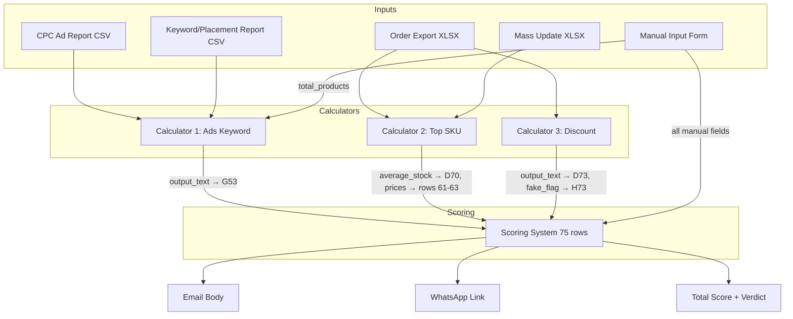
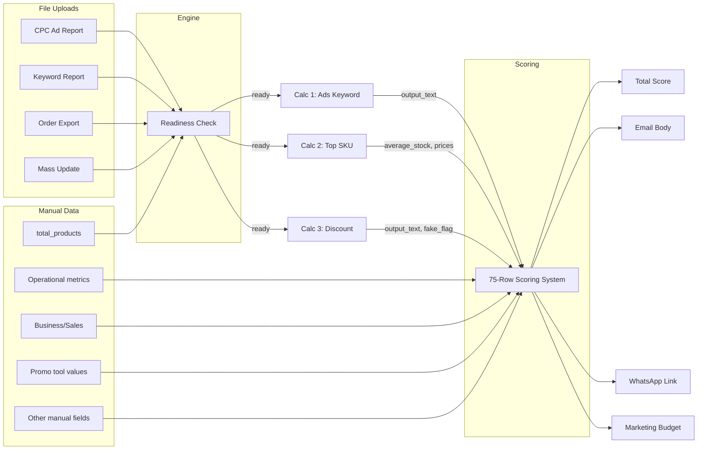

# Calculator Logic Reference

This document specifies the complete calculation logic for the AHA Store Internal Check Up (Store ICU) system. It covers three data calculators, a 75-row scoring system, and the orchestration engine that connects them. Every formula, threshold, and output format is documented to a level that allows exact reimplementation.

## Table of Contents

- [Architecture Overview](#architecture-overview)
- [Data Conventions](#data-conventions)
- [Formatting Functions Reference](#formatting-functions-reference)
- [Calculator 1: Ads Keyword](#calculator-1-ads-keyword)
- [Calculator 2: Top SKU (Sales)](#calculator-2-top-sku-sales)
- [Calculator 3: Discount Check](#calculator-3-discount-check)
- [Scoring System](#scoring-system)
- [DEFAULT_RULES Reference](#default_rules-reference)
- [Fashion vs Non-Fashion Behavior](#fashion-vs-non-fashion-behavior)
- [Edge Cases & Zero-State Behavior](#edge-cases--zero-state-behavior)
- [Orchestration Engine](#orchestration-engine)
- [Data Flow Summary](#data-flow-summary)
- [Test Vectors](#test-vectors)

---

## Architecture Overview



All calculators are **pure functions** — they accept data in, return structured results out, and perform no I/O or database access. The I/O layer (`calculator_service.py`) handles data loading and result persistence separately.

---

## Data Conventions

### Indonesian Price Format

Shopee exports use Indonesian number formatting where `.` is the thousands separator:

| Raw String | Numeric Value |
|-----------|--------------|
| `"125.000"` | 125,000 |
| `"1.250.000"` | 1,250,000 |
| `"529.000"` | 529,000 |

**Conversion rule:** Strip all `.` characters, then parse as float.

### Safe Number Coercion

All numeric fields from parsed data use this coercion logic:

1. `None` → `0.0`
2. Already `int` or `float` → cast to `float`
3. String `""` or `"-"` → `0.0`
4. Other string → attempt `float()`, fallback `0.0`

### IDR Formatting

Display format: `IDR {integer:,}` — e.g., `IDR 26,433,781`

### Percentage Formatting

- **1 decimal place:** `fraction × 100` formatted as `"X.Y%"` (e.g., 0.235 → `"23.5%"`)
- **0 decimal places:** `fraction × 100` formatted as `"X%"` (e.g., 0.95 → `"95%"`)

### ROUNDUP Function

Round UP to N decimal places:

```text
ROUNDUP(value, decimals) = CEIL(value × 10^decimals) / 10^decimals
```

### ROUNDDOWN Function

Round DOWN to N decimal places:

```text
ROUNDDOWN(value, decimals) = FLOOR(value × 10^decimals) / 10^decimals
```

---

## Formatting Functions Reference

All value formatting functions used across the calculators and scoring system. Functions are defined locally in each module — some share names but have slightly different implementations.

### Calculator 1 (ads_keyword.py)

| Function | Signature | Format Pattern | Example | Used By |
|----------|-----------|---------------|---------|---------|
| `_format_idr` | `_format_idr(value: int\|float) -> str` | `IDR {int(value):,}` | `26433781` → `"IDR 26,433,781"` | AK2 (ad summary), AL2/AL5 (top/bottom ads GMV/cost) |
| `_format_roas` | `_format_roas(value: float\|int) -> str` | `f"{float(value):g}"` (strip trailing zeros) | `5.68` → `"5.68"`, `6.0` → `"6"`, `5.90` → `"5.9"` | AL2/AL5 (ROAS display) |
| `_format_pct` | `_format_pct(fraction: float) -> str` | `f"{fraction * 100:.1f}%"` | `0.05` → `"5.0%"`, `0.235` → `"23.5%"` | AK2 (product participation %) |

### Calculator 3 (discount.py)

| Function | Signature | Format Pattern | Example | Used By |
|----------|-----------|---------------|---------|---------|
| `_format_pct_1dp` | `_format_pct_1dp(fraction: float) -> str` | `f"{fraction * 100:.1f}%"` | `0.027` → `"2.7%"`, `0.0` → `"0.0%"` | Output 1-4 (discount/voucher/paket percentages) |
| `_roundup` | `_roundup(value: float, decimals: int) -> float` | `ceil(value × 10^decimals) / 10^decimals` | `_roundup(0.0271, 3)` → `0.028` | Output 2 (range min/max) |

### Scoring System (scoring.py)

| Function | Signature | Format Pattern | Example | Used By |
|----------|-----------|---------------|---------|---------|
| `_fmt_pct_1dp` | `_fmt_pct_1dp(value: float) -> str` | `f"{value * 100:.1f}%"` | `0.235` → `"23.5%"` | Row 28 (returning visitors %), Row 51 (GMV ratio), Row 52 (cost ratio), Row 57 (campaign %), promo tool rows |
| `_fmt_pct_0dp` | `_fmt_pct_0dp(value: float) -> str` | `f"{value * 100:.0f}%"` | `0.95` → `"95%"` | Row 24 (content quality %), Rows 42-43 (promo usage/effectiveness %) |
| `_fmt_num_1dp` | `_fmt_num_1dp(value: float) -> str` | `f"{value:.1f}%"` | `0.5` → `"0.5%"` (raw number, not fraction) | Row 7 (unfulfilled order rate), Row 8 (late shipment rate) |
| `_fmt_num_2dp` | `_fmt_num_2dp(value: float) -> str` | `f"{value:.2f}"` | `4.65` → `"4.65"` | Row 9 (preparation time), Row 11 (overall rating) |
| `_fmt_idr` | `_fmt_idr(value: float) -> str` | `f"{rounded:,}".replace(",", ".")` | `1250000` → `"1.250.000"`, `-500000` → `"-500.000"` | Row 13 (sales IDR), Row 29 (followers), G73 (budget), competition rows |
| `_rounddown` | `_rounddown(value: float, decimals: int) -> float` | `floor(value × 10^decimals) / 10^decimals` | `_rounddown(0.1567, 2)` → `0.15` | G72 (marketing percentage base) |
| `_extract_pct` | `_extract_pct(pattern: str, text: str) -> float` | Regex capture group → `float / 100` | `_extract_pct(r"Voucher ([\d.]+)%", "Voucher 2.7%")` → `0.027` | G68/G72 (parse D73 discount text) |

**Key difference:** `_fmt_pct_1dp` and `_fmt_pct_0dp` multiply by 100 (input is a fraction like `0.235`). `_fmt_num_1dp` does **not** multiply (input is already a percentage number like `0.5`). The scoring system uses `_fmt_idr` with Indonesian dot separator (`.`), while Calculator 1 uses `_format_idr` with comma separator (`,`).

---

## Calculator 1: Ads Keyword

**Purpose:** Analyze Shopee advertising performance from two CSV reports and produce combined text output for the scoring system.

**Source:** `backend/app/calculators/ads_keyword.py`

### Inputs

| Parameter | Type | Description |
|-----------|------|-------------|
| `cpc_data` | `list[dict]` | Parsed CPC Ad Report CSV rows |
| `keyword_data` | `list[dict]` | Parsed Keyword/Placement Report CSV rows |
| `total_products` | `int` | Total products in store (manual input, AK1) |
| `language` | `str` | `"id"` (Indonesian, default) or `"en"` (English) — controls AK3/AK4/AL2/AL5/AL6 variant logic |

### Result Structure

```python
@dataclass
class AdsKeywordResult:
    output_text: str            # Combined multi-section text for scoring G53
    details: dict[str, Any]     # Keys: ak2, ak3, ak4, al2, al3, al5, al6-al9, thresholds
```

### Sheet 1 Processing (CPC Ad Report)

#### Required Columns

| Column Name | Used For |
|------------|---------|
| `Status` | Ad status classification |
| `Jenis Iklan` | Ad type filtering |
| `Nama Iklan` | Product name extraction |
| `Penempatan Iklan` | Placement classification |
| `Mode Bidding` | Bidding mode classification |

#### CleanName Function

Removes text from the first `[` onward, then strips whitespace:

```text
"Product A [1]"     → "Product A"
"Product B [SKU-2]" → "Product B"
"Product C"         → "Product C"
""                  → ""
```

#### AK2: Ad Overview Summary

Count ads by status across ALL rows:

| Status Value | Counter |
|-------------|---------|
| `"Berjalan"` | count_active |
| `"Dijeda"` | count_paused |
| `"Berakhir"` | count_ended |

Count unique products (for product participation):

- **Filter:** `Status != "Berakhir"` AND `Jenis Iklan == "Iklan Produk"` AND `Nama Iklan` is not empty
- **Deduplication:** Apply `CleanName()` to `Nama Iklan`, collect into a set
- **unique_count** = size of that set
- **product_pct** = `unique_count / total_products` (0 if total_products is 0)

**Output format:**

```text
• Total Iklan: {count_active} Aktif, {count_paused} Dijeda dan {count_ended} Berakhir.
• Melibatkan {unique_count} ({product_pct formatted as X.Y%}) produk dari total jumlah produk: {total_products}.
```

#### AK3: Ad Type Breakdown

Count non-ended ads by placement type. **Filter all rows where** `Status != "Berakhir"`:

| Category | Filter | Counters |
|----------|--------|----------|
| Search Page | `Jenis Iklan == "Iklan Produk"` AND `Penempatan Iklan == "Halaman Pencarian"` | total, auto (`Mode Bidding == "Bidding Otomatis"`), manual (`Mode Bidding == "Bidding Manual"`) |
| Recommendation Page | `Jenis Iklan == "Iklan Produk"` AND `Penempatan Iklan == "Halaman Rekomendasi"` | total, auto, manual |
| All Placements | `Penempatan Iklan == "Semua Penempatan"` (NO Jenis filter) | total only |
| Shop Ads | `Jenis Iklan == "Iklan Toko"` | total, auto, manual |

**Output format (English `language="en"` — 4 categories):**

```text
• Jenis Iklan yang aktif digunakan:
  {search_total} Iklan Produk Halaman Pencarian ({search_auto} Otomatis & {search_manual} Manual).
  {reco_total} Iklan Produk Halaman Rekomendasi ({reco_auto} Otomatis & {reco_manual} Manual).
  {semua_total} Iklan Produk Otomatis Semua Halaman.
  {toko_total} Iklan Toko ({toko_auto} Otomatis & {toko_manual} Manual).
```

**Output format (Indonesian `language="id"` — 2 categories):**

```text
• Jenis Iklan yang aktif digunakan:
  {semua_total} Iklan Produk Otomatis Semua Halaman.
  {toko_total} Iklan Toko ({toko_auto} Otomatis & {toko_manual} Manual).
```

#### AK4: Recommendation Flags

**active_ratio** = `count_active / total_ads` (total_ads = total row count; 0 if no rows)

**Common flags (both languages):**

| Flag # | Condition | Output |
|--------|-----------|--------|
| 1 | `product_pct < 0.5` | `📌 Jumlah produk yang dipartisipasikan ke dalam iklan kurang maksimal (saran >50%).` |
| 1 (else) | `product_pct >= 0.5` | `📌 Jumlah produk yang dipartisipasikan ke dalam iklan sudah cukup baik.` |
| 2 | `active_ratio < 0.5` | `📌 Jumlah iklan dengan status aktif kurang maksimal (saran >50%).` |
| 2 (elif) | `active_ratio >= 0.5` AND `product_pct >= 0.5` | `📌 Jumlah iklan dengan status aktif sudah cukup baik.` |
| 2 (else) | `active_ratio >= 0.5` AND `product_pct < 0.5` | **(suppressed — no output)** |

**English-only flags (`language="en"`):** Remaining flags check ALL rows (including ended):

| Flag # | Condition | Output |
|--------|-----------|--------|
| 3 | No `"Halaman Pencarian"` in ANY row | `📌 Iklan Produk Halaman Pencarian belum dimanfaatkan.` |
| 4 | No row has `Penempatan == "Halaman Pencarian"` AND `Bidding Otomatis` | `📌 Iklan Produk Halaman Pencarian (Bidding Otomatis) belum dimanfaatkan.` |
| 5 | No row has `Penempatan == "Halaman Pencarian"` AND `Bidding Manual` | `📌 Iklan Produk Halaman Pencarian (Bidding Manual) belum dimanfaatkan.` |
| 6 | No `"Halaman Rekomendasi"` in ANY row | `📌 Iklan Produk Halaman Rekomendasi belum dimanfaatkan.` |
| 7 | No row has `Penempatan == "Halaman Rekomendasi"` AND `Bidding Otomatis` | `📌 Iklan Produk Halaman Rekomendasi (Bidding Otomatis) belum dimanfaatkan.` |
| 8 | No row has `Penempatan == "Halaman Rekomendasi"` AND `Bidding Manual` | `📌 Iklan Produk Halaman Rekomendasi (Bidding Manual) belum dimanfaatkan.` |

**Iklan Toko flag (both languages):**

| Flag # | Condition | Output |
|--------|-----------|--------|
| Last | No `"Iklan Toko"` in `Jenis Iklan` of ANY row | `📌 Iklan Toko belum dimanfaatkan.` |

**Indonesian (`language="id"`)** produces 3 flags total (Flag 1, Flag 2, Iklan Toko). **English (`language="en"`)** produces up to 9 flags (Flag 1, Flag 2, Flags 3-8, Iklan Toko).

**Critical:** Flags 1-2 use non-ended row counts for product_pct/active_ratio. Remaining flags scan ALL rows including ended.

Output: join all generated flags with `\n`.

### Sheet 2 Processing (Keyword/Placement Report)

#### Required Columns

| Column Name | Used For |
|------------|---------|
| `Nama Iklan` | Ad name |
| `Jenis Iklan` | Ad type (empty = shop-level) |
| `Omzet Penjualan` | GMV |
| `Efektifitas Iklan` | ROAS |
| `Biaya` | Cost |
| `Mode Bidding` | Bidding mode |
| `Penempatan Iklan` | Placement |
| `Kata Pencarian/Penempatan` | Keyword text |

#### Threshold Calculations

Compute from ALL rows (including shop-level where `Jenis Iklan` is empty):

| Threshold | Formula | Cap |
|-----------|---------|-----|
| **AM6** | `ROUND(AVERAGE(Omzet Penjualan WHERE Omzet Penjualan > 0))` | None |
| **AM7** | `MIN(ROUND(AVERAGE(Efektifitas Iklan WHERE Efektifitas Iklan > 0)), 10)` | 10 |
| **AM9** | `ROUND(AVERAGE(Biaya WHERE Biaya > 0))` | None |
| **AM10** | `MIN(ROUND(AVERAGE(Efektifitas Iklan WHERE Efektifitas Iklan > 0)), 3)` | 3 |

Note: AM7 and AM10 share the same average ROAS but have different caps (10 vs 3).

#### AL2: TOP Ads (Best Performers)

**Product rows only:** Filter rows where `Jenis Iklan != ""` (excludes shop-level).

**Primary selection:**

- `Omzet Penjualan > AM6` AND `Efektifitas Iklan > AM7`
- Sort by `Omzet Penjualan` descending
- Limit: 5

**Fallback** (Indonesian `language="id"` only — English has no fallback, returns empty if primary fails):

- `Omzet Penjualan > AM6 / 2` AND `Efektifitas Iklan > MAX(AM7 / 2, 6)`
- Sort by `Omzet Penjualan` descending
- Limit: 5

**Format per ad (4 lines):**

```text
  ▶ {CleanName(Nama Iklan)}
    GMV: IDR {Omzet Penjualan} {ROAS: {Efektifitas Iklan}}
    {Mode Bidding}
    {Jenis Iklan} {Penempatan Iklan}: {Kata Pencarian/Penempatan}
```

ROAS format: strip trailing zeros (e.g., `5.68`, `6`, `5.9`).

**Header:**

- Primary: `• TOP Iklan (GMV tertinggi dengan ROAS terbaik):`
- Fallback: `• TOP Iklan [fallback] (GMV tertinggi dengan ROAS terbaik):`

Empty if no ads qualify.

#### AL3: Top Ads Recommendation

Substring count on the complete AL2 text:

| Condition | Output |
|-----------|--------|
| `count("Bidding Otomatis") >= 3` | `📌 Iklan dengan performa terbaik mengandalkan pengaturan otomatis (pengaturan manual berpotensi belum dimanfaatkan secara maksimal).` |
| `count("GMV Max") >= 3` (elif) | Same message as above |
| Otherwise | `📌 Iklan dengan performa terbaik sudah mengandalkan pengaturan manual.` |

#### AL5: BOTTOM Ads (Worst Performers)

**Product rows only** (`Jenis Iklan != ""`).

**Language-variant thresholds:**

| Parameter | Indonesian (`"id"`) | English (`"en"`) |
|-----------|--------------------|--------------------|
| Minimum cost | 100,000 | 50,000 |
| Fallback ROAS cap limit | 5 | 4 |

**Primary selection:**

- `Biaya > min_cost` AND `Biaya > AM9` AND `Efektifitas Iklan < AM10` AND `Efektifitas Iklan < 5`
- Sort by `Biaya` descending
- Limit: 5

**Fallback** (if primary returns empty):

- `Biaya > min_cost` AND `Biaya > AM9` AND `Efektifitas Iklan < MIN(ROUND(AM10 × 2), fallback_roas_cap_limit)` AND `Efektifitas Iklan < 5`
- Sort by `Biaya` descending
- Limit: 5

**Format per ad:**

Primary (4 lines):

```text
  ▶ {CleanName(Nama Iklan)}
    Biaya: IDR {Biaya} {ROAS: {Efektifitas Iklan}}
    {Mode Bidding}
    {Jenis Iklan} {Penempatan Iklan}: {Kata Pencarian/Penempatan}
```

Fallback (3 lines — bidding merged with placement line):

```text
  ▶ {CleanName(Nama Iklan)}
    Biaya: IDR {Biaya} {ROAS: {Efektifitas Iklan}}
    {Mode Bidding} {Jenis Iklan} {Penempatan Iklan}: {Kata Pencarian/Penempatan}
```

**Header:**

- Primary: `• BOTTOM Iklan (biaya tertinggi dengan ROAS terendah):`
- Fallback: `• BOTTOM Iklan [fallback] (biaya tertinggi dengan ROAS terendah):`

#### AL6-AL9: Bottom Flags

Substring counts on the complete AL5 text:

| Flag | Condition | Output |
|------|-----------|--------|
| **AL6** | Indonesian: `count("Otomatis") >= 1`; English: `count("Bidding Otomatis") >= 1` | `📌 Terdapat iklan dengan pengaturan otomatis yang tidak terkontrol biayanya (disarankan dimonitor 1-2x setiap hari).` |
| **AL7** | `count("Bidding Manual") >= 1` | `📌 Terdapat iklan dengan pengaturan manual yang tidak terkontrol biayanya (disarankan dimonitor 1-2x setiap hari).` |
| **AL8** | `count("Iklan Pencarian Produk: ") >= 3` (note: this is a Shopee-specific ad type variant that appears in keyword reports) | `📌 Terdapat kata kunci dengan pengaturan manual yang tidak terkontrol biayanya (disarankan dipantau 1-2x setiap hari).` |
| **AL9** | `count("Auto Bidding") >= 1` | `📌 Terdapat iklan dengan pengaturan otomatis yang tidak terkontrol biayanya (disarankan dimonitor 1-2x setiap hari).` |

Each flag is empty string if its condition is not met.

### Final Output Assembly

Combine sections in this exact order, separated by `\n\n`, skipping empty sections:

```text
AK2, AK3, AK4, AL2, AL3, AL5, AL6, AL7, AL8, AL9
```

### Pseudocode

#### Flow Diagram

```
┌─────────────────────────────────────────────────────────┐
│                  calculate_ads_keyword()                 │
│                                                         │
│  cpc_data ──► calculate_sheet1() ──► {ak2, ak3, ak4}   │
│                     │                                   │
│                     ▼                                   │
│  keyword_data ──► calculate_sheet2() ──► {al2..al9}     │
│                     │                                   │
│                     ▼                                   │
│              combine_output()                           │
│                     │                                   │
│                     ▼                                   │
│              AdsKeywordResult(output_text, details)      │
└─────────────────────────────────────────────────────────┘
```

#### Sheet 1 (CPC Ad Report)

```
FUNCTION calculate_sheet1(rows, total_products, language):
    # AK2: Ad Overview Summary
    FOR each row in rows:
        COUNT status into active/paused/ended
        IF status != "Berakhir" AND jenis == "Iklan Produk" AND nama not empty:
            ADD CleanName(nama) to unique_products set
    product_pct = unique_count / total_products
    ak2 = format overview text

    # AK3: Ad Type Breakdown (non-ended rows only)
    FOR each non-ended row:
        CLASSIFY into search/reco/semua/toko with auto/manual counters
    IF language == "en":
        ak3 = 4-category format (search, reco, semua, toko)
    ELSE:
        ak3 = 2-category format (semua, toko)

    # AK4: Recommendation Flags
    active_ratio = count_active / total_ads
    EMIT flag 1 (product participation < 50%)
    EMIT flag 2 (active ratio < 50%, with suppression logic)
    IF language == "en":
        EMIT flags 3-8 (placement-specific checks on ALL rows)
    EMIT iklan toko flag (both languages, ALL rows)
    ak4 = JOIN flags with newline

    RETURN {ak2, ak3, ak4}
```

#### Sheet 2 (Keyword/Placement Report)

```
FUNCTION calculate_sheet2(rows, language):
    # Thresholds from ALL rows (including shop-level)
    AM6 = ROUND(AVG(GMV where GMV > 0))
    AM7 = MIN(ROUND(AVG(ROAS where ROAS > 0)), 10)
    AM9 = ROUND(AVG(Cost where Cost > 0))
    AM10 = MIN(ROUND(AVG(ROAS where ROAS > 0)), 3)

    product_rows = rows WHERE Jenis Iklan != ""

    # AL2: TOP Ads
    top_primary = product_rows WHERE GMV > AM6 AND ROAS > AM7
                  ORDER BY GMV DESC LIMIT 5
    IF top_primary not empty:
        top_ads = top_primary
    ELIF language == "en":
        top_ads = []     # English: no fallback
    ELSE:
        top_ads = product_rows WHERE GMV > AM6/2 AND ROAS > MAX(AM7/2, 6)
                  ORDER BY GMV DESC LIMIT 5   # Indonesian fallback

    # AL3: Top Ads Recommendation (substring count on AL2 text)
    IF "Bidding Otomatis" count >= 3 OR "GMV Max" count >= 3:
        al3 = "relying on auto settings"
    ELSE:
        al3 = "already using manual settings"

    # AL5: BOTTOM Ads (language-variant min_cost)
    min_cost = 50000 if en else 100000
    cap_limit = 4 if en else 5
    bottom_primary = product_rows WHERE Cost > min_cost AND Cost > AM9
                     AND ROAS < AM10 AND ROAS < 5
                     ORDER BY Cost DESC LIMIT 5
    IF empty: apply fallback with MIN(ROUND(AM10*2), cap_limit)

    # AL6-AL9: Bottom flags (substring counts on AL5 text)
    RETURN {al2, al3, al5, al6..al9, thresholds}
```

---

## Calculator 2: Top SKU (Sales)

**Purpose:** Analyze order data to find top-selling products, compute revenue rankings and stock levels.

**Source:** `backend/app/calculators/top_sku.py`

### Inputs

| Parameter | Type | Description |
|-----------|------|-------------|
| `order_data` | `list[dict]` | Parsed Order Export rows |
| `mass_update_data` | `list[dict]` | Parsed Mass Update / Sales Info rows |

### Result Structure

```python
@dataclass
class TopSkuResult:
    output_text: str         # Always empty string (this calculator outputs tables, not text)
    details: dict[str, Any]  # Keys: output_1, output_2, average_stock, product_count, total_unique_products
```

### Required Columns

**Order Export:**

| Column | Used For |
|--------|---------|
| `Nama Produk` | Product name |
| `Nama Variasi` | Variant name |
| `Nomor Referensi SKU` | SKU reference |
| `Harga Setelah Diskon` | Discounted price (Indonesian format) |
| `Jumlah` | Quantity per line |
| `Jumlah Produk di Pesan` | Total items in the order |
| `Voucher Ditanggung Penjual` | Seller-borne voucher (Indonesian format) |
| `Cashback Koin` | Coin cashback (Indonesian format) |
| `Diskon Dari Shopee` | Shopee-subsidized discount (Indonesian format) |

**Mass Update:**

| Column | Used For |
|--------|---------|
| `Nama Produk` | Product name for lookup |
| `Nama Variasi` | Variant name for lookup |
| `Kode Variasi` | Variant code |
| `Stok` | Current stock level |

### Processing Pipeline

#### Step 1: Extract Per-Line Data

For each row in order_data, compute:

```text
product_variant_label = "{Nama Produk} - {Nama Variasi}"

items_in_order = Jumlah Produk di Pesan    (use 1.0 if <= 0)

revenue = (Harga Setelah Diskon × Jumlah)
        - (Voucher Ditanggung Penjual / items_in_order)
        - (Cashback Koin / items_in_order)
        + (Diskon Dari Shopee / items_in_order)
```

All price fields use Indonesian format cleaning (strip `.` thousands separator).

Order-level discounts (voucher, cashback, Shopee discount) are divided evenly across all items in that order.

#### Step 2: Aggregate by Product

Group all line items by exact `product_variant_label` match.

Per group, compute:

- **total_qty** = sum of all `Jumlah` values
- **total_omzet** = sum of all `revenue` values

#### Step 3: Rank Top Products

1. Sort aggregated products by `total_omzet` descending
2. If `unique_products <= 20`: return all products
3. Otherwise: `limit = MAX(ROUND(unique_products × 0.20), 20)`
4. Return top `limit` products

#### Step 4: Enrich with Kode Variasi

Build a lookup from mass_update_data:

- Key: `"{Nama Produk} - {Nama Variasi}"` → Value: `Kode Variasi`

For each top product:

- Look up `product_variant_label` in the lookup
- If not found: `"Kode Variasi tidak ditemukan"`

#### Step 5: Average Selling Price (Rata2 Harga Jual)

For each top product, find the maximum single-line revenue across all original line items that match its `product_variant_label`.

```text
rata2_harga_jual = MAX(revenue) for all line_items where product_variant_label matches
```

#### Step 6: Stock Lookup

Build a second lookup from mass_update_data:

- Key: `Kode Variasi` → Value: `Stok` (as integer)

For each top product:

- If Kode Variasi is `"Kode Variasi tidak ditemukan"`: stock = 0
- Otherwise: look up stock by Kode Variasi (default 0)

#### Step 7: Average Stock

```text
average_stock = ROUND(SUM(stok for all top products) / count(top products))
```

Returns integer. Returns 0 if no products.

#### Step 8: Build Output Tables

**output_1** (Revenue Ranking):

```json
[
  {
    "kode_variasi": "ABC123",
    "product_name": "Product A - Variant X",
    "total_omzet": 5250000,
    "rata2_harga_jual": 125000
  }
]
```

Values `total_omzet` and `rata2_harga_jual` are rounded to integers.

**output_2** (Stock Ranking):

Split `product_variant_label` on the LAST ` - ` occurrence:

```json
[
  {
    "kode_variasi": "ABC123",
    "nama_produk": "Product A",
    "varian": "Variant X",
    "stok": 45
  }
]
```

### Downstream Usage

| Consumer | Field | Description |
|----------|-------|-------------|
| Scoring Row 70 | `details.average_stock` | Stock score (>=24: +10, >=12: +5, <12: -5) |
| Scoring Rows 61-63 | `details.output_1[0..2].rata2_harga_jual` | Competition price check |

### Pseudocode

#### Flow Diagram

```
┌───────────────────────────────────────────────────────────────┐
│                   calculate_top_sku()                          │
│                                                               │
│  order_data ──► _extract_per_line()                           │
│                       │                                       │
│                       ▼                                       │
│               _aggregate_by_product()                         │
│                       │                                       │
│                       ▼                                       │
│               _rank_top_products()                            │
│                       │                                       │
│  mass_update ──► _build_mass_update_lookup() ──┐              │
│                                                │              │
│                       ▼                        ▼              │
│               _enrich_with_mass_update()                      │
│                       │                                       │
│                       ├──► _calculate_average_stock()          │
│                       └──► _build_output_tables()              │
│                                    │                          │
│                                    ▼                          │
│                          TopSkuResult(output_text, details)    │
└───────────────────────────────────────────────────────────────┘
```

#### Structured Pseudocode

```
FUNCTION calculate_top_sku(order_data, mass_update_data):
    IF order_data is empty:
        RETURN empty result (all zeros)

    # Step 1: Extract per-line data
    FOR each row in order_data:
        product_variant_label = "{Nama Produk} - {Nama Variasi}"
        items_in_order = MAX(Jumlah Produk di Pesan, 1)
        revenue = (Harga Setelah Diskon × Jumlah)
                  - (Voucher / items_in_order)
                  - (Cashback / items_in_order)
                  + (Diskon Shopee / items_in_order)
        COLLECT LineItem(sku, label, quantity, revenue)

    # Step 2: Aggregate by product+variant
    GROUP line_items BY product_variant_label
    FOR each group:
        total_qty = SUM(quantity)
        total_omzet = SUM(revenue)

    # Step 3: Rank top products
    SORT by total_omzet DESC
    IF unique_products <= 20:
        RETURN all
    ELSE:
        limit = MAX(ROUND(unique_products × 0.20), 20)
        RETURN top `limit`

    # Step 4-6: Enrich with mass update data
    BUILD name_to_kode lookup: "{Nama Produk} - {Nama Variasi}" → Kode Variasi
    BUILD kode_to_stok lookup: Kode Variasi → Stok
    FOR each top product:
        kode = lookup by label (default "Kode Variasi tidak ditemukan")
        rata2_harga_jual = MAX(revenue) across matching line items
        stok = lookup by kode (default 0, 0 if kode not found)

    # Step 7: Average stock
    average_stock = ROUND(SUM(stok) / count(top_products))

    # Step 8: Build output tables
    output_1 = [{kode_variasi, product_name, total_omzet, rata2_harga_jual}]
    output_2 = [{kode_variasi, nama_produk, varian, stok}]
               (split label on LAST " - ")

    RETURN TopSkuResult("", {output_1, output_2, average_stock, ...})
```

---

## Calculator 3: Discount Check

**Purpose:** Analyze discount patterns across orders to detect "fake discounts" and compute discount health metrics.

**Source:** `backend/app/calculators/discount.py`

### Inputs

| Parameter | Type | Description |
|-----------|------|-------------|
| `order_data` | `list[dict]` | Parsed Order Export rows (same data as Calculator 2) |

### Result Structure

```python
@dataclass
class DiscountResult:
    output_text: str         # 4-5 lines of formatted text
    details: dict[str, Any]  # Keys: discount_pct, range_min, range_max, voucher_pct, paket_pct,
                             #        fake_discount_flag, product_summary, top_sku, totals
```

### Required Columns

| Column | Used For |
|--------|---------|
| `No. Pesanan` | Order number for Urutan calculation |
| `Nama Produk` | Product grouping |
| `Harga Awal` | Original price (Indonesian format) |
| `Harga Setelah Diskon` | Discounted price (Indonesian format) |
| `Jumlah` | Quantity |
| `Voucher Ditanggung Penjual` | Seller voucher (Indonesian format) |
| `Paket Diskon (Diskon dari Penjual)` | Seller bundle discount (Indonesian format) |

### Processing Pipeline

#### Step 1: Calculate Urutan (Item Position)

Iterate through rows sequentially:

| Condition | Result |
|-----------|--------|
| `No. Pesanan` is empty | Urutan = 0 (skip this row entirely) |
| `No. Pesanan` differs from previous row | Reset counter to 1 |
| `No. Pesanan` same as previous row | Increment counter |

#### Step 2: Calculate Per-Line Values

For each row where Urutan > 0:

**Voucher and Paket Diskon** are ONLY applied when `Urutan == 1` (first item in order) to avoid double-counting. For Urutan > 1, both are treated as 0.

```text
N (Total Discount) = (Harga Awal - Harga Setelah Diskon) + Voucher + Paket
O (Discount %)     = N / Harga Awal                        (0 if Harga Awal is 0)
P (Total Paid)     = Harga Setelah Diskon - Voucher - Paket
```

#### Step 3: Product Summary

Group by `Nama Produk` only (exact match, **no variant** — differs from Calculator 2).

Per group:

- **qty** = sum of `Jumlah`
- **avg_discount_pct** = `SUM(N) / SUM(Harga Awal)` for all line items in the group — a **weighted ratio** (not arithmetic mean of per-line percentages). Matches spreadsheet formula `T = SUMIF(B:B, R2, N:N) / SUMIF(B:B, R2, J:J)`.

#### Step 4: TOP SKU Filter

1. Compute `avg_qty = SUM(qty for all products) / count(products)`
2. Filter: `qty > avg_qty` AND `avg_discount_pct < 1.0` (less than 100%)
3. Sort by `qty` descending
4. `limit = ROUND(unique_products × 0.20)` — **no minimum 20 floor** (unlike Calculator 2)

### Output Values

**Output 1 — % Diskon TOP SKU:**

```text
SUMIF(P > 0, N) / SUM(P)
```

Sum of `total_discount` for line items where `total_paid > 0`, divided by sum of all `total_paid`.

**Output 2 — Range:**

```text
ROUNDUP(MIN(top_sku avg_discount_pct), 3) ~ ROUNDUP(MAX(top_sku avg_discount_pct), 3)
```

Both as percentage with 1 decimal place.

**Output 3 — Voucher %:**

```text
SUM(voucher for all line items) / SUM(harga_setelah_diskon for all line items)
```

**Output 4 — Paket Diskon %:**

```text
SUM(paket for all line items) / SUM(harga_setelah_diskon for all line items)
```

**Output 5 — Fake Discount Flag:**

```text
SUM(N) / SUM(P) > 0.20  →  "📌 Berpotensi menggunakan 'fake discount'"
```

### Output Text Format

```text
% Diskon TOP SKU: {output1}
Range: {range_min} ~ {range_max}
Voucher {voucher_pct}
Paket Diskon {paket_pct}
📌 Berpotensi menggunakan 'fake discount'    ← only if flag is true
```

### Key Differences from Calculator 2

| Aspect | Calculator 2 (Top SKU) | Calculator 3 (Discount) |
|--------|----------------------|------------------------|
| Ranking by | Revenue (omzet) | Quantity (qty) |
| Grouping key | `Nama Produk - Nama Variasi` | `Nama Produk` only |
| Order-level discount handling | Divided by `Jumlah Produk di Pesan` | Applied only at `Urutan == 1` |
| Top product limit | `MAX(ROUND(20%), 20)` | `ROUND(20%)` only |
| Purpose | Revenue ranking + stock | Discount health analysis |

### Downstream Usage

| Consumer | Field | Description |
|----------|-------|-------------|
| Scoring D73 | `output_text` | Injected into row 73 value |
| Scoring H73 | `details.fake_discount_flag` | No flag: +5pts, flag: 0pts |
| Scoring G68 | Parsed from `output_text` | Marketing cost estimation formula |

### Pseudocode

#### Flow Diagram

```
┌───────────────────────────────────────────────────────────┐
│                  calculate_discount()                      │
│                                                           │
│  order_data ──► _calculate_urutan()                       │
│                       │                                   │
│                       ▼                                   │
│               _calculate_line_items()                     │
│               (N=total discount, O=disc%, P=total paid)   │
│                       │                                   │
│                       ├──► _build_product_summary()        │
│                       │           │                       │
│                       │           ▼                       │
│                       │    _filter_top_sku()               │
│                       │           │                       │
│                       ▼           ▼                       │
│               _format_output()                            │
│               (5 outputs: disc%, range, voucher%,         │
│                paket%, fake flag)                          │
│                       │                                   │
│                       ▼                                   │
│              DiscountResult(output_text, details)          │
└───────────────────────────────────────────────────────────┘
```

#### Structured Pseudocode

```
FUNCTION calculate_discount(order_data):
    IF order_data is empty:
        RETURN zero-state result

    # Step 1: Calculate Urutan (item position within each order)
    prev_order = None
    FOR each row:
        IF No. Pesanan is empty → urutan = 0
        ELIF same as previous → increment counter
        ELSE → reset counter to 1

    # Step 2: Calculate per-line values
    FOR each row WHERE urutan > 0:
        IF urutan == 1:
            voucher = Voucher Ditanggung Penjual
            paket = Paket Diskon
        ELSE:
            voucher = 0, paket = 0     # Avoid double-counting
        N = (Harga Awal - Harga Setelah Diskon) + voucher + paket
        O = N / Harga Awal              (0 if Harga Awal == 0)
        P = Harga Setelah Diskon - voucher - paket

    # Step 3: Product summary (weighted ratio, NOT arithmetic mean)
    GROUP line_items BY Nama Produk (exact match, no variant)
    FOR each group:
        qty = SUM(Jumlah)
        avg_discount_pct = SUM(N) / SUM(Harga Awal)

    # Step 4: TOP SKU filter
    avg_qty = total_qty / count(products)
    FILTER: qty > avg_qty AND avg_discount_pct < 1.0
    SORT BY qty DESC
    LIMIT = ROUND(unique_products × 0.20)   # no minimum 20 floor

    # Step 5: Generate outputs
    Output 1 = SUMIF(P>0, N) / SUM(P)                              # % Diskon
    Output 2 = ROUNDUP(MIN(top_disc),3) ~ ROUNDUP(MAX(top_disc),3) # Range
    Output 3 = SUM(voucher) / SUM(harga_setelah_diskon)            # Voucher %
    Output 4 = SUM(paket) / SUM(harga_setelah_diskon)              # Paket %
    Output 5 = SUM(N)/SUM(P) > 0.20 → fake discount flag

    RETURN DiscountResult(combined text, details)
```

---

## Scoring System

**Purpose:** Combine manual inputs with calculator outputs into a 75-row evaluation producing per-category scores, a total score, conclusion text, marketing budget recommendation, email body, and WhatsApp link.

**Source:** `backend/app/calculators/scoring.py` (1823 lines)

### Entry Point

```python
def calculate_score(
    manual_data: dict,
    calculator_results: dict,
    template: str,              # "fashion" or "non_fashion"
    verdict: str,               # User-selected verdict (F75)
    store_name: str,
    period: str,
    brand_name: str,
    email: str | None = None,
    rules: dict | None = None,  # Configurable rules from DB
    rule_version: int = 1,
) -> ScoringResult
```

### Result Structure

```python
@dataclass
class ScoringResult:
    total_score: float
    category_scores: list[CategoryScore]
    verdict: str
    conclusion: str              # G66
    marketing_estimation: str    # G68
    marketing_percentage: str    # G72
    marketing_budget: str        # G73
    closing_message: str         # G75
    email_subject: str
    email_body: str
    whatsapp_link: str
    template: str
    rule_version: int
```

### Two Templates

| Parameter | Fashion | Non-Fashion | Source |
|-----------|---------|-------------|--------|
| Conversion rate threshold | >2% | >3% | DEFAULT_RULES default is `3.0`; fashion `2.0` from DB rules |
| ROI threshold | >8 | >9 | DEFAULT_RULES default is `9.0`; fashion `8.0` from DB rules |
| Marketing floor | 15% | 12% | DEFAULT_RULES `marketing.floor_fashion` / `marketing.floor` |
| Fashion adjustment | 5% | 0% | DEFAULT_RULES `marketing.fashion_adjustment`; 0 when `is_fashion=False` |

**Important:** `DEFAULT_RULES` contains a **single** set of thresholds (non-fashion values). Fashion-specific differences (conversion rate `2.0`, ROI `8.0`) are applied via DB-provided rules, not via separate hardcoded constants.

### Category 1: Kesehatan Operasional Toko (Rows 7-11)

**Max score: 10 points**

| Row | Metric | Input Key | Threshold | Pass Score | Fail Score |
|-----|--------|-----------|-----------|------------|------------|
| 7 | Tingkat Pesanan Tidak Terselesaikan | `operational.unfulfilledOrderRate` | <= 1% | +4 | -value |
| 8 | Tingkat Keterlambatan Pengiriman | `operational.lateShipmentRate` | <= 1% | +3 | -value |
| 9 | Masa Pengemasan (days) | `operational.preparationTime` | <= 1 | +3 | -((value - 1) × 100) |
| 10 | Persentase Chat Dibalas | `operational.chatResponseRate` | >= 95% | 0 (info) | 0 (info) |
| 11 | Keseluruhan Penilaian | `operational.overallRating` | >= 4.7 | 0 (info) | 0 (info) |

**Row 10 special:** The value is rounded UP to 2 decimal places before comparing: `CEIL(value × 100) / 100`.

**G-column message templates (rows 7-11):**

| Row | Verdict | Template | Placeholders |
|-----|---------|----------|-------------|
| 7 | Pass | `✔️ Tingkat Pesanan Tidak Terselesaikan = {val_str} Sudah Baik` | `val_str`: `f"{value:.1f}%"` |
| 7 | Fail | `❌ Tingkat Pesanan Tidak Terselesaikan = {val_str} Kurang Baik, nilai disarankan: <{threshold}%` | `threshold`: `f"{threshold:g}"` |
| 8 | Pass | `✔️ Tingkat Keterlambatan Pengiriman = {val_str} Sudah Baik` | `val_str`: `f"{value:.1f}%"` |
| 8 | Fail | `❌ Tingkat Keterlambatan Pengiriman = {val_str} Kurang Baik, nilai disarankan: <{threshold}%` | `threshold`: `f"{threshold:g}"` |
| 9 | Pass | `✔️ Masa Pengemasan = {val_str} hari Sudah Baik` | `val_str`: `f"{value:.2f}"` |
| 9 | Fail | `❌ Masa Pengemasan = {val_str} hari Kurang Baik, nilai disarankan: <{threshold} hari` | `threshold`: `f"{threshold:g}"` |
| 10 | Pass | `✔️ Persentase Chat Dibalas = {val_str} Sudah Baik` | `val_str`: `f"{value:.0f}%"` |
| 10 | Fail | `❌ Persentase Chat Dibalas = {val_str} Kurang Baik, nilai disarankan: >{threshold}%` | `threshold`: `f"{threshold:g}"` |
| 11 | Pass | `✔️ Keseluruhan Penilaian = {val_str} Sudah Baik` | `val_str`: `f"{value:.2f}"` |
| 11 | Fail | `❌ Keseluruhan Penilaian = {val_str} Kurang Baik, nilai disarankan: >{threshold}` | `threshold`: `f"{threshold:g}"` |

### Category 2: Bisnis Analisis (Rows 13-20)

**Max score: 20 points**

Compute first:

- `sales_months[0..5]` = `business.salesMonth0` through `business.salesMonth5`
- `current_month` = `sales_months[0]`
- `avg_6mo` = average of all 6 months (0 if all are 0)

| Row | Metric | Logic | Score |
|-----|--------|-------|-------|
| 13 | Penjualan (current month) | Pass if `avg_6mo < current_month × 1.10` | +10 or 0 |
| 14-18 | Past 5 months | Reference only | 0 |
| 19 | Rata² Penjualan 6 bulan terakhir | Pass if `avg_6mo > 100,000,000` | +10 or 0 |
| 20 | Tingkat Konversi | Pass if value >= threshold (default `3.0` from DEFAULT_RULES; fashion `2.0` from DB rules) | 0 (info) |

**Row 20 override flow:** The conversion rate threshold starts at `3.0` in `_score_business()` (from DEFAULT_RULES). During `calculate_score()`, **after** all categories are scored, lines 1758-1764 re-read the conversion_rate threshold from rules and override the benchmark and verdict for row 20. This post-scoring override is where template-specific rules (e.g., fashion `2.0`) take effect.

**Row 13 detail:** The `threshold_pct=90` from rules maps to multiplier `(200 - 90) / 100 = 1.10`. Pass condition: `avg_6mo < current_month × 1.10`.

**G-column message templates (rows 13, 20):**

| Row | Verdict | Template | Placeholders |
|-----|---------|----------|-------------|
| 13 | Pass | `✔️ Penjualan = IDR {idr_val} Meningkat {change_pct}% dibandingkan dengan rata² 6 bulan terakhir: IDR {idr_avg}` | `idr_val`: `_fmt_idr(current)`, `change_pct`: `f"{abs(change_pct):.1f}"`, `idr_avg`: `_fmt_idr(avg_6mo)` |
| 13 | Fail | `❌ Penjualan = IDR {idr_val} Menurun {change_pct}% dibandingkan dengan rata² 6 bulan terakhir: IDR {idr_avg}` | Same as pass |
| 13 | Fail (severe) | Appended when `change_pct < -25`: `\n❗️ Potensi peningkatan harga jual signifikan atau terdapat event abnormal.` | — |
| 20 | Pass | `✔️ Tingkat Konversi = {val_str} Sudah Baik` | `val_str`: `f"{value:.1f}%"`, `benchmark`: row benchmark string |
| 20 | Fail | `❌ Tingkat Konversi = {val_str} Kurang Baik, nilai disarankan: {benchmark}` | Same |

`change_pct` formula: `((current_month - avg_6mo) / avg_6mo) × 100` (uses absolute value in template).

### Category 3: Skor Kesehatan Konten (Rows 22-24)

**Max score: 0 points (informational)**

| Row | Metric | Logic |
|-----|--------|-------|
| 22 | Perlu ditingkatkan | `content.needsImprovement` |
| 23 | Kualitas baik | `content.goodQuality` |
| 24 | % Konten baik | `d23 / (d23 + d22)`, pass if >= 95% |

**G-column message templates (row 24):**

| Row | Verdict | Template | Placeholders |
|-----|---------|----------|-------------|
| 24 | Pass | `✔️ % Konten baik = {val_str} Sudah Baik` | `val_str`: `_fmt_pct_0dp(value)`, `threshold`: `f"{threshold:g}"` |
| 24 | Fail | `❌ % Konten baik = {val_str} Kurang Baik, nilai disarankan: >{threshold}%` | Same |

### Category 4: Tinjauan Pengunjung (Rows 26-29)

**Max score: 5 points**

| Row | Metric | Input | Logic | Score |
|-----|--------|-------|-------|-------|
| 26 | Total Pengunjung | `visitors.totalVisitors` | Reference | 0 |
| 27 | Pengunjung Lama | `visitors.returningVisitors` | Reference | 0 |
| 28 | % Pengunjung Lama | `d27 / d26` | Pass if > 23% | +3 or 0 |
| 29 | Total Pengikut | `visitors.totalFollowers` | Pass if > 50,000 | +2 or 0 |

**G-column message templates (rows 28-29):**

| Row | Verdict | Template | Placeholders |
|-----|---------|----------|-------------|
| 28 | Pass | `✔️ % Pengunjung Lama = {val_str} Sudah Baik` | `val_str`: `_fmt_pct_1dp(value)`, `threshold`: `f"{threshold:g}"` |
| 28 | Fail | `❌ % Pengunjung Lama = {val_str} Kurang Baik, nilai disarankan: >{threshold}%` | Same |
| 29 | Pass | `✔️ Total Pengikut = {val_str} Sudah Baik` | `val_str`: `f"{int(value):,}".replace(",", ".")` |
| 29 | Fail | `❌ Total Pengikut = {val_str} Kurang Baik, nilai disarankan: >50.000` | Same |

### Category 5: Promo Toko (Rows 31-43)

**Max score: 15 points (opportunity scoring)**

#### 11 Promo Tools (Rows 31-41)

| # | Field Key | Display Name | Benchmark % |
|---|-----------|-------------|-------------|
| 1 | `promoToko` | Promo Toko | 8% |
| 2 | `paketDiskon` | Paket Diskon | 16% |
| 3 | `komboHemat` | Kombo Hemat | 1% |
| 4 | `flashSale` | Flash Sale Toko Saya | 1% |
| 5 | `voucher` | Voucher | 84% |
| 6 | `shopeeLive` | Shopee Live | 15% |
| 7 | `gameToko` | Game Toko | 1% |
| 8 | `brandMembership` | Brand Membership | 1% |
| 9 | `gratisOngkir` | Gratis Ongkir XTRA | >0 (any) |
| 10 | `chatBroadcast` | Chat Broadcast | 1% |
| 11 | `programAfiliasi` | Program Afiliasi | 18% |

Input: `promoTools.{fieldKey}` = revenue value from that tool.

`d13` = `business.salesMonth0` (current month sales).

**Verdict logic per tool:**

```text
if D == 0:                         → "❌" (not used)
elif D / D13 >= 50%:               → "❌" (too dependent)
elif benchmark == 0:               → "✔️" if D > 0, else "❌"
elif D >= benchmark% × D13:        → "✔️" (meets benchmark)
else:                              → "❌"
```

**Note:** `gratisOngkir` has benchmark = 0, triggering the third branch — any revenue > 0 passes (binary check rather than percentage threshold).

**used_count** = count of tools where D > 0
**pass_count** = count of tools where verdict is "✔️"

#### Summary Rows

| Row | Metric | Formula | Pass | Fail |
|-----|--------|---------|------|------|
| 42 | % Penggunaan alat promosi | `used_count / 11` | > 80%: 0 pts | <= 80%: +5 pts |
| 43 | % Efektifitas alat promosi | `pass_count / 11` | > 90%: 0 pts | <= 90%: +10 pts |

**Opportunity scoring:** Points are added when the store has room for improvement (fail = opportunity = points).

#### Promo G-column Messages (Rows 31-41, individual tools)

| Condition | Template Key | Template | Placeholders |
|-----------|-------------|----------|-------------|
| D == 0 | `message_zero` | `{verdict} {metric} nil pendapatan` | `verdict`: row F-column, `metric`: display name |
| D/D13 >= 50% | `message_dependent` | `{verdict} {metric} = {pct_str} Terlalu mengandalkan promo, nilai disarankan: 15%-50%` | `pct_str`: `_fmt_pct_1dp(d_value / d13)` |
| Fail | `message_fail` | `❌ {metric} = {pct_str} Kurang Efektif, nilai disarankan: {benchmark}` | `benchmark`: row benchmark string |
| Pass (regular) | `message_pass` | `✔️ {metric} ({pct_str}) digunakan & persentase penggunaan baik` | `pct_str`: `_fmt_pct_1dp(d_value / d13)` |
| Pass (Program Afiliasi) | `message_pass_afiliasi` | `✔️ {metric} ({pct_str}) digunakan` | Only for `metric == "Program Afiliasi"` |

These templates are in `DEFAULT_RULES.promo_tools.individual_messages`.

#### Promo G-column Messages (Rows 42-43, summary)

| Row | Verdict | Template | Placeholders |
|-----|---------|----------|-------------|
| 42 | Pass | `✔️ Penggunaan alat promosi = {val_str} Sudah Baik` | `val_str`: `_fmt_pct_0dp(usage_rate)`, `threshold`: `f"{threshold:g}"` |
| 42 | Fail | `❌ Penggunaan alat promosi = {val_str} Kurang Baik, nilai disarankan: >{threshold}%` | Same |
| 43 | Pass | `✔️ Efektifitas alat promosi = {val_str} Sudah Baik` | `val_str`: `_fmt_pct_0dp(effectiveness_rate)`, `threshold`: `f"{threshold:g}"` |
| 43 | Fail | `❌ Efektifitas alat promosi = {val_str} Kurang Baik, nilai disarankan: >{threshold}%` | Same |

### Category 6: Jumlah Produk & Status Toko (Rows 45-46)

**Max score: 15 points**

| Row | Metric | Logic | Score |
|-----|--------|-------|-------|
| 45 | Jumlah Produk | `products.productCount >= 35` | +5 or 0 |
| 46 | Status Toko | `products.storeStatus` | Mall: +10, Star+: +5, else: 0 |

**G-column message templates (rows 45-46):**

| Row | Verdict | Template | Placeholders |
|-----|---------|----------|-------------|
| 45 | Pass | `✔️ Jumlah Produk = {value_int} OK` | `value_int`: `str(int(value))`, `threshold`: `f"{threshold:g}"` |
| 45 | Fail | `❌ Jumlah Produk = {value_int} NOT OK, nilai disarankan: >={threshold}` | Same |
| 46 | Pass | `✔️ Status Toko = {store_status} OK` | `store_status`: `str(value)` |
| 46 | Fail | `❌ Status Toko = {store_status} Wajib Shopee Mall` | Same |

### Category 7: Data Iklan (Rows 48-53)

**Max score: 10 points**

| Row | Metric | Formula | Logic | Score |
|-----|--------|---------|-------|-------|
| 48 | Penjualan (iklan) | `ads.adSales` | Reference | 0 |
| 49 | Biaya (iklan) | `ads.adCost` | Reference | 0 |
| 50 | ROI | `D48 / D49` | Pass if >= threshold (default: `9.0` from DEFAULT_RULES; fashion `8.0` from DB rules) | Fail: +5, Pass: 0 |
| 51 | % GMV Iklan / GMV Toko | `D48 / D13` | Pass if < 84% | Pass: +5, Fail: 0 |
| 52 | % Biaya Iklan / GMV Toko | `D49 / D13` | <1%: fail, <5%: fail, 5-10%: pass, >10%: fail | 0 (info) |
| 53 | Iklan check up | Calculator 1 `output_text` | Injected | 0 |

**G-column message templates (rows 50-53):**

| Row | Condition | Template Key | Template | Placeholders |
|-----|-----------|-------------|----------|-------------|
| 50 | Pass | `message_pass` | `✔️ ROI = {val_str} Sudah Baik` | `val_str`: `f"{roi:.1f}"`, `benchmark`: row benchmark |
| 50 | Fail | `message_fail` | `❌ ROI = {val_str} Kurang Baik, nilai disarankan: {benchmark}` | Same |
| 51 | No ads (D48==0) | `message_no_ads` | `❌ Iklan tidak aktif sama sekali` | — |
| 51 | Pass | `message_pass` | `✔️ % GMV Iklan / GMV Toko = {pct_str} Sudah Baik` | `pct_str`: `_fmt_pct_1dp(d51)`, `threshold`: `f"{threshold:g}"` |
| 51 | Fail | `message_fail` | `❌ % GMV Iklan / GMV Toko = {pct_str} Terlalu bergantung terhadap Iklan, nilai disarankan: <{threshold}%` | Same |
| 52 | No ads (D49==0) | `message_no_ads` | `❌ Iklan tidak aktif sama sekali` | — |
| 52 | Too minimal (<5%) | `message_too_minimal` | `❌ Penggunaan iklan terlalu minim ({pct_str}). Nilai disarankan: {min}%-{max}%.` | `pct_str`: `_fmt_pct_1dp(d52)`, `min`/`max`: from rules |
| 52 | Fail (>10%) | `message_fail` | `❌ % Biaya Iklan / GMV Toko = {pct_str} Biaya terlalu tinggi, nilai disarankan: <{threshold}%` | `threshold`: `str(int(cost_max))` |
| 52 | Pass (5-10%) | `message_pass` | `✔️ % Biaya Iklan / GMV Toko = {pct_str} Sudah Baik` | Same |
| 53 | — | — | Calculator 1 `output_text` injected directly | — |

### Category 8: Partisipasi Campaign (Rows 55-57)

**Max score: 10 points**

| Row | Metric | Formula | Logic | Score |
|-----|--------|---------|-------|-------|
| 55 | Sesi dinominasikan | `campaign.nominatedSessions` | Reference | 0 |
| 56 | Sesi tersedia | `campaign.availableSessions` | Reference | 0 |
| 57 | % Partisipasi Campaign | `D55 / D56` | Pass if > 90% | Fail: +10, Pass: 0 |

**G-column message templates (row 57):**

| Row | Condition | Template Key | Template | Placeholders |
|-----|-----------|-------------|----------|-------------|
| 57 | No data (value==0.0) | `message_no_data` | `❌Tidak ada Campaign yang dipartisipasikan` | — |
| 57 | Pass | `message_pass` | `✔️ % Partisipasi Campaign = {pct_str} Sudah Baik` | `pct_str`: `_fmt_pct_1dp(value)`, `threshold`: `f"{threshold:g}"` |
| 57 | Fail | `message_fail` | `❌ % Partisipasi Campaign = {pct_str} Kurang Baik, nilai disarankan: >{threshold}%` | Same |

### Category 9: Kompetisi TOP Produk (Rows 60-63)

**Max score: 0 points (informational)**

For products 1-3 (rows 61-63):

- **Selling price** = Calculator 2 `output_1[i].rata2_harga_jual` (i = 0, 1, 2)
- **Market price** = `competition.product{i+1}.marketPrice` (manual input)
- **Competitive** if `selling_price <= market_price × 1.10`

**G-column message templates (rows 61-63):**

| Verdict | Template | Placeholders |
|---------|----------|-------------|
| Pass | `✅kompetitif` | — |
| Fail | `❌tidak kompetitif (harga kisaran pasaran: Rp. {market_price})` | `market_price`: `_fmt_idr(market_price)` |

### Category 10: Stok (Row 70)

**Max score: 10 points**

Source: Calculator 2 `details.average_stock` (rounded to integer)

| Threshold | Score |
|-----------|-------|
| `average_stock >= 24` | +10 |
| `average_stock >= 12` | +5 |
| `average_stock < 12` | -5 |

If Calculator 2 has not been run, the category is marked `available=False` with score 0.

### Category 11: Discount (Row 73)

**Max score: 5 points**

Source: Calculator 3 `details.fake_discount_flag`

| Condition | Score |
|-----------|-------|
| No fake discount | +5 |
| Fake discount detected | 0 |

If Calculator 3 has not been run, the category is marked `available=False` with score 0.

### Total Score

```text
total_score = SUM(category.score for all 11 categories)
```

### Interpretation Ranges

| Score Range | Label | Verdict Symbol |
|-------------|-------|----------------|
| >= 71 | Good Candidate | ✔️ |
| 41-70 | Needs Review | ⭕️ |
| <= 40 | Not Recommended | ❌ |

### Complex Derived Formulas

#### G68: Marketing Cost Estimation

Parse 5 percentages from Calculator 3 output text (D73):

```text
t  = extract "% Diskon TOP SKU: X%" → X/100
ra = extract "Range: X%"            → X/100
rb = extract "~ X%"                 → X/100
v  = extract "Voucher X%"           → X/100
p  = extract "Paket Diskon X%"      → X/100
```

Compute:

```text
d52 = ad_cost / current_month_sales   (fraction)

low  = (ra × t) + v + p + d52 + 0.05
high = (rb × t) + v + p + d52 + 0.05

output = "{low×100:.1f}% ~ {high×100:.1f}%"
```

If D73 contains "Berpotensi" or "fake discount", append:
`\n📌 Berpotensi menggunakan 'fake discount'`

#### G72: Recommended Marketing Percentage

```text
avg = ((ra×t + v + p + d52) + (rb×t + v + p + d52)) / 2
base = ROUNDDOWN(avg - 0.03, 2)

upper_limit = 0.20 + fashion_adjustment    (0.05 for fashion, 0 for non-fashion)
floor = 0.15 (fashion) or 0.12 (non-fashion)

# Two G68 extractions (matching spreadsheet LEFT/CEILING methods):
g68_left    = raw fraction before "~" in G68 text    (e.g. "15.3% ~ 22.7%" → 0.153)
ceiling_g68 = CEIL(first percentage from G68 text) / 100   (e.g. "15.3%" → 0.16)

# MIN/MAX chain with g68_left:
min_val      = MIN(MIN(base, upper_limit), g68_left)     (skip g68_left if no G68 text)
capped_value = MAX(MAX(min_val, 0.10), floor)

# Final branching: prefer ceiling_g68 when it exceeds the capped value
if ceiling_g68 > 0 AND capped_value <= ceiling_g68:
    result = ceiling_g68
else:
    result = capped_value
```

#### G73: Marketing Budget Text

**Suppressed** for verdicts starting with "❌" or equal to "⭕️" → empty string.

Otherwise:

```text
display_pct = CLAMP(g72_value, 0.10, 0.25)
budget = current_month_sales × display_pct

"💡Minimum anggaran marketing yang dibutuhkan AHA untuk meningkatkan
performa omzet penjualan toko = {display_pct×100:.0f}%
 (± IDR {budget formatted}/bulan)"
```

#### G66: Conclusion

Multi-line text assembled from:

1. Sales range: `"- Omset toko di kisaran {min_sales} juta - {max_sales} juta per bulan sejak 6 bulan terakhir"`
2. Operational quality (append chat warning if row 10 verdict is "❌")
3. `"- Nama produk disarankan untuk dimulai dengan nama brand"`
4. `"- Background foto utama disarankan warna putih"`
5. If promo effectiveness (row 43) < 80%: `"- Beberapa fitur promosi masih belum dimanfaatkan secara efektif"`
6. If campaign participation (row 57) < 80%: `"- Partisipasi Campaign Shopee belum maksimal."`
7. `"- Banyak produk habis stok tidak diarsipkan."`
8. `"- Banyak produk tidak terjual di 30 hari terakhir."`
9. Discount range from G68: `"- Diskon range: {g68_text}"`

#### G75: Closing Messages

| Verdict | Message |
|---------|---------|
| `"✔️"` | Invitation to discuss optimization via `cal-bd2.ahacommerce.net` |
| `"❌"` | Suggest AHA Coventures via `bit.ly/AHACoventures` |
| `"❌ Non Mall"` | Offer Mall application assistance (requirements: HAKI, NIB, legal docs) |
| `"❌ No Brand"` | Polite decline |
| `"❌ Opex"` | Fix shipping first (<2%) and packaging (<1 day) |
| `""` (empty) | Good performance acknowledgment |
| `"⭕️"` | Empty string |

### Email Assembly

**Subject:** `🏥 AHA Store Internal Check Up (Store ICU) - {store_name} {period}`

**Body sections** (in order, each preceded by an emoji header):

| # | Header | Source Rows |
|---|--------|-------------|
| 1 | 📊 Performa Operasional Toko | Rows 7-11 G-column |
| 2 | 📈 Performa Penjualan Toko | Rows 13, 20 G-column |
| 3 | 📝 Kualitas Konten Produk | Row 24 G-column |
| 4 | 👥 Tinjauan Pengunjung | Rows 28, 29 G-column |
| 5 | 🏷️ Tingkat Penggunaan Alat Promosi | Rows 31-43 G-column + Row 46 (store status) |
| 6 | 📣 Performa Iklan | Rows 50-53 G-column |
| 7 | 🎯 Partisipasi Campaign | Row 57 G-column |
| 8 | 🏆 Kompetisi TOP Produk | Rows 61-63 G-column |
| 9 | 📋 Kesimpulan | G66 conclusion |
| 10 | 📌 Estimasi persentase biaya marketing | G68 text |
| 11 | (no header) | G73 budget text |
| 12 | (no header) | G75 closing message |

### WhatsApp Link

```text
message = "Halo, ini hasil Store Internal Check Up (Store ICU) untuk {store_name} periode {period}. Silakan cek email untuk detail lengkapnya."
link = "https://api.whatsapp.com/send?text={URL_ENCODE(message)}"
```

### Configurable Rules System

All thresholds and point values are configurable via a `rules` dict loaded from the `scoring_rules` database table. When `rules` is `None`, the system falls back to a single `DEFAULT_RULES` dict (module-level constant). There are **not** separate fashion/non-fashion rule sets — fashion-specific behavior is handled via `is_fashion` checks in the scoring functions and via DB-provided rule overrides for specific thresholds (e.g., ROI threshold, conversion rate).

G-column message templates support `{placeholder}` syntax. Missing placeholders are preserved as-is via a `_SafeDict` that returns `{key}` for unknown keys. Malformed templates (unmatched braces) also degrade gracefully by returning the template unchanged.

### Pseudocode

#### Flow Diagram

```
┌──────────────────────────────────────────────────────────────────┐
│                       calculate_score()                           │
│                                                                  │
│  manual_data ──┬──► _score_operational()  ──► Cat 1 (rows 7-11)  │
│                ├──► _score_business()     ──► Cat 2 (rows 13-20) │
│                ├──► _score_content()      ──► Cat 3 (rows 22-24) │
│                ├──► _score_visitors()     ──► Cat 4 (rows 26-29) │
│                ├──► _score_promo_tools()  ──► Cat 5 (rows 31-43) │
│                ├──► _score_products()     ──► Cat 6 (rows 45-46) │
│                ├──► _score_ads()          ──► Cat 7 (rows 48-53) │
│                └──► _score_campaign()     ──► Cat 8 (rows 55-57) │
│                                                                  │
│  calc_results ──┬──► _score_competition() ──► Cat 9 (rows 60-63) │
│                 ├──► _score_stock()       ──► Cat 10 (row 70)    │
│                 └──► _score_discount_row()──► Cat 11 (row 73)    │
│                                                                  │
│  Post-scoring: override row 20 (conversion rate) from rules      │
│                                                                  │
│  total_score = SUM(all category scores)                          │
│                                                                  │
│  _generate_*_messages() ──► G-column text for all rows           │
│                                                                  │
│  d52 = adCost / salesMonth0                                      │
│  d73 = Calculator 3 output_text                                  │
│                                                                  │
│  _compute_g68()  ──► marketing estimation text                   │
│  _compute_g72()  ──► marketing percentage (fraction)             │
│  _compute_g73()  ──► marketing budget text                       │
│  _compute_g66()  ──► conclusion text                             │
│  _compute_g75()  ──► closing message                             │
│                                                                  │
│  _assemble_email_body() + _build_whatsapp_link()                 │
│                        │                                         │
│                        ▼                                         │
│              ScoringResult (all fields)                           │
└──────────────────────────────────────────────────────────────────┘
```

#### Structured Pseudocode — Main Pipeline

```
FUNCTION calculate_score(manual_data, calculator_results, template, verdict, ...):
    is_fashion = (template == "fashion")

    # ═══ Phase 1: Score all 11 categories ═══
    categories = [
        _score_operational(manual_data, rules),
        _score_business(manual_data, rules),
        _score_content(manual_data, rules),
        _score_visitors(manual_data, rules),
        _score_promo_tools(manual_data, rules),
        _score_products(manual_data, rules),
        _score_ads(manual_data, template, rules),
        _score_campaign(manual_data, rules),
        _score_competition(manual_data, calculator_results),
        _score_stock(calculator_results, rules),
        _score_discount_row(calculator_results, rules),
    ]

    # Post-scoring override: row 20 conversion rate from rules
    conv_threshold = rules.business.conversion_rate.threshold  (default 3.0)
    Override row 20 benchmark and verdict with conv_threshold

    total_score = SUM(all category scores)

    # ═══ Phase 2: Generate G-column messages ═══
    FOR each category: _generate_*_messages(category, ...)

    # ═══ Phase 3: Derived formulas (G68/G72/G73/G66/G75) ═══
    d13 = salesMonth0
    d52 = adCost / d13
    d73 = Calculator 3 output_text

    # G68: Parse D73 → compute low/high marketing cost estimates
    t, ra, rb, v, p = parse 5 percentages from D73
    low  = (ra*t) + v + p + d52 + 0.05
    high = (rb*t) + v + p + d52 + 0.05
    g68 = "{low}% ~ {high}%"  (+ fake discount warning if present)

    # G72: Complex MIN/MAX with fashion adjustment
    avg = ((ra*t+v+p+d52) + (rb*t+v+p+d52)) / 2
    base = ROUNDDOWN(avg - 0.03, 2)
    upper_limit = 0.20 + fashion_adj
    g68_left = raw fraction before "~" in g68
    ceiling_g68 = CEIL(first % from g68) / 100
    min_val = MIN(MIN(base, upper_limit), g68_left)
    capped = MAX(MAX(min_val, 0.10), floor)
    g72 = ceiling_g68 IF ceiling_g68 > 0 AND capped <= ceiling_g68 ELSE capped

    # G73: Budget text (suppressed for ❌/⭕️ verdicts)
    display_pct = CLAMP(g72, 0.10, 0.25)
    budget = d13 × display_pct

    # G66: Multi-line conclusion, G75: Closing message by verdict

    # ═══ Phase 4: Email + WhatsApp ═══
    Assemble email body from G-column messages across all categories
    Build WhatsApp link with URL-encoded message

    RETURN ScoringResult(...)
```

#### Structured Pseudocode — Per-Category Scoring

```
# ─── Cat 1: Kesehatan Operasional Toko (rows 7-11, max 10 pts) ───
FUNCTION _score_operational(manual_data, rules):
    d7  = operational.unfulfilledOrderRate
    d8  = operational.lateShipmentRate
    d9  = operational.preparationTime
    d10 = operational.chatResponseRate
    d11 = operational.overallRating

    row 7:  IF d7  <= 1.0 → score = +4      ELSE score = -d7
    row 8:  IF d8  <= 1.0 → score = +3      ELSE score = -d8
    row 9:  IF d9  <= 1.0 → score = +3      ELSE score = -((d9 - 1) × 100)
    row 10: CEIL(d10 × 100) / 100, then compare >= 95   (info only, score = 0)
    row 11: compare d11 >= 4.7                           (info only, score = 0)
    RETURN CategoryScore(sum of row scores, max=10)

# ─── Cat 2: Bisnis Analisis (rows 13-20, max 20 pts) ───
FUNCTION _score_business(manual_data, rules):
    sales_months[0..5] = salesMonth0..salesMonth5
    current = sales_months[0]
    avg_6mo = AVG(all 6 months)    # 0 if all are 0

    # Row 13: Sales trend
    multiplier = (200 - threshold_pct) / 100    # threshold_pct=90 → 1.10
    IF avg_6mo < current × multiplier → score = +10  ELSE 0

    # Rows 14-18: Past months (reference only, score = 0)

    # Row 19: 6-month average
    IF avg_6mo > 100,000,000 → score = +10  ELSE 0

    # Row 20: Conversion rate (scored with default threshold=3.0)
    # NOTE: overridden post-scoring in calculate_score() with rules threshold
    RETURN CategoryScore(sum of row 13 + 19 scores, max=20)

# ─── Cat 3: Skor Kesehatan Konten (rows 22-24, info only) ───
FUNCTION _score_content(manual_data, rules):
    d22 = content.needsImprovement
    d23 = content.goodQuality
    d24 = d23 / (d23 + d22)
    row 24: IF d24 >= 0.95 → verdict ✔️  ELSE ❌     (score always 0)
    RETURN CategoryScore(0, max=0)

# ─── Cat 4: Tinjauan Pengunjung (rows 26-29, max 5 pts) ───
FUNCTION _score_visitors(manual_data, rules):
    d26 = visitors.totalVisitors       (reference)
    d27 = visitors.returningVisitors   (reference)
    d28 = d27 / d26                    # % returning
    d29 = visitors.totalFollowers

    row 28: IF d28 > 0.23 → score = +3  ELSE 0
    row 29: IF d29 > 50000 → score = +2  ELSE 0
    RETURN CategoryScore(row28 + row29, max=5)

# ─── Cat 5: Promo Toko (rows 31-43, max 15 pts, opportunity) ───
FUNCTION _score_promo_tools(manual_data, rules):
    d13 = business.salesMonth0
    used_count = 0
    pass_count = 0

    FOR each of 11 PROMO_TOOLS (rows 31-41):
        d = promoTools.{fieldKey}
        IF d == 0             → verdict = ❌
        ELIF d/d13 >= 0.50    → verdict = ❌  (too dependent)
        ELIF benchmark == 0   → verdict = ✔️ if d > 0   (gratisOngkir)
        ELIF d >= benchmark×d13 → verdict = ✔️
        ELSE                  → verdict = ❌
        IF d > 0: used_count++
        IF verdict == ✔️: pass_count++

    # Row 42: Usage rate = used_count / 11
    IF usage > 80% → score = 0  ELSE score = +5   (opportunity)

    # Row 43: Effectiveness rate = pass_count / 11
    IF effectiveness > 90% → score = 0  ELSE score = +10   (opportunity)

    RETURN CategoryScore(row42 + row43, max=15)

# ─── Cat 6: Jumlah Produk & Status Toko (rows 45-46, max 15 pts) ───
FUNCTION _score_products(manual_data, rules):
    d45 = products.productCount
    d46 = products.storeStatus

    row 45: IF d45 >= 35 → score = +5  ELSE 0
    row 46: IF d46 == "Shopee Mall" → score = +10
            ELIF d46 == "Star+"     → score = +5
            ELSE                    → score = 0
    RETURN CategoryScore(row45 + row46, max=15)

# ─── Cat 7: Data Iklan (rows 48-53, max 10 pts, opportunity) ───
FUNCTION _score_ads(manual_data, template, rules):
    d48 = ads.adSales
    d49 = ads.adCost
    d13 = business.salesMonth0

    row 48: reference only (d48)
    row 49: reference only (d49)

    # Row 50: ROI = d48 / d49
    roi_threshold = 9.0 (non-fashion) or 8.0 (fashion, from rules)
    IF roi >= threshold → score = 0  ELSE score = +5   (opportunity)

    # Row 51: GMV ratio = d48 / d13
    IF d51 < 0.84 → score = +5  ELSE score = 0

    # Row 52: Cost ratio = d49 / d13 (info only, score = 0)
    IF <1% → ❌  ELIF <5% → ❌  ELIF <=10% → ✔️  ELSE → ❌

    # Row 53: Calculator 1 output_text (injected, score = 0)
    RETURN CategoryScore(row50 + row51, max=10)

# ─── Cat 8: Partisipasi Campaign (rows 55-57, max 10 pts, opportunity) ───
FUNCTION _score_campaign(manual_data, rules):
    d55 = campaign.nominatedSessions   (reference)
    d56 = campaign.availableSessions   (reference)
    d57 = d55 / d56                    # participation rate

    row 57: IF d57 > 0.90 → score = 0  ELSE score = +10   (opportunity)
    RETURN CategoryScore(row57, max=10)

# ─── Cat 9: Kompetisi TOP Produk (rows 60-63, info only) ───
FUNCTION _score_competition(manual_data, calculator_results):
    FOR i in 0..2 (products 1-3):
        selling_price = Calculator 2 output_1[i].rata2_harga_jual
        market_price  = competition.product{i+1}.marketPrice
        IF selling_price <= market_price × 1.10 → verdict ✔️
        ELSE → verdict ❌
    RETURN CategoryScore(0, max=0)

# ─── Cat 10: Stok (row 70, max 10 pts) ───
FUNCTION _score_stock(calculator_results, rules):
    IF Calculator 2 not run → available=False, score=0
    avg_stock = ROUND(Calculator 2 details.average_stock)
    IF avg_stock >= 24 → score = +10
    ELIF avg_stock >= 12 → score = +5
    ELSE → score = -5
    RETURN CategoryScore(score, max=10)

# ─── Cat 11: Discount (row 73, max 5 pts) ───
FUNCTION _score_discount_row(calculator_results, rules):
    IF Calculator 3 not run → available=False, score=0
    IF fake_discount_flag == False → score = +5
    ELSE → score = 0
    RETURN CategoryScore(score, max=5)
```

#### Key Branching: Fashion vs Non-Fashion

```
IF is_fashion:
    marketing_floor = 0.15
    fashion_adjustment = 0.05     # upper_limit = 0.25
    conversion_threshold = 2.0%   # (from DB rules override)
    ROI_threshold = 8.0           # (from DB rules override)
ELSE:
    marketing_floor = 0.12
    fashion_adjustment = 0.0      # upper_limit = 0.20
    conversion_threshold = 3.0%   # (DEFAULT_RULES)
    ROI_threshold = 9.0           # (DEFAULT_RULES)
```

---

## DEFAULT_RULES Reference

The complete `DEFAULT_RULES` dict structure, organized by category. These are the runtime fallback values when `rules=None`. Source: `scoring.py` lines 226-384.

### Operational

| Key | Threshold | Points | Comparison | Message Pass | Message Fail |
|-----|-----------|--------|------------|-------------|-------------|
| `unfulfilled_order_rate` | 1.0 | 4 | lte | `✔️ Tingkat Pesanan Tidak Terselesaikan = {val_str} Sudah Baik` | `❌ Tingkat Pesanan Tidak Terselesaikan = {val_str} Kurang Baik, nilai disarankan: <{threshold}%` |
| `late_shipment_rate` | 1.0 | 3 | lte | `✔️ Tingkat Keterlambatan Pengiriman = {val_str} Sudah Baik` | `❌ Tingkat Keterlambatan Pengiriman = {val_str} Kurang Baik, nilai disarankan: <{threshold}%` |
| `preparation_time` | 1.0 | 3 | lte | `✔️ Masa Pengemasan = {val_str} hari Sudah Baik` | `❌ Masa Pengemasan = {val_str} hari Kurang Baik, nilai disarankan: <{threshold} hari` |
| `chat_response_rate` | 95.0 | — | gte (info_only) | `✔️ Persentase Chat Dibalas = {val_str} Sudah Baik` | `❌ Persentase Chat Dibalas = {val_str} Kurang Baik, nilai disarankan: >{threshold}%` |
| `overall_rating` | 4.7 | — | gte (info_only) | `✔️ Keseluruhan Penilaian = {val_str} Sudah Baik` | `❌ Keseluruhan Penilaian = {val_str} Kurang Baik, nilai disarankan: >{threshold}` |

### Business

| Key | Field | Value |
|-----|-------|-------|
| `monthly_sales_trend` | threshold_pct | 90.0 |
| | points | 10 |
| | comparison | gte |
| | message_pass | `✔️ Penjualan = IDR {idr_val} Meningkat {change_pct}% dibandingkan dengan rata² 6 bulan terakhir: IDR {idr_avg}` |
| | message_fail | `❌ Penjualan = IDR {idr_val} Menurun {change_pct}% dibandingkan dengan rata² 6 bulan terakhir: IDR {idr_avg}` |
| | message_fail_severe | `\n❗️ Potensi peningkatan harga jual signifikan atau terdapat event abnormal.` |
| `six_month_avg_threshold` | threshold | 100,000,000 |
| | points | 10 |
| `conversion_rate` | threshold | 3.0 |
| | comparison | gte (info_only) |
| | message_pass | `✔️ Tingkat Konversi = {val_str} Sudah Baik` |
| | message_fail | `❌ Tingkat Konversi = {val_str} Kurang Baik, nilai disarankan: {benchmark}` |

### Content

| Key | Threshold | Comparison | Message Pass | Message Fail |
|-----|-----------|------------|-------------|-------------|
| `quality_ratio` | 95.0 | gte (info_only) | `✔️ % Konten baik = {val_str} Sudah Baik` | `❌ % Konten baik = {val_str} Kurang Baik, nilai disarankan: >{threshold}%` |

### Visitors

| Key | Threshold | Points | Comparison | Message Pass | Message Fail |
|-----|-----------|--------|------------|-------------|-------------|
| `returning_visitors_pct` | 23.0 | 3 | gte | `✔️ % Pengunjung Lama = {val_str} Sudah Baik` | `❌ % Pengunjung Lama = {val_str} Kurang Baik, nilai disarankan: >{threshold}%` |
| `followers` | 50,000 | 2 | gte | `✔️ Total Pengikut = {val_str} Sudah Baik` | `❌ Total Pengikut = {val_str} Kurang Baik, nilai disarankan: >50.000` |

### Promo Tools

| Key | Field | Value |
|-----|-------|-------|
| `usage_pct_threshold` | threshold | 80.0 |
| | opportunity_points | 5 |
| | message_pass | `✔️ Penggunaan alat promosi = {val_str} Sudah Baik` |
| | message_fail | `❌ Penggunaan alat promosi = {val_str} Kurang Baik, nilai disarankan: >{threshold}%` |
| `effectiveness_pct_threshold` | threshold | 90.0 |
| | opportunity_points | 10 |
| | message_pass | `✔️ Efektifitas alat promosi = {val_str} Sudah Baik` |
| | message_fail | `❌ Efektifitas alat promosi = {val_str} Kurang Baik, nilai disarankan: >{threshold}%` |
| `individual_messages` | message_zero | `{verdict} {metric} nil pendapatan` |
| | message_dependent | `{verdict} {metric} = {pct_str} Terlalu mengandalkan promo, nilai disarankan: 15%-50%` |
| | message_fail | `❌ {metric} = {pct_str} Kurang Efektif, nilai disarankan: {benchmark}` |
| | message_pass | `✔️ {metric} ({pct_str}) digunakan & persentase penggunaan baik` |
| | message_pass_afiliasi | `✔️ {metric} ({pct_str}) digunakan` |

### Products & Status

| Key | Field | Value |
|-----|-------|-------|
| `product_count` | threshold | 35 |
| | points | 5 |
| | comparison | gte |
| | message_pass | `✔️ Jumlah Produk = {value_int} OK` |
| | message_fail | `❌ Jumlah Produk = {value_int} NOT OK, nilai disarankan: >={threshold}` |
| `store_status_points` | mall | 10 |
| | star_plus | 5 |
| | star | 0 |
| | regular | 0 |
| | message_pass | `✔️ Status Toko = {store_status} OK` |
| | message_fail | `❌ Status Toko = {store_status} Wajib Shopee Mall` |

### Ads

| Key | Field | Value |
|-----|-------|-------|
| `roi_threshold` | threshold | 9.0 |
| | opportunity_points | 5 |
| | comparison | gt |
| | message_pass | `✔️ ROI = {val_str} Sudah Baik` |
| | message_fail | `❌ ROI = {val_str} Kurang Baik, nilai disarankan: {benchmark}` |
| `gmv_ratio_threshold` | threshold | 84.0 |
| | points | 5 |
| | comparison | lt |
| | message_pass | `✔️ % GMV Iklan / GMV Toko = {pct_str} Sudah Baik` |
| | message_fail | `❌ % GMV Iklan / GMV Toko = {pct_str} Terlalu bergantung terhadap Iklan, nilai disarankan: <{threshold}%` |
| | message_no_ads | `❌ Iklan tidak aktif sama sekali` |
| `cost_ratio_range` | min | 5.0 |
| | max | 10.0 |
| | info_only | true |
| | message_pass | `✔️ % Biaya Iklan / GMV Toko = {pct_str} Sudah Baik` |
| | message_fail | `❌ % Biaya Iklan / GMV Toko = {pct_str} Biaya terlalu tinggi, nilai disarankan: <{threshold}%` |
| | message_no_ads | `❌ Iklan tidak aktif sama sekali` |
| | message_too_minimal | `❌ Penggunaan iklan terlalu minim ({pct_str}). Nilai disarankan: {min}%-{max}%.` |

### Campaign

| Key | Field | Value |
|-----|-------|-------|
| `participation_pct_threshold` | threshold | 90.0 |
| | opportunity_points | 10 |
| | comparison | gte |
| | message_pass | `✔️ % Partisipasi Campaign = {pct_str} Sudah Baik` |
| | message_fail | `❌ % Partisipasi Campaign = {pct_str} Kurang Baik, nilai disarankan: >{threshold}%` |
| | message_no_data | `❌Tidak ada Campaign yang dipartisipasikan` |

### Stock

| Key | Threshold | Points | Comparison |
|-----|-----------|--------|------------|
| `high_threshold` | 24 | 10 | gte |
| `mid_threshold` | 12 | 5 | gte |
| `low_penalty` | 12 | -5 | lt |

### Discount

| Key | Field | Value |
|-----|-------|-------|
| `fake_discount_flag` | points_no_flag | 5 |
| | points_flag | 0 |

### Marketing

| Key | Field | Value | Description |
|-----|-------|-------|-------------|
| `floor` | value | 0.12 | Non-fashion marketing floor |
| `floor_fashion` | value | 0.15 | Fashion marketing floor |
| `base_subtraction` | value | 0.03 | G72 base subtraction |
| `upper_limit_base` | value | 0.20 | G72 upper limit base |
| `fashion_adjustment` | value | 0.05 | Added to upper_limit when fashion |
| `minimum_threshold` | value | 0.10 | G72 minimum |
| `display_max` | value | 0.25 | G73 clamp max |
| `display_min` | value | 0.10 | G73 clamp min |

### Competition

| Key | Template |
|-----|----------|
| `message_pass` | `✅kompetitif` |
| `message_fail` | `❌tidak kompetitif (harga kisaran pasaran: Rp. {market_price})` |

### Interpretation

**Score ranges:**

| Min | Max | Label | Verdict |
|-----|-----|-------|---------|
| 71 | — | Good Candidate | ✔️ |
| 41 | 70 | Needs Review | ⭕️ |
| — | 40 | Not Recommended | ❌ |

**Closing messages (6 verdict variants):**

| Verdict | Message |
|---------|---------|
| `"✔️"` | `Berdasarkan data analisa diatas, potensi toko masih belum maksimal. Kami mengundang untuk berdiskusi mengenai potensi optimisasi toko melalui link berikut: cal-bd2.ahacommerce.net` |
| `"❌"` | `Berdasarkan data analisa diatas, perlu mempertimbangkan potensi keuntungan. Silakan cek AHA Coventures: bit.ly/AHACoventures` |
| `"❌ Non Mall"` | `Toko belum berstatus Mall. AHA dapat membantu proses pengajuan Shopee Mall. Persyaratan: HAKI (Merek Terdaftar), NIB, dan dokumen legalitas usaha.` |
| `"❌ No Brand"` | `Toko bukan merupakan toko yang memiliki brand sendiri. Terima kasih atas waktunya, semoga sukses selalu.` |
| `""` (empty) | `Performa toko sudah cukup baik. Terima kasih atas waktunya, semoga sukses selalu.` |
| `"❌ Opex"` | `Tingkat keterlambatan cukup tinggi. Disarankan untuk memperbaiki pengiriman (<2%) dan masa pengemasan (<1 hari) terlebih dahulu.` |
| `"⭕️"` | *(empty string)* |

---

## Fashion vs Non-Fashion Behavior

### Comparison Table

| Behavior | Non-Fashion (Default) | Fashion | Source |
|----------|----------------------|---------|--------|
| Conversion rate threshold (Row 20) | >= 3.0% | >= 2.0% | DB rules override of `business.conversion_rate.threshold` |
| ROI threshold (Row 50) | >= 9.0 | >= 8.0 | DB rules override of `ads.roi_threshold.threshold` |
| Marketing floor (G72) | 12% | 15% | `DEFAULT_RULES.marketing.floor` / `floor_fashion` |
| Fashion adjustment (G72) | 0% | +5% | `DEFAULT_RULES.marketing.fashion_adjustment` (applied when `is_fashion=True`) |
| Upper limit (G72) | 20% | 25% (20% + 5%) | `upper_limit_base + fashion_adjustment` |

### Override Mechanism

1. **DEFAULT_RULES (hardcoded):** Contains the non-fashion defaults. Marketing floor and fashion adjustment are the only values that differ structurally — both variants exist as separate keys (`floor` vs `floor_fashion`).

2. **DB rules (runtime):** When `rules` is provided (loaded from `scoring_rules` table), individual thresholds like conversion rate and ROI threshold can be overridden per-template. This is how fashion gets `conversion_rate.threshold=2.0` and `roi_threshold.threshold=8.0`.

3. **`is_fashion` code checks:** The `calculate_score()` function sets `is_fashion = (template == "fashion")`. This flag controls:
   - Which marketing floor to use (`floor_fashion` vs `floor`)
   - Whether `fashion_adjustment` is applied (0 when `is_fashion=False`)
   - These happen in `_compute_g72()` via direct `is_fashion` parameter

4. **Post-scoring override (conversion rate):** After all categories are scored, `calculate_score()` re-reads `conversion_rate.threshold` from rules and overrides row 20's benchmark and verdict. This ensures template-specific rules apply even though `_score_business()` initially uses the DEFAULT_RULES value.

---

## Edge Cases & Zero-State Behavior

### Calculator 1: Ads Keyword — Zero States

| Condition | Behavior |
|-----------|----------|
| Empty `cpc_data` (no CPC rows) | AK2: `"• Total Iklan: 0 Aktif, 0 Dijeda dan 0 Berakhir.\n• Melibatkan 0 (0.0%) produk dari total jumlah produk: {total_products}."` |
| | AK3: All counts are 0 |
| | AK4: Flag 1 triggers (product_pct=0 < 0.5), Flag 2 triggers (active_ratio=0/0=0 < 0.5), Flags 3-7 all trigger (no rows) |
| Empty `keyword_data` (no keyword rows) | AL2: empty (no ads qualify), AL3: manual message (fallback), AL5: empty, AL6-AL9: empty |
| | Thresholds: AM6=0, AM7=0, AM9=0, AM10=0 |
| `total_products=0` | product_pct = 0 (division guarded), AK2 shows 0 products |

### Calculator 2: Top SKU — Zero States

| Condition | Return Value |
|-----------|-------------|
| Empty `order_data` | `output_text=""`, `details={"output_1": [], "output_2": [], "average_stock": 0, "product_count": 0, "total_unique_products": 0}` |
| No matching mass_update | All products get `kode_variasi="Kode Variasi tidak ditemukan"`, `stok=0` |
| Single product | Returns that product as the only top SKU |

### Calculator 3: Discount — Zero States

| Condition | Return Value |
|-----------|-------------|
| Empty `order_data` | `output_text="% Diskon TOP SKU: 0.0%\nRange: 0.0% ~ 0.0%\nVoucher 0.0%\nPaket Diskon 0.0%"` |
| | `details={"discount_pct": "0.0%", "range_min": "0.0%", "range_max": "0.0%", "voucher_pct": "0.0%", "paket_pct": "0.0%", "fake_discount_flag": False, "product_summary": [], "top_sku": [], "totals": {"sum_n": 0, "sum_p": 0, "sum_voucher": 0, "sum_paket": 0, "sum_harga_setelah_diskon": 0}}` |
| All rows have empty `No. Pesanan` | All urutan=0, all rows skipped → same as empty |
| All `Harga Awal=0` | discount_pct=0 for all rows |

### Scoring — Zero States

| Condition | Behavior |
|-----------|----------|
| Calculator 2 not run (missing from `calculator_results`) | Stock category: `available=False`, score=0, message=`"Calculator 2 (Top SKU) belum dijalankan"` |
| Calculator 3 not run (missing from `calculator_results`) | Discount category: `available=False`, score=0, message=`"Calculator 3 (Discount) belum dijalankan"` |
| All `salesMonth0..5` are 0 | `avg_6mo=0`, Row 13: passes (0 < 0 × 1.10 is false → actually fails), Row 19: fails (0 < 100M) |
| `adCost=0` | ROI=0 (D48/0 guarded → 0), Row 52: `"❌ Iklan tidak aktif sama sekali"` |
| `adSales=0` | Row 51: `"❌ Iklan tidak aktif sama sekali"` (no_ads message) |
| All promo tool values = 0 | All 11 tools: verdict=❌, used_count=0, pass_count=0, Row 42/43 both fail → +15 opportunity points |
| Empty D73 text (no Calculator 3) | G68="", G72=floor value, G73=budget based on floor |

---

## Orchestration Engine

**Purpose:** Manage calculator dependencies, determine readiness, and coordinate execution.

**Source:** `backend/app/calculators/engine.py`

### Dependency Maps

**Files required per calculator:**

| Calculator | Required Files |
|-----------|---------------|
| `ads_keyword` | `cpc_ad_report`, `keyword_report` |
| `discount` | `order_export` |
| `top_sku` | `order_export`, `mass_update` |

**Manual inputs required per calculator:**

| Calculator | Required Manual Inputs |
|-----------|----------------------|
| `ads_keyword` | `total_products` (from `manual_data.products.productCount`) |

**Reverse map — which calculators each file affects:**

| File Type | Affected Calculators |
|-----------|---------------------|
| `cpc_ad_report` | `ads_keyword` |
| `keyword_report` | `ads_keyword` |
| `order_export` | `discount`, `top_sku` |
| `mass_update` | `top_sku` |

### Readiness Check

`check_calculator_readiness(brand_id, conn)` returns per-calculator:

- **status:** `"ready"` (all dependencies met) or `"pending"` (missing dependencies)
- **has_result:** whether a stored result already exists
- **missing_files / missing_manual:** lists of what is missing
- **calculated_at:** timestamp of last result

### Execution Modes

**Run all ready:** `run_ready_calculators(brand_id, user_id, conn)`

- Checks readiness for all 3 calculators
- Runs each ready calculator independently
- Returns per-calculator status: `success` / `skipped` / `error`

**Run after upload:** `run_calculators_for_upload(brand_id, file_type, user_id, conn)`

- Only runs calculators affected by the specific uploaded file
- Used for targeted auto-execution after file upload

**Clear stale results:** `clear_dependent_results(brand_id, file_type, conn)`

- Deletes calculator results that depend on the re-uploaded file type
- Called before re-running to prevent stale data

### Error Isolation

Each calculator runs in its own try/except block. One calculator's failure does not prevent others from executing.

### Database Storage

Results are stored via `upsert_result()` (INSERT ON CONFLICT UPDATE) keyed by `(brand_id, calculator_type)` — one result per calculator per brand, replaced on re-run.

### Pseudocode

#### Flow Diagram

```
┌────────────────────────────────────────────────────────────────┐
│              Orchestration Engine                                │
│                                                                │
│  ┌─────────────────────────────────────────────────┐           │
│  │        check_calculator_readiness()              │           │
│  │                                                 │           │
│  │  uploads ──► available file types (set)          │           │
│  │  manual_data ──► has total_products?             │           │
│  │  existing results ──► has_result, calculated_at  │           │
│  │                                                 │           │
│  │  FOR each calculator:                           │           │
│  │    missing = required_files - available_files    │           │
│  │    missing_manual = check manual dependencies   │           │
│  │    status = "ready" if nothing missing           │           │
│  └─────────────────────────────────────────────────┘           │
│                         │                                      │
│           ┌─────────────┼──────────────┐                       │
│           ▼             ▼              ▼                       │
│  ┌─────────────┐ ┌──────────────┐ ┌─────────────────┐         │
│  │ run_ready_  │ │ run_calcs_   │ │ clear_dependent_ │         │
│  │ calculators │ │ for_upload   │ │ results          │         │
│  │ (run all    │ │ (targeted    │ │ (delete stale    │         │
│  │  ready)     │ │  by file)    │ │  before re-run)  │         │
│  └─────────────┘ └──────────────┘ └─────────────────┘         │
│           │             │                                      │
│           ▼             ▼                                      │
│    Per calculator: try/except isolation                        │
│    → success / skipped / error                                │
└────────────────────────────────────────────────────────────────┘
```

#### Structured Pseudocode

```
FUNCTION check_calculator_readiness(brand_id, conn):
    available_files = {file_type for upload in brand uploads}
    has_total_products = manual_data.products.productCount exists?
    existing_results = query calculator_results by brand

    FOR each calculator_type in [ads_keyword, discount, top_sku]:
        required = CALCULATOR_REQUIRED_FILES[type]
        missing_files = required - available_files
        missing_manual = check CALCULATOR_REQUIRED_MANUAL[type]
        status = "ready" IF no missing files AND no missing manual
        RETURN {status, has_result, missing_files, missing_manual, ...}

FUNCTION run_ready_calculators(brand_id, user_id, conn):
    readiness = check_calculator_readiness(brand_id, conn, user_id)
    FOR each calculator:
        IF not ready → skip with reason
        ELSE:
            TRY:  runner(brand_id, user_id) → success
            CATCH: log warning → error
    RETURN [per-calculator results]

FUNCTION run_calculators_for_upload(brand_id, file_type, user_id, conn):
    affected = FILE_TO_CALCULATORS[file_type]
    readiness = check_calculator_readiness(brand_id, conn, user_id)
    RUN only affected calculators that are ready

FUNCTION clear_dependent_results(brand_id, file_type, conn):
    affected = FILE_TO_CALCULATORS[file_type]
    DELETE calculator results for affected types
```

---

## Data Flow Summary



---

## Test Vectors

Sample input → expected output pairs extracted from the test suite. Use these to verify a reimplementation produces identical results.

### Calculator 1: Ads Keyword — MND Test Vector

**Input:** `total_products = 80`, CPC data with 49 rows (4 Berjalan, 1 Dijeda, 44 Berakhir), all ads use `Penempatan Iklan = "Semua Penempatan"` and `Mode Bidding = "GMV Max Custom ROAS"`.

Active ads (Berjalan):
1. "Automatically select products Ad" — Iklan Produk, Cost: 3,950,930, Revenue: 38,296,173, ROAS: 9.69
2. "MOON DAE Nami Bag Tas Selempang [9]" — Iklan Produk, Cost: 65,109, Revenue: 381,302, ROAS: 5.86
3. "MOON DAE Bona Shoulder Bag [11]" — Iklan Produk, Cost: 27,287, Revenue: 110,695, ROAS: 4.06
4. "MOON DAE Kimmy Bag [8]" — Iklan Produk, Cost: 11,032, Revenue: 0, ROAS: 0.0

Paused (Dijeda):
5. "MOON DAE Rachel Bag [11]" — Iklan Produk, Cost: 33,515, Revenue: 110,300, ROAS: 3.29

**Expected AK2 output:**

```text
• Total Iklan: 4 Aktif, 1 Dijeda dan 44 Berakhir.
• Melibatkan 4 (5.0%) produk dari total jumlah produk: 80.
```

Note: unique products = 4 (CleanName deduplication: "Automatically select products Ad", "MOON DAE Nami Bag Tas Selempang", "MOON DAE Bona Shoulder Bag", "MOON DAE Kimmy Bag"). Rachel is Dijeda so included in non-ended, but count is still 4 unique since it's "MOON DAE Rachel Bag". Actually 5 unique product names but total_products=80 so pct=5/80=6.25%... The test asserts exact "4 (5.0%)" which means 4 unique and 4/80=5.0%.

### Calculator 1: Threshold Calculation Test Vector

**Input (keyword data, 3 rows):**

| Row | Omzet Penjualan | Biaya | Efektifitas Iklan |
|-----|----------------|-------|-------------------|
| 1 | 5,000,000 | 600,000 | 4.0 |
| 2 | 2,572,696 | 303,118 | 6.0 |
| 3 | 0 | 0 | 0.0 |

**Expected thresholds:**

| Threshold | Calculation | Result |
|-----------|------------|--------|
| AM6 | ROUND((5,000,000 + 2,572,696) / 2) | **3,786,348** |
| AM7 | MIN(ROUND((4.0 + 6.0) / 2), 10) = MIN(5, 10) | **5** |
| AM9 | ROUND((600,000 + 303,118) / 2) | **451,559** |
| AM10 | MIN(ROUND((4.0 + 6.0) / 2), 3) = MIN(5, 3) | **3** |

Note: Row 3 excluded from all averages because all values are 0.

### Calculator 2: Top SKU — Revenue & Stock Test Vector

**Input (order data, single product):**

```json
{
  "Nomor Referensi SKU": "SKU001",
  "Nama Produk": "Product A",
  "Nama Variasi": "Red",
  "Harga Setelah Diskon": "100.000",
  "Jumlah": 2,
  "Jumlah Produk di Pesan": 2,
  "Voucher Ditanggung Penjual": "10.000",
  "Cashback Koin": "0",
  "Diskon Dari Shopee": "0"
}
```

**Expected revenue:** `(100,000 × 2) - (10,000 / 2) - (0 / 2) + (0 / 2) = 195,000`

**Average stock example:** Products with stok [100, 150, 120] → `ROUND((100 + 150 + 120) / 3)` = **123**

**Ranking limit:** 100 unique products → `MAX(ROUND(100 × 0.20), 20)` = `MAX(20, 20)` = 20 top products returned.

### Calculator 3: Discount — SUKA Test Vector (No Fake Discount)

**Input (12 rows, 4 unique products):**

| No. Pesanan | Nama Produk | Harga Awal | Harga Setelah Diskon | Jumlah | Voucher | Paket |
|-------------|-------------|-----------|---------------------|--------|---------|-------|
| SUKA001 | Sepatu Sneakers | 200.000 | 195.000 | 1 | 3.000 | 0 |
| SUKA001 | Kaos Polos | 50.000 | 48.000 | 2 | 3.000 | 0 |
| SUKA002 | Sepatu Sneakers | 200.000 | 190.000 | 1 | 2.000 | 0 |
| SUKA003 | Tas Ransel | 150.000 | 150.000 | 1 | 0 | 0 |
| SUKA004 | Sepatu Sneakers | 200.000 | 195.000 | 2 | 1.000 | 0 |
| SUKA004 | Topi Baseball | 75.000 | 72.000 | 1 | 1.000 | 0 |
| SUKA005 | Kaos Polos | 50.000 | 49.000 | 3 | 0 | 0 |
| SUKA006 | Tas Ransel | 150.000 | 148.000 | 1 | 0 | 0 |
| SUKA007 | Sepatu Sneakers | 200.000 | 198.000 | 3 | 0 | 0 |
| SUKA008 | Kaos Polos | 50.000 | 49.000 | 4 | 0 | 0 |
| SUKA009 | Sepatu Sneakers | 200.000 | 194.000 | 2 | 0 | 0 |
| SUKA010 | Tas Ransel | 150.000 | 150.000 | 2 | 500 | 0 |

**Expected output (4 lines, no fake discount flag):**

```text
% Diskon TOP SKU: {pct}%
Range: {min}% ~ {max}%
Voucher {v}%
Paket Diskon {p}%
```

The `fake_discount_flag` is `False` because `sum_n / sum_p <= 0.20` (low discount ratios).

### Calculator 3: Discount — MND Test Vector (Fake Discount Triggered)

**Input (10 rows, 4 unique products, heavy discounts + vouchers + paket):**

| No. Pesanan | Nama Produk | Harga Awal | Harga Setelah Diskon | Jumlah | Voucher | Paket |
|-------------|-------------|-----------|---------------------|--------|---------|-------|
| MND001 | MOON DAE Nami Bag | 250.000 | 125.000 | 1 | 20.000 | 5.000 |
| MND001 | MOON DAE Seoul Bag | 200.000 | 100.000 | 1 | 20.000 | 5.000 |
| MND002 | MOON DAE Nami Bag | 250.000 | 120.000 | 2 | 15.000 | 3.000 |
| MND003 | MOON DAE Bona Bag | 180.000 | 90.000 | 1 | 10.000 | 2.000 |
| MND004 | MOON DAE Nami Bag | 250.000 | 125.000 | 1 | 25.000 | 5.000 |
| MND004 | MOON DAE Honey Bag | 220.000 | 110.000 | 1 | 25.000 | 5.000 |
| MND005 | MOON DAE Seoul Bag | 200.000 | 95.000 | 2 | 20.000 | 4.000 |
| MND006 | MOON DAE Bona Bag | 180.000 | 85.000 | 1 | 15.000 | 3.000 |
| MND007 | MOON DAE Nami Bag | 250.000 | 120.000 | 3 | 10.000 | 2.000 |
| MND008 | MOON DAE Honey Bag | 220.000 | 105.000 | 1 | 8.000 | 1.000 |

**Expected exact output:**

```text
% Diskon TOP SKU: 137.3%
Range: 59.5% ~ 59.5%
Voucher 11.4%
Paket Diskon 2.3%
📌 Berpotensi menggunakan 'fake discount'
```

**Expected exact totals:**

| Metric | Value |
|--------|-------|
| sum_n (total discount) | 1,273,000.0 |
| sum_p (total paid) | 927,000.0 |
| sum_voucher | 123,000.0 |
| sum_paket | 25,000.0 |
| sum_harga_setelah_diskon | 1,075,000.0 |
| fake_discount_flag | True (`1,273,000 / 927,000 = 1.373 > 0.20`) |
| discount_pct | "137.3%" |
| range_min / range_max | "59.5%" / "59.5%" |
| voucher_pct | "11.4%" (`123,000 / 1,075,000`) |
| paket_pct | "2.3%" (`25,000 / 1,075,000`) |
| Unique products | 4 (Nami, Seoul, Bona, Honey) |
| Top SKU | "MOON DAE Nami Bag" (qty=7) |

### Scoring: Threshold Calculation Test Vector

**Input for G68 (marketing estimation):**

```text
D73 = "% Diskon TOP SKU: 100.0%\nRange: 40.0% ~ 50.0%\nVoucher 3.0%\nPaket Diskon 1.0%"
d52 = 0.05 (ad cost ratio)
```

**Parsed values:** t=1.0, ra=0.40, rb=0.50, v=0.03, p=0.01

**G68 computation:**

```text
low  = (0.40 × 1.0) + 0.03 + 0.01 + 0.05 + 0.05 = 0.54 → "54.0%"
high = (0.50 × 1.0) + 0.03 + 0.01 + 0.05 + 0.05 = 0.64 → "64.0%"
Output: "54.0% ~ 64.0%"
```
