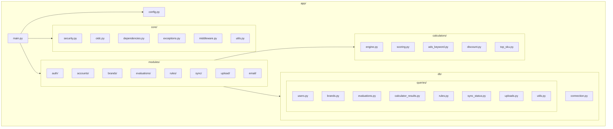
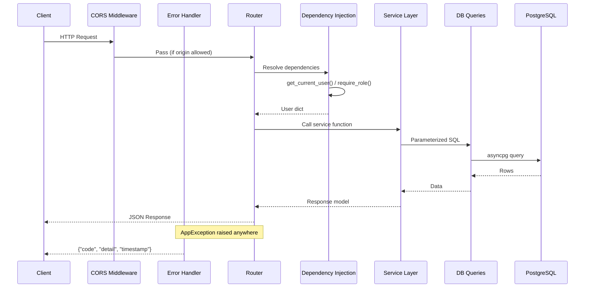
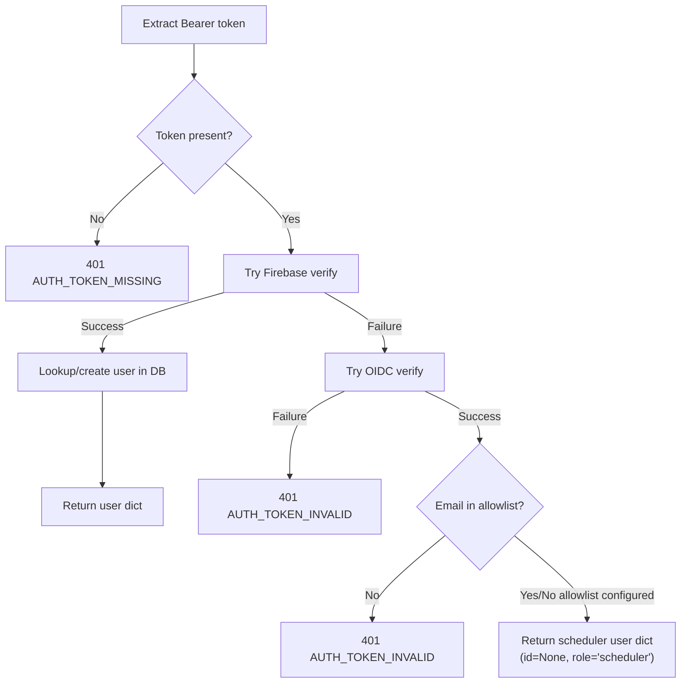
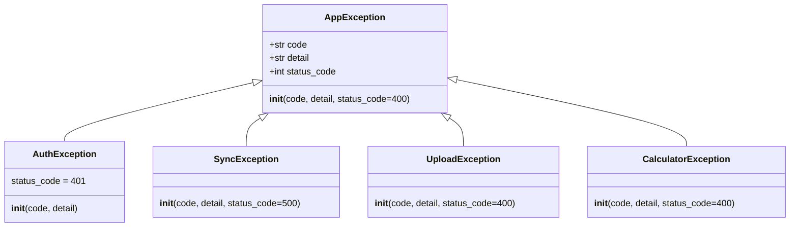

# Backend Architecture

This document covers the backend architecture of the AHA SICU application -- a FastAPI service deployed on Cloud Run with Cloud SQL PostgreSQL.

**Entry point:** `backend/app/main.py`

---

## Module Layout

The backend follows a modular structure under `app/modules/`, with each domain encapsulated in its own package.



### Module Internal Structure

Each module under `app/modules/` follows a consistent pattern:

| File | Responsibility |
|------|---------------|
| `router.py` | FastAPI route definitions, request/response wiring, dependency injection |
| `service.py` | Business logic, orchestration, DB calls via `db.connection()` |
| `schemas.py` | Pydantic models for request bodies and response shapes |

Some modules include additional domain-specific files:

- **evaluations/** -- `calculator_service.py` (bridges calculators to the evaluation domain)
- **sync/** -- `sheets_client.py` (Google Sheets API client)
- **upload/** -- `gcs_client.py` (GCS upload), `parser.py` (CSV parsing), `zip_handler.py` (ZIP extraction)
- **email/** -- `template.py` (HTML email template rendering)
- **accounts/** -- `queries.py` (module-local queries)

### Registered Modules

All routers are registered in `main.py` under the `/api/v1/` prefix:

| Module | Prefix | Purpose |
|--------|--------|---------|
| auth | `/api/v1/auth` | Login, token exchange |
| accounts | `/api/v1/accounts` | User account management |
| brands | `/api/v1/brands` | Brand CRUD, brand data |
| evaluations | `/api/v1/evaluations` | Evaluation lifecycle, calculators, scoring |
| rules | `/api/v1/rules` | Scoring rule management |
| sync | `/api/v1/sync` | Google Sheets data sync |
| upload | `/api/v1/upload` | CSV/ZIP file uploads to GCS |
| email | `/api/v1/email` | Email sending via SMTP |

---

## Request Lifecycle

Every HTTP request passes through the following layers in order:



### Layer responsibilities

1. **CORS Middleware** -- Validates `Origin` header against an allowlist of Firebase Hosting domains and localhost dev servers. Configured in `main.py`.

2. **Error Handling** -- `AppException` handler registered via `app.add_exception_handler()`. Catches any `AppException` (or subclass) and returns a structured JSON response with `code`, `detail`, and `timestamp`.

3. **Router** -- Declares endpoints, query/path parameters, response models. Delegates to service layer. Does not contain business logic.

4. **Dependency Injection** -- FastAPI `Depends()` resolves auth and authorization before the route handler runs. See [Dependency Injection](#dependency-injection) below.

5. **Service Layer** -- Contains all business logic. Acquires DB connections via `async with db.connection() as conn`, calls query functions, and returns Pydantic response models.

6. **DB Queries** -- Pure parameterized SQL functions in `app/db/queries/`. Each function takes a `conn: asyncpg.Connection` as its first argument.

---

## Calculator Engine

The `app/calculators/` package contains **pure functions with no I/O**. All data is passed in as arguments; results are returned as data structures. This separation makes calculators independently testable without database or network mocking.

| File | Purpose |
|------|---------|
| `engine.py` | Orchestration -- checks readiness and runs all available calculators for a brand |
| `scoring.py` | Final score calculation with rule-based evaluation, verdict, email/WhatsApp output |
| `ads_keyword.py` | Ads keyword analysis calculator |
| `discount.py` | Discount compliance checker |
| `top_sku.py` | Top SKU performance calculator |

The `engine.py` module provides two key functions:
- `check_calculator_readiness()` -- determines which calculators have their required data available
- `run_ready_calculators()` -- executes all calculators whose prerequisites are met, returning per-calculator status (success/skipped/error)

Calculators are invoked from the evaluations module via `calculator_service.py`, which handles loading data from the database and passing it to the pure calculator functions.

---

## Database Layer

### Connection Pool

Defined in `app/db/connection.py` as the `DatabasePool` class, exposed as a module-level singleton `db`.

| Setting | Default | Description |
|---------|---------|-------------|
| `min_size` | 1 | Minimum connections in the asyncpg pool |
| `max_size` | 5 | Maximum connections in the asyncpg pool |

Key behaviors:
- Initialized during application lifespan startup (`lifespan()` in `main.py`)
- Custom JSON/JSONB codecs registered via `_init_connection()` so asyncpg returns Python dicts instead of raw strings
- Connections acquired via async context manager: `async with db.connection() as conn`
- Pool closed on application shutdown

### Query Layer

`app/db/queries/` contains one module per domain. Each module exports async functions that accept an `asyncpg.Connection` as the first argument and use parameterized SQL (`$1`, `$2`, etc.) to prevent injection.

| Query Module | Domain |
|-------------|--------|
| `users.py` | User lookup/create by Firebase UID |
| `brands.py` | Brand CRUD |
| `evaluations.py` | Evaluation inputs, records, listing/pagination |
| `calculator_results.py` | Calculator result storage and retrieval |
| `rules.py` | Scoring rule versions |
| `sync_status.py` | Google Sheets sync tracking |
| `uploads.py` | File upload metadata |
| `utils.py` | Shared query utilities |

---

## Core Utilities

### `app/core/security.py` -- Firebase Auth

- `init_firebase(settings)` -- Initializes the Firebase Admin SDK. Local dev uses `FIREBASE_CREDENTIALS_PATH` (service account JSON file); Cloud Run uses Application Default Credentials (ADC) automatically.
- `verify_firebase_token(token)` -- Verifies a Firebase ID token asynchronously (delegates to `asyncio.to_thread` to avoid blocking the event loop). Returns `{"uid", "email"}`.

### `app/core/oidc.py` -- Google OIDC

- `verify_oidc_token(token)` -- Verifies Google OIDC tokens for service-to-service auth (Cloud Scheduler). Validates against the `cloud_run_url` audience setting. Returns `{"email", "issuer"}`.
- Reuses a single `google.auth.transport.requests.Request` instance for TCP connection pooling.

### `app/core/dependencies.py` -- Dependency Injection

See [Dependency Injection](#dependency-injection) section.

### `app/core/exceptions.py` -- Exception Hierarchy

See [Error Handling](#error-handling) section.

### `app/core/middleware.py` -- Global Error Handler

- `app_exception_handler(request, exc)` -- Registered as a FastAPI exception handler for `AppException`. Logs the error with request context and returns:
  ```json
  {
    "code": "ERROR_CODE",
    "detail": "Human-readable message",
    "timestamp": "2026-03-07T12:00:00+00:00"
  }
  ```

### `app/core/utils.py` -- Shared Helpers

- `ensure_dict(value)` -- Safely coerces a value to `dict`, handling double-encoded JSONB strings from legacy data.

---

## Dependency Injection

Authentication and authorization are handled via FastAPI's `Depends()` system in `app/core/dependencies.py`.

### `get_current_user()`

Extracts the `Bearer` token from the `Authorization` header and validates it through a dual-auth flow:



**Firebase path (human users):**
1. Verifies the Firebase ID token
2. Looks up the user by `firebase_uid` in the database
3. If not found, **auto-creates** the user record (first login)
4. Updates `last_login` timestamp
5. Returns the full user dict from the database (includes `id`, `email`, `role`, `firebase_uid`)

**OIDC path (Cloud Scheduler):**
1. Falls back to OIDC when Firebase verification fails
2. Validates the token audience against `cloud_run_url`
3. Optionally checks the service account email against `allowed_scheduler_emails`
4. Returns a synthetic user dict: `{"id": None, "email": "<sa-email>", "role": "scheduler", "firebase_uid": None}`

### `require_role(*allowed_roles)`

A dependency factory for role-based access control. Returns a dependency function that:
1. Resolves `get_current_user()`
2. Checks `current_user["role"]` against the allowed roles
3. Raises `403 RULE_ACCESS_DENIED` if unauthorized
4. Returns the user dict on success

Usage in routers:

```python
# As a route dependency (no need for user data in handler)
@router.delete("/{id}", dependencies=[Depends(require_role("leader", "admin"))])

# As a parameter dependency (need user data in handler)
async def handler(current_user: dict = Depends(require_role("leader", "admin"))):
```

---

## Error Handling

All application errors extend the `AppException` base class defined in `app/core/exceptions.py`.



| Exception | Default Status | Used By |
|-----------|---------------|---------|
| `AppException` | 400 | Generic errors, validation, 404s |
| `AuthException` | 401 | Token verification failures |
| `SyncException` | 500 | Google Sheets sync failures |
| `UploadException` | 400 | File upload/parse errors |
| `CalculatorException` | 400 | Calculator missing data, execution failures |

The global `app_exception_handler` in `middleware.py` catches all `AppException` subclasses, logs the error with request context (path, method), and returns a structured JSON response.

---

## Configuration

Application settings are managed via Pydantic `BaseSettings` in `app/config.py`, loaded from environment variables with `.env` file support.

| Group | Settings | Description |
|-------|----------|-------------|
| **Database** | `database_url`, `db_user`, `db_password`, `db_name`, `cloud_sql_instance`, `database_pool_min`, `database_pool_max` | Cloud SQL PostgreSQL connection. Direct URL for local dev; component-based construction for Cloud Run (via Unix socket). |
| **Firebase** | `firebase_credentials_path` | Admin SDK credentials. Local dev uses `FIREBASE_CREDENTIALS_PATH` (file path); Cloud Run uses Application Default Credentials (ADC) automatically. |
| **OIDC** | `cloud_run_url`, `allowed_scheduler_emails` | OIDC audience validation and service account allowlist for Cloud Scheduler auth. |
| **SMTP** | `smtp_host`, `smtp_port`, `smtp_user`, `smtp_password`, `smtp_from_name`, `smtp_from_email`, `email_enabled` | Email sending configuration. Defaults to Gmail SMTP on port 587. Gated by `email_enabled` flag. |
| **Google Sheets** | `gsheets_credentials_path`, `gsheets_credentials_json`, `gsheets_vp_spreadsheet_id`, `gsheets_vp_range`, `gsheets_meeting_spreadsheet_id`, `gsheets_meeting_range` | Credentials and spreadsheet IDs for VP and 1st Meeting data sync. |
| **GCS** | `gcs_upload_bucket` | Bucket name for file uploads. Empty string triggers local dev fallback. |

The `effective_database_url` property handles URL construction: if `database_url` is set directly it is used as-is; otherwise, a Cloud SQL Unix socket URL is built from `db_user`, `db_password`, `db_name`, and `cloud_sql_instance`.

A module-level singleton `settings = Settings()` is imported throughout the application.

---

## Application Startup

The `lifespan()` async context manager in `main.py` handles startup and shutdown:

**Startup:**
1. Initialize Firebase Admin SDK (if credentials configured)
2. Initialize asyncpg connection pool (if database URL available)

**Shutdown:**
1. Close the asyncpg connection pool

CORS middleware is configured with an explicit origin allowlist covering localhost dev servers and Firebase Hosting domains (`aha-coms-sicu-dev`, `aha-coms-sicu-prod`).
