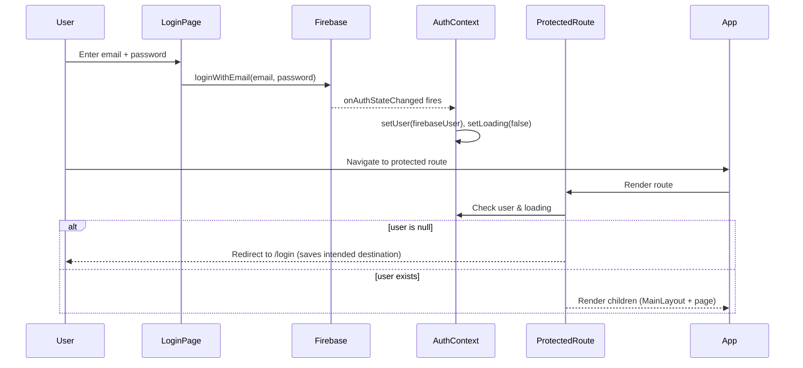
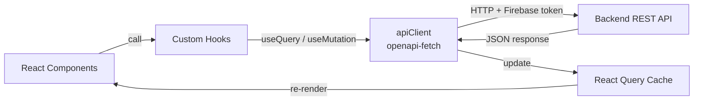
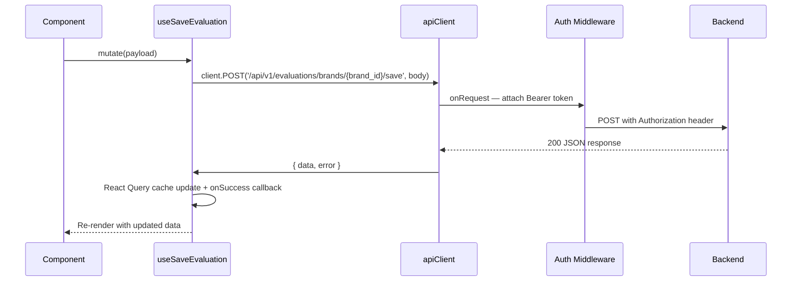

# Frontend Architecture

This document describes the frontend architecture of AHA SICU (Store ICU), a React single-page application built with Vite, TypeScript strict mode, and Tailwind CSS v4.

---

## Technology Stack

| Category         | Technology                                      |
|------------------|------------------------------------------------|
| Framework        | React 19 + TypeScript ~5.9                      |
| Build tool       | Vite 7                                          |
| Styling          | Tailwind CSS 4 + tw-animate-css                 |
| Routing          | react-router-dom 7                              |
| Server state     | @tanstack/react-query 5 (React Query)           |
| Tables           | @tanstack/react-table 8                         |
| Forms            | react-hook-form 7                               |
| UI primitives    | Radix UI (via radix-ui package) + shadcn         |
| Icons            | lucide-react                                    |
| Charts           | recharts 3                                      |
| Auth provider    | Firebase 12 (email/password)                    |
| API client       | openapi-fetch 0.15                              |
| i18n             | i18next + react-i18next (Indonesian locale)     |
| Theme            | next-themes                                     |
| Toasts           | sonner                                          |
| Date utilities   | date-fns 4                                      |
| Image export     | html-to-image                                   |
| Testing          | Vitest 4 + Testing Library (React, user-event)  |

---

## Pages and Routes

All protected routes are wrapped in `ProtectedRoute` and rendered inside `MainLayout` via a layout route. Role-restricted routes additionally wrap their element in `RoleProtectedRoute`.

| Path                     | Page Component        | Access       | Description                              |
|--------------------------|-----------------------|--------------|------------------------------------------|
| `/`                      | --                    | redirect     | Redirects to `/dashboard`                |
| `/login`                 | `LoginPage`           | public       | Firebase email/password login            |
| `/dashboard`             | `DashboardPage`       | protected    | Overview dashboard                       |
| `/brands`                | `BrandsPage`          | protected    | Brand listing with search and sync       |
| `/evaluation/:brandId`   | `EvaluationPage`      | protected    | Multi-section evaluation form for a brand|
| `/history`               | `HistoryPage`         | protected    | Evaluation history list                  |
| `/history/:id`           | `EvaluationDetailPage`| protected    | Read-only evaluation detail view         |
| `/rules`                 | `RulesPage`           | leader/admin | Scoring rule configuration               |
| `/accounts`              | `AccountsPage`        | admin        | User account management                  |

Defined in `frontend/src/App.tsx`.

---

## Component Organization

```
frontend/src/components/
  auth/             ProtectedRoute, RoleProtectedRoute
  brands/           Brand list table, brand cards
  dashboard/        Dashboard widgets, summary cards, charts
  evaluation/       Multi-step evaluation form, section panels, forms/formConfig.ts
  evaluations/      History table, grouped evaluation views
  layout/           MainLayout (sidebar + header + Outlet)
  rules/            Rule editor components
  sync/             Google Sheets sync trigger and status
  ui/               Shared UI primitives (Radix UI + shadcn)
```

### Shared UI Primitives (`ui/`)

Built on Radix UI via shadcn conventions. Each file exports a single composable component:

badge, button, calendar, card, collapsible, dialog, input, label, popover, progress, radio-group, select, sonner (toast), table, tabs.

---

## State Management

The frontend uses **no global state library** (no Redux, no Zustand). All state is handled through three mechanisms:

| Concern       | Solution                                         |
|---------------|--------------------------------------------------|
| Server state  | React Query v5 (`useQuery` / `useMutation`)      |
| UI state      | React `useState` in components                   |
| Auth state    | `AuthContext` (React Context + Firebase listener) |
| Theme state   | `next-themes` `ThemeProvider`                     |

React Query is configured at the app root via `QueryClientProvider` with a default `QueryClient` instance.

---

## API Client

**File:** `frontend/src/services/apiClient.ts`

Built with `openapi-fetch`, the client provides type-safe HTTP calls against an inline `paths` interface that mirrors the backend OpenAPI schema.

### Middleware Stack

Two middleware functions are registered on the client (executed in order):

1. **Auth middleware** (`onRequest`) -- Retrieves the current Firebase ID token via `getCurrentUserToken()` and attaches it as a `Bearer` token in the `Authorization` header.

2. **Server error middleware** (`onResponse`) -- On any HTTP 500 response, dispatches a `CustomEvent('api-server-error')` on `window`. The `App` component listens for this event and shows a `DowntimeWarningDialog`.

### Usage Pattern

```typescript
import client from '../services/apiClient';

// Type-safe — path and response types are enforced at compile time
const { data, error } = await client.GET('/api/v1/brands', {
  params: { query: { page: 1, limit: 20 } },
});
```

---

## Authentication Flow



### Role Protection

`RoleProtectedRoute` adds an additional layer on top of `ProtectedRoute`. It fetches the user profile (including `role`) via the `useCurrentUser` hook (calls `/api/v1/me`) and checks against an `allowedRoles` array.

- **`/rules`** -- allowed for `leader` and `admin`
- **`/accounts`** -- allowed for `admin` only

If the role check fails, the user is redirected to `/dashboard` with a `sonner` toast error.

**Key files:**
- `frontend/src/context/AuthContext.tsx` -- Context provider with `onAuthStateChanged` listener
- `frontend/src/components/auth/ProtectedRoute.tsx` -- Redirects unauthenticated users
- `frontend/src/components/auth/RoleProtectedRoute.tsx` -- Redirects users without the required role

---

## Form Management

### react-hook-form

Used for validation logic across evaluation forms.

### useAutoSaveForm Hook

**File:** `frontend/src/hooks/useAutoSaveForm.ts`

A custom hook that provides debounced auto-save with optimistic local state. Key behaviors:

1. **Deep merge on init** -- Merges server-returned `initialData` into `EMPTY_MANUAL_DATA` defaults so that missing fields are initialized to `null`.
2. **Local overrides** -- Field changes are stored as local overrides (`localOverrides` state) and merged with the server base data for rendering, avoiding stale closures.
3. **Debounced save** -- `triggerSave()` debounces with a 500ms delay. Only the latest pending data is sent.
4. **Retry** -- `retrySave()` immediately sends the current merged data (local overrides + server base) without debounce.
5. **Save status** -- Exposes `saveStatus` (`idle` | `saving` | `saved` | `error`) and `lastSaved` timestamp.

### formConfig.ts

**File:** `frontend/src/components/evaluation/forms/formConfig.ts`

Defines the evaluation form schema as TypeScript interfaces and field definition arrays. Eight data categories are defined:

| Category      | Interface          | Field Count |
|---------------|--------------------|-------------|
| operational   | `OperationalData`  | 5           |
| business      | `BusinessData`     | 8           |
| visitors      | `VisitorsData`     | 3           |
| promoTools    | `PromoToolsData`   | 11          |
| products      | `ProductsData`     | 2           |
| ads           | `AdsData`          | 2           |
| campaign      | `CampaignData`     | 2           |
| competition   | `CompetitionData`  | 15 (3x5)    |

Each `FieldDefinition` includes: `key`, `label`, `inputType` (`number` | `currency` | `text` | `select`), optional `unit`, `benchmark`, `threshold`, and `link`.

The file also exports utility functions: `formatIDR`, `parseIDR`, `generateMonthLabels`, `computeSectionProgress`.

---

## Internationalization (i18n)

**File:** `frontend/src/i18n.ts`

Configured with `i18next` and `react-i18next`. The application uses a single Indonesian (`id`) locale loaded from `frontend/src/locales/id.json` (~400+ translation keys). No language switching is exposed to users.

```typescript
i18n.use(initReactI18next).init({
  resources: { id: { translation: id } },
  lng: 'id',
  interpolation: { escapeValue: false },
});
```

---

## Custom Hooks

All data-fetching hooks are thin wrappers around React Query's `useQuery` and `useMutation`, calling the typed `apiClient`.

| Hook                       | Type       | Purpose                                           |
|----------------------------|------------|---------------------------------------------------|
| `useCurrentUser`           | query      | Fetch authenticated user profile (`/api/v1/me`)   |
| `useBrands`                | query      | Paginated brand list with search                  |
| `useBrandDetail`           | query      | Single brand by ID                                |
| `useBrandEvaluations`      | query      | Evaluations for a specific brand                  |
| `useEvaluation`            | query+mut  | Evaluation inputs (GET + PUT manual data)          |
| `useEvaluationDetail`      | query      | Single evaluation detail by ID                    |
| `useEvaluationHistory`     | query      | Paginated evaluation history list                 |
| `useGroupedEvaluations`    | query      | Evaluations grouped by brand                      |
| `useDeleteEvaluation`      | mutation   | Delete an evaluation                              |
| `useCalculator`            | query+mut  | Calculator results and trigger endpoints           |
| `useScoring`               | mutation   | Trigger score calculation for a brand              |
| `useSaveEvaluation`        | mutation   | Save finalized evaluation                         |
| `useAutoSaveForm`          | mutation   | Debounced auto-save for manual form data           |
| `useUpload`                | mutation   | Signed URL upload flow (get URL, upload, process)  |
| `useSync`                  | query+mut  | Google Sheets sync status and trigger              |
| `useRules`                 | query      | Fetch scoring rules                               |
| `useUpdateRule`            | mutation   | Update a scoring rule template                    |
| `useAccounts`              | query+mut  | Account CRUD (list, create, update role, delete)   |
| `useSendEmail`             | mutation   | Send evaluation report email                      |

---

## Data Flow



Detailed flow for a typical mutation (e.g., saving an evaluation):



---

## Application Bootstrap

**File:** `frontend/src/main.tsx`

The application mounts in this order:

1. `React.StrictMode`
2. `ThemeProvider` (next-themes, default `light`, system detection disabled)
3. `App` component, which provides:
   - `QueryClientProvider` (React Query)
   - `BrowserRouter` (react-router-dom)
   - `AuthProvider` (Firebase auth context)
   - Skip-to-content accessibility link
   - `DowntimeWarningDialog` (triggered by 500 errors)
   - `Routes` (page routing)
   - `Toaster` (sonner toast notifications)

```
StrictMode
  ThemeProvider
    QueryClientProvider
      BrowserRouter
        AuthProvider
          DowntimeWarningDialog
          Routes
            /login        -> LoginPage
            ProtectedRoute + MainLayout
              /dashboard  -> DashboardPage
              /brands     -> BrandsPage
              /evaluation/:brandId -> EvaluationPage
              /history    -> HistoryPage
              /history/:id -> EvaluationDetailPage
              /rules      -> RoleProtectedRoute(leader,admin) -> RulesPage
              /accounts   -> RoleProtectedRoute(admin) -> AccountsPage
            /             -> redirect /dashboard
          Toaster
```
