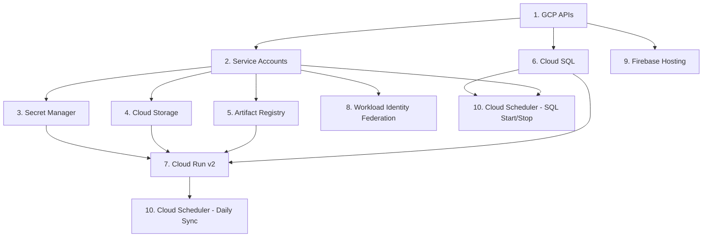

# Architecture: Infrastructure

This document describes the GCP infrastructure for AHA SICU, managed via Terraform in `infrastructure/terraform/`.

---

## GCP Resource Inventory

| Resource | Service | Name Pattern | Notes |
|---|---|---|---|
| Cloud Run v2 | Compute | `aha-coms-sicu-{env}-api` | Backend API, 1 CPU / 1Gi, 0-2 instances, deletion protection in prod |
| Cloud SQL | Database | `aha-sicu-db` (single instance) | PostgreSQL 18, db-f1-micro, hosts `aha_coms_sicu_dev` + `aha_coms_sicu_prod` databases |
| Artifact Registry | Container Registry | `aha-coms-sicu-{env}-registry` | Docker format, keeps latest 2 images, deletes versions older than 1 day |
| Secret Manager | Secrets | `aha_coms_sicu_{env}_*` | 4 secrets: `db_password`, `gsheets_credentials`, `firebase_admin`, `smtp_password` |
| Cloud Storage | Object Storage | `{project_id}-aha-coms-sicu-{env}-uploads` | Temporary uploads, 24h auto-delete lifecycle, uniform bucket-level access |
| Firebase Hosting | Frontend | `aha-coms-sicu-{env}` | SPA hosting, deployed via Firebase CLI |
| Cloud Scheduler | Cron | `aha-coms-sicu-{env}-daily-sync` | Daily brand sync at 08:30 WIB weekdays |
| Cloud Scheduler | Cron | `aha-coms-sicu-sql-start` | Start Cloud SQL at 08:00 WIB weekdays |
| Cloud Scheduler | Cron | `aha-coms-sicu-sql-stop` | Stop Cloud SQL at 18:30 WIB weekdays |
| Workload Identity | Auth | `aha-coms-sicu-{env}-github-pool` | Keyless GitHub Actions OIDC federation |

Region: `asia-southeast2` (Jakarta) for all resources.

---

## Terraform Module Structure

Infrastructure uses a modular design with shared resources at root and per-environment resources in a reusable module.

### Root Module

| File | Purpose |
|---|---|
| `main.tf` | Provider config, API enablement (9 APIs), module calls for dev + prod |
| `variables.tf` | Shared input variables (project_id, region, github_repo, Cloud SQL config, etc.) |
| `outputs.tf` | Per-environment outputs prefixed with `dev_` or `prod_` + shared Cloud SQL outputs |
| `cloud_sql.tf` | Shared Cloud SQL instance, app user, SQL scheduler SA, start/stop jobs |

### Environment Module (`modules/environment/`)

| File | Purpose |
|---|---|
| `main.tf` | All per-environment resources: SAs, IAM, secrets, Cloud Run, Firebase, GCS, Artifact Registry, WIF, Scheduler |
| `variables.tf` | Module input variables passed from root |
| `outputs.tf` | Cloud Run URL, Artifact Registry URL, SA emails, WIF provider path, GCS bucket, Firebase site |

A single `terraform apply` provisions both environments. Each module call passes environment-specific values (CORS origins, etc.).

---

## Service Accounts

Five service accounts follow the naming convention `aha-coms-sicu-{env}-{purpose}-sa`.

| Service Account | ID Pattern | Purpose | Key Roles |
|---|---|---|---|
| Cloud Run API | `aha-coms-sicu-{env}-api-sa` | Runtime identity for the backend | `secretmanager.secretAccessor` (4 secrets), `storage.objectAdmin` (upload bucket), `cloudsql.client`, `firebaseauth.admin`, `iam.serviceAccountTokenCreator` (self, for signed URLs) |
| Deploy | `aha-coms-sicu-{env}-deploy-sa` | GitHub Actions CI/CD | `run.admin`, `artifactregistry.writer`, `firebasehosting.admin`, `iam.serviceAccountUser` (on Cloud Run SA), `cloudsql.client`, `cloudsql.editor`, `secretmanager.secretAccessor` (db_password) |
| Scheduler | `aha-coms-sicu-{env}-sched-sa` | Cloud Scheduler daily sync | `run.invoker` (on Cloud Run v2 service) |
| SQL Scheduler | `aha-coms-sicu-sql-sched-sa` | Cloud SQL start/stop (shared) | `cloudsql.admin` |
| Google Sheets | `aha-coms-sicu-{env}-sheets-sa` | Sheets API access for brand sync | (Share target Sheet with this SA email) |

Note: No SA keys are generated. The Deploy SA authenticates via Workload Identity Federation. The Scheduler and SQL Scheduler SAs use OAuth tokens injected by Cloud Scheduler. The Sheets SA credentials are stored as a secret.

---

## Workload Identity Federation

GitHub Actions authenticates to GCP without service account keys using OIDC.

**Flow:** GitHub OIDC token --> Workload Identity Pool --> Provider validates `assertion.repository` --> Deploy SA impersonation

**Configuration:**

- **Pool:** `aha-coms-sicu-{env}-github-pool`
- **Provider:** `github-provider` with issuer `https://token.actions.githubusercontent.com`
- **Attribute mapping:**
  - `google.subject` = `assertion.sub`
  - `attribute.actor` = `assertion.actor`
  - `attribute.repository` = `assertion.repository`
- **Attribute condition:** `assertion.repository == "{owner/repo}"` -- restricts access to a single repository
- **SA binding:** `roles/iam.workloadIdentityUser` granted to `principalSet` matching the repository attribute

---

## Cloud SQL

A single `db-f1-micro` instance running PostgreSQL 18 hosts both environments.

| Property | Value |
|---|---|
| Instance name | `aha-sicu-db` |
| Version | `POSTGRES_18` |
| Tier | `db-f1-micro` |
| Disk | 10 GB PD-SSD |
| Availability | Zonal |
| Edition | Enterprise |
| SSL | `ENCRYPTED_ONLY` |
| Backups | Enabled (PITR, 7 retained) |
| Deletion protection | Enabled |

**Databases:** `aha_coms_sicu_dev` and `aha_coms_sicu_prod` on the same instance (created by environment module).

**User:** `aha_sicu` -- password managed via Secret Manager, not Terraform state.

**Scheduled start/stop** for cost optimization (weekdays only):

| Job | Schedule (WIB) | Action |
|---|---|---|
| `aha-coms-sicu-sql-start` | 08:00 Mon-Fri | `activationPolicy = ALWAYS` |
| `aha-coms-sicu-sql-stop` | 18:30 Mon-Fri | `activationPolicy = NEVER` |

Both jobs call the SQL Admin API directly via the `aha-coms-sicu-sql-sched-sa` service account OAuth token.

---

## Secret Manager

Terraform creates the secret resources but does **not** manage values. Values are injected via `gcloud`:

```bash
echo -n "VALUE" | gcloud secrets versions add aha_coms_sicu_{env}_db_password --data-file=-
echo -n "VALUE" | gcloud secrets versions add aha_coms_sicu_{env}_gsheets_credentials --data-file=-
echo -n "VALUE" | gcloud secrets versions add aha_coms_sicu_{env}_firebase_admin --data-file=-
echo -n "VALUE" | gcloud secrets versions add aha_coms_sicu_{env}_smtp_password --data-file=-
```

Secrets are mounted as environment variables in Cloud Run via `value_source.secret_key_ref` (not volume mounts):

| Secret | Cloud Run Env Var |
|---|---|
| `aha_coms_sicu_{env}_db_password` | `DB_PASSWORD` |
| `aha_coms_sicu_{env}_gsheets_credentials` | `GSHEETS_CREDENTIALS_JSON` |
| `aha_coms_sicu_{env}_smtp_password` | `SMTP_PASSWORD` |

Note: Firebase Admin SDK uses Application Default Credentials (ADC) on Cloud Run -- no secret mapping needed.

---

## Cloud Storage (GCS)

| Property | Value |
|---|---|
| Bucket name | `{project_id}-aha-coms-sicu-{env}-uploads` |
| Location | `asia-southeast2` |
| Bucket-level access | Uniform (no ACLs) |
| Lifecycle | Delete objects after 1 day (24h) |
| Force destroy | Enabled in dev, disabled in prod |
| CORS origins | Dev: `https://aha-coms-sicu-dev.web.app`, `http://localhost:5173`; Prod: `https://aha-coms-sicu-prod.web.app` |
| CORS methods | `PUT` |
| IAM | Cloud Run SA gets `roles/storage.objectAdmin` (bucket-scoped, not project-wide) |

---

## Cloud Scheduler

| Job | Schedule (WIB) | Target | Auth |
|---|---|---|---|
| `aha-coms-sicu-{env}-daily-sync` | 08:30 Mon-Fri | `POST {cloud_run_url}/api/v1/sync` | OIDC token via Scheduler SA |
| `aha-coms-sicu-sql-start` | 08:00 Mon-Fri | `PATCH sqladmin.googleapis.com/.../instances/{name}` | OAuth token via SQL Scheduler SA |
| `aha-coms-sicu-sql-stop` | 18:30 Mon-Fri | `PATCH sqladmin.googleapis.com/.../instances/{name}` | OAuth token via SQL Scheduler SA |

The daily sync job retries up to 3 times with backoff between 30s and 300s.

---

## Security Model

- **Least-privilege service accounts:** Each SA has only the roles it needs, scoped to specific resources where possible (e.g., bucket-level IAM, per-secret accessor bindings).
- **No SA keys:** Deploy SA uses Workload Identity Federation (OIDC). Scheduler SAs use Cloud Scheduler-injected tokens. Sheets SA credentials are stored in Secret Manager.
- **Secret externalization:** All sensitive values live in Secret Manager, never in Terraform state or environment config files.
- **Uniform bucket-level access:** No object ACLs; access controlled entirely via IAM.
- **Deletion protection:** Enabled on Cloud Run (prod) and Cloud SQL instance.
- **Repository-scoped OIDC:** Workload Identity attribute condition restricts federation to a single GitHub repository.
- **Encrypted-only SQL connections:** `ssl_mode = "ENCRYPTED_ONLY"` on Cloud SQL.
- **Automated backups:** Cloud SQL PITR enabled with 7 retained backups. Pre-deploy backups created before prod migrations.

---

## Environment Separation

Both environments are provisioned by a single `terraform apply` using the environment module pattern:

```hcl
module "dev"  { source = "./modules/environment"; environment = "dev";  ... }
module "prod" { source = "./modules/environment"; environment = "prod"; ... }
```

The Cloud SQL instance is shared; environment separation happens at the database level (`aha_coms_sicu_dev` vs `aha_coms_sicu_prod`). Each environment has its own Cloud Run service, service accounts, secrets, storage bucket, Artifact Registry, Firebase Hosting site, and Workload Identity pool.

---

## Bootstrap Sequence

Resources must be provisioned in dependency order. The following diagram shows the required sequence:



**Step-by-step:**

1. **APIs** -- Enable all required GCP APIs (`main.tf`).
2. **Service Accounts** -- Create all SAs and their IAM bindings (environment module).
3. **Secret Manager** -- Create secret resources and accessor bindings. Inject values via `gcloud`.
4. **Cloud Storage** -- Create upload bucket with lifecycle and CORS.
5. **Artifact Registry** -- Create Docker repository. Push an initial image.
6. **Cloud SQL** -- Create instance (`cloud_sql.tf`) and per-env databases (environment module). Set DB password via Secret Manager.
7. **Cloud Run v2** -- Deploy service with secrets, SQL connector, and env vars.
8. **Workload Identity** -- Create pool and provider for GitHub Actions.
9. **Firebase Hosting** -- Create hosting site. Deploy frontend via Firebase CLI.
10. **Cloud Scheduler** -- Create daily sync (environment module) and SQL start/stop jobs (`cloud_sql.tf`).
