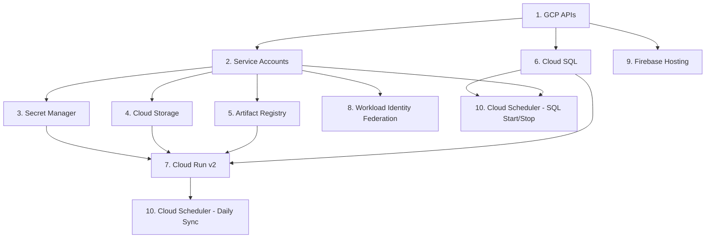

# Architecture: Infrastructure

This document describes the GCP infrastructure for AHA SICU, managed via Terraform in `infrastructure/terraform/`.

---

## GCP Resource Inventory

| Resource | Service | Name Pattern | Notes |
|---|---|---|---|
| Cloud Run v2 | Compute | `aha-sicu-{env}-api` | Backend API, 1 CPU / 1Gi, 0-2 instances, deletion protection in prod |
| Cloud SQL | Database | `aha-sicu-db` (single instance) | PostgreSQL 18, db-f1-micro, hosts `aha_sicu_dev` + `aha_sicu_prod` databases |
| Artifact Registry | Container Registry | `aha-sicu-{env}-registry` | Docker format, keeps latest 2 images, deletes versions older than 1 day |
| Secret Manager | Secrets | `aha_sicu_{env}_*` | 4 secrets: `db_password`, `gsheets_credentials`, `firebase_admin`, `smtp_password` |
| Cloud Storage | Object Storage | `{project_id}-aha-sicu-{env}-uploads` | Temporary uploads, 24h auto-delete lifecycle, uniform bucket-level access |
| Firebase Hosting | Frontend | `aha-sicu-{env}` | SPA hosting, deployed via Firebase CLI |
| Cloud Scheduler | Cron | `aha-sicu-{env}-daily-sync` | Daily brand sync at 02:00 UTC (09:00 WIB) |
| Cloud Scheduler | Cron | `aha-sicu-cloud-sql-start` | Start Cloud SQL at 01:30 UTC (08:30 WIB) |
| Cloud Scheduler | Cron | `aha-sicu-cloud-sql-stop` | Stop Cloud SQL at 11:30 UTC (18:30 WIB) |
| Workload Identity | Auth | `aha-sicu-{env}-github-pool` | Keyless GitHub Actions OIDC federation |

Region: `asia-southeast2` (Jakarta) for all resources.

---

## Terraform Module Breakdown

| File | Purpose |
|---|---|
| `main.tf` | Provider config, required API enablement (8 APIs), Google Sheets SA |
| `variables.tf` | All input variables with defaults and validation |
| `outputs.tf` | Downstream values: Cloud Run URL, Artifact Registry URL, WI provider path, SA emails, SQL connection name |
| `iam.tf` | 3 service accounts (cloud_run, deploy, scheduler) + IAM bindings |
| `cloud_run.tf` | Cloud Run v2 service, env vars, secret mounts, Cloud SQL connector, public access IAM |
| `cloud_sql.tf` | SQL instance, dual databases, app user, sql_scheduler SA, start/stop scheduler jobs |
| `artifact_registry.tf` | Docker repository with cleanup policies |
| `secrets.tf` | 4 Secret Manager secrets + IAM accessor bindings for Cloud Run and Deploy SAs |
| `storage.tf` | GCS upload bucket with lifecycle, CORS, and bucket-level IAM |
| `firebase.tf` | Firebase Hosting site resource (deployment via CLI) |
| `workload_identity.tf` | WI pool, OIDC provider, attribute mapping and condition, SA impersonation binding |
| `scheduler.tf` | Daily sync Cloud Scheduler job targeting `POST /api/v1/sync` |

---

## Service Accounts

Four service accounts follow the naming convention `aha-sicu-{env}-{purpose}-sa`.

| Service Account | ID Pattern | Purpose | Key Roles |
|---|---|---|---|
| Cloud Run API | `aha-sicu-{env}-api-sa` | Runtime identity for the backend | `secretmanager.secretAccessor` (4 secrets), `storage.objectAdmin` (upload bucket), `cloudsql.client`, `firebaseauth.admin`, `iam.serviceAccountTokenCreator` (self, for signed URLs) |
| Deploy | `aha-sicu-{env}-deploy-sa` | GitHub Actions CI/CD | `run.admin`, `artifactregistry.writer`, `firebasehosting.admin`, `iam.serviceAccountUser` (on Cloud Run SA), `cloudsql.client`, `secretmanager.secretAccessor` (db_password) |
| Scheduler | `aha-sicu-{env}-scheduler-sa` | Cloud Scheduler daily sync | `run.invoker` (on Cloud Run v2 service) |
| SQL Scheduler | `aha-sicu-sql-scheduler-sa` | Cloud SQL start/stop | `cloudsql.admin` |
| Google Sheets | `aha-sicu-{env}-sheets-sa` | Sheets API access for brand sync | (Share target Sheet with this SA email) |

Note: No SA keys are generated. The Deploy SA authenticates via Workload Identity Federation. The Scheduler and SQL Scheduler SAs use OAuth tokens injected by Cloud Scheduler. The Sheets SA credentials are stored as a secret.

---

## Workload Identity Federation

GitHub Actions authenticates to GCP without service account keys using OIDC.

**Flow:** GitHub OIDC token --> Workload Identity Pool --> Provider validates `assertion.repository` --> Deploy SA impersonation

**Configuration:**

- **Pool:** `aha-sicu-{env}-github-pool`
- **Provider:** `github-provider` with issuer `https://token.actions.githubusercontent.com`
- **Attribute mapping:**
  - `google.subject` = `assertion.sub`
  - `attribute.actor` = `assertion.actor`
  - `attribute.repository` = `assertion.repository`
- **Attribute condition:** `assertion.repository == "{owner/repo}"` -- restricts access to a single repository
- **SA binding:** `roles/iam.workloadIdentityUser` granted to `principalSet` matching the repository attribute

---

## Cloud SQL

A single `db-f1-micro` instance running PostgreSQL 18 hosts both environments.

| Property | Value |
|---|---|
| Instance name | `aha-sicu-db` |
| Version | `POSTGRES_18` |
| Tier | `db-f1-micro` |
| Disk | 10 GB PD-SSD |
| Availability | Zonal |
| Edition | Enterprise |
| SSL | `ENCRYPTED_ONLY` |
| Backups | Disabled (cost optimization) |
| Deletion protection | Enabled in prod |

**Databases:** `aha_sicu_dev` and `aha_sicu_prod` on the same instance.

**User:** `aha_sicu` -- password managed via Secret Manager, not Terraform state.

**Scheduled start/stop** for cost optimization:

| Job | Schedule (UTC) | Local Time (WIB) | Action |
|---|---|---|---|
| `aha-sicu-cloud-sql-start` | `30 1 * * *` | 08:30 | `activationPolicy = ALWAYS` |
| `aha-sicu-cloud-sql-stop` | `30 11 * * *` | 18:30 | `activationPolicy = NEVER` |

Both jobs call the SQL Admin API directly via the `aha-sicu-sql-scheduler-sa` service account OAuth token.

---

## Secret Manager

Terraform creates the secret resources but does **not** manage values. Values are injected via `gcloud`:

```bash
echo -n "VALUE" | gcloud secrets versions add aha_sicu_{env}_db_password --data-file=-
echo -n "VALUE" | gcloud secrets versions add aha_sicu_{env}_gsheets_credentials --data-file=-
echo -n "VALUE" | gcloud secrets versions add aha_sicu_{env}_firebase_admin --data-file=-
echo -n "VALUE" | gcloud secrets versions add aha_sicu_{env}_smtp_password --data-file=-
```

Secrets are mounted as environment variables in Cloud Run via `value_source.secret_key_ref` (not volume mounts):

| Secret | Cloud Run Env Var |
|---|---|
| `aha_sicu_{env}_db_password` | `DB_PASSWORD` |
| `aha_sicu_{env}_gsheets_credentials` | `GSHEETS_CREDENTIALS_JSON` |
| `aha_sicu_{env}_firebase_admin` | `FIREBASE_CREDENTIALS_JSON` |
| `aha_sicu_{env}_smtp_password` | `SMTP_PASSWORD` |

---

## Cloud Storage (GCS)

| Property | Value |
|---|---|
| Bucket name | `{project_id}-aha-sicu-{env}-uploads` |
| Location | `asia-southeast2` |
| Bucket-level access | Uniform (no ACLs) |
| Lifecycle | Delete objects after 1 day (24h) |
| Force destroy | Enabled in dev, disabled in prod |
| CORS origins | `https://aha-sicu-dev.web.app`, `http://localhost:5173` |
| CORS methods | `PUT` |
| IAM | Cloud Run SA gets `roles/storage.objectAdmin` (bucket-scoped, not project-wide) |

---

## Cloud Scheduler

| Job | Schedule | Target | Auth |
|---|---|---|---|
| `aha-sicu-{env}-daily-sync` | `0 2 * * *` UTC (09:00 WIB) | `POST {cloud_run_url}/api/v1/sync` | OIDC token via Scheduler SA |
| `aha-sicu-cloud-sql-start` | `30 1 * * *` UTC (08:30 WIB) | `PATCH sqladmin.googleapis.com/.../instances/{name}` | OAuth token via SQL Scheduler SA |
| `aha-sicu-cloud-sql-stop` | `30 11 * * *` UTC (18:30 WIB) | `PATCH sqladmin.googleapis.com/.../instances/{name}` | OAuth token via SQL Scheduler SA |

The daily sync job retries up to 3 times with backoff between 30s and 300s.

---

## Security Model

- **Least-privilege service accounts:** Each SA has only the roles it needs, scoped to specific resources where possible (e.g., bucket-level IAM, per-secret accessor bindings).
- **No SA keys:** Deploy SA uses Workload Identity Federation (OIDC). Scheduler SAs use Cloud Scheduler-injected tokens. Sheets SA credentials are stored in Secret Manager.
- **Secret externalization:** All sensitive values live in Secret Manager, never in Terraform state or environment config files.
- **Uniform bucket-level access:** No object ACLs; access controlled entirely via IAM.
- **Deletion protection:** Enabled on Cloud Run and Cloud SQL in prod (`var.environment == "prod"`).
- **Repository-scoped OIDC:** Workload Identity attribute condition restricts federation to a single GitHub repository.
- **Encrypted-only SQL connections:** `ssl_mode = "ENCRYPTED_ONLY"` on Cloud SQL.

---

## Environment Separation

Both environments share the same Terraform configuration, differentiated by variable files:

- `dev.tfvars` -- development settings (no deletion protection, force_destroy on bucket)
- `prod.tfvars` -- production settings (deletion protection enabled, no force_destroy)

The Cloud SQL instance is shared; environment separation happens at the database level (`aha_sicu_dev` vs `aha_sicu_prod`). Each environment has its own Cloud Run service, service accounts, secrets, storage bucket, Artifact Registry, and Workload Identity pool.

---

## Bootstrap Sequence

Resources must be provisioned in dependency order. The following diagram shows the required sequence:



**Step-by-step:**

1. **APIs** -- Enable all required GCP APIs (`main.tf`).
2. **Service Accounts** -- Create all 4+1 SAs and their IAM bindings (`iam.tf`, `cloud_sql.tf`, `main.tf`).
3. **Secret Manager** -- Create secret resources and accessor bindings (`secrets.tf`). Inject values via `gcloud`.
4. **Cloud Storage** -- Create upload bucket with lifecycle and CORS (`storage.tf`).
5. **Artifact Registry** -- Create Docker repository (`artifact_registry.tf`). Push an initial image.
6. **Cloud SQL** -- Create instance and databases (`cloud_sql.tf`). Set DB password via Secret Manager.
7. **Cloud Run v2** -- Deploy service with secrets, SQL connector, and env vars (`cloud_run.tf`).
8. **Workload Identity** -- Create pool and provider for GitHub Actions (`workload_identity.tf`).
9. **Firebase Hosting** -- Create hosting site (`firebase.tf`). Deploy frontend via Firebase CLI.
10. **Cloud Scheduler** -- Create daily sync and SQL start/stop jobs (`scheduler.tf`, `cloud_sql.tf`).
