# Data Models

Database schema reference for AHA SICU. PostgreSQL with asyncpg driver, managed by Alembic migrations.

---

## ER Diagram

```mermaid
erDiagram
    users {
        SERIAL id PK
        VARCHAR_128 firebase_uid UK "NOT NULL"
        VARCHAR_255 email "NOT NULL"
        VARCHAR_20 role "DEFAULT 'member'"
        TIMESTAMPTZ created_at "DEFAULT NOW()"
        TIMESTAMPTZ last_login
    }

    brand_vp_data {
        SERIAL id PK
        VARCHAR_255 brand_name UK "NOT NULL"
        JSONB raw_data "NOT NULL"
        TIMESTAMPTZ created_at "DEFAULT NOW()"
        TIMESTAMPTZ updated_at "DEFAULT NOW()"
    }

    brand_meeting_data {
        SERIAL id PK
        VARCHAR_255 brand_name UK "NOT NULL"
        JSONB raw_data "NOT NULL"
        TIMESTAMPTZ created_at "DEFAULT NOW()"
        TIMESTAMPTZ updated_at "DEFAULT NOW()"
    }

    evaluation_inputs {
        SERIAL id PK
        INTEGER brand_id FK "NOT NULL, UNIQUE"
        INTEGER last_edited_by FK "NULLABLE"
        VARCHAR_20 category_type
        JSONB manual_data "DEFAULT '{}'"
        TIMESTAMPTZ created_at "DEFAULT NOW()"
        TIMESTAMPTZ updated_at "DEFAULT NOW()"
    }

    brand_uploads {
        SERIAL id PK
        INTEGER brand_id FK "NOT NULL"
        VARCHAR_50 file_type "NOT NULL"
        VARCHAR_100 calculator_target "NOT NULL"
        VARCHAR_255 filename "NOT NULL"
        INTEGER file_size "NOT NULL"
        INTEGER row_count
        JSONB parsed_data "NOT NULL"
        INTEGER uploaded_by FK "NULLABLE"
        TIMESTAMPTZ uploaded_at "DEFAULT NOW()"
    }

    calculator_results {
        SERIAL id PK
        INTEGER brand_id FK "NOT NULL"
        VARCHAR_50 calculator_type "NOT NULL"
        JSONB details "NOT NULL"
        TEXT output_text "NOT NULL"
        TIMESTAMPTZ calculated_at "DEFAULT NOW()"
    }

    evaluations {
        SERIAL id PK
        INTEGER brand_id FK "NOT NULL"
        INTEGER user_id FK "NULLABLE"
        VARCHAR_20 template "NOT NULL"
        DECIMAL_5_2 final_score "NOT NULL"
        VARCHAR_20 verdict "NOT NULL"
        JSONB score_breakdown "NOT NULL"
        JSONB calculator_results "NOT NULL"
        JSONB manual_inputs "NOT NULL"
        INTEGER rule_version "NOT NULL, DEFAULT 1"
        TEXT email_output
        VARCHAR_50 period "NOT NULL, DEFAULT ''"
        TIMESTAMPTZ created_at "NOT NULL, DEFAULT NOW()"
    }

    scoring_rules {
        SERIAL id PK
        VARCHAR_20 template UK "NOT NULL"
        JSONB rules "NOT NULL"
        INTEGER version "NOT NULL, DEFAULT 1"
        INTEGER updated_by FK "NULLABLE"
        TIMESTAMPTZ updated_at "NOT NULL, DEFAULT NOW()"
    }

    sync_status {
        SERIAL id PK
        TIMESTAMPTZ started_at "NOT NULL"
        TIMESTAMPTZ completed_at
        BOOLEAN success
        INTEGER brands_synced "DEFAULT 0"
        TEXT error_message
        JSONB sync_details
    }

    brand_vp_data ||--o{ evaluation_inputs : "brand_id"
    brand_vp_data ||--o{ brand_uploads : "brand_id"
    brand_vp_data ||--o{ calculator_results : "brand_id"
    brand_vp_data ||--o{ evaluations : "brand_id"
    brand_vp_data ||--o| brand_meeting_data : "brand_name"
    users ||--o{ evaluations : "user_id"
    users ||--o{ evaluation_inputs : "last_edited_by"
    users ||--o{ brand_uploads : "uploaded_by"
    users ||--o| scoring_rules : "updated_by"
```

---

## Tables

### users

Authentication and authorization. Created on first Firebase login.

| Column | Type | Constraints |
|---|---|---|
| `id` | `SERIAL` | `PRIMARY KEY` |
| `firebase_uid` | `VARCHAR(128)` | `UNIQUE NOT NULL` |
| `email` | `VARCHAR(255)` | `NOT NULL` |
| `role` | `VARCHAR(20)` | `DEFAULT 'member'`, `CHECK (role IN ('member', 'leader', 'admin'))` |
| `created_at` | `TIMESTAMPTZ` | `DEFAULT NOW()` |
| `last_login` | `TIMESTAMPTZ` | |

**Indexes:**
- `idx_users_firebase_uid` on `(firebase_uid)`

---

### brand_vp_data

Brand data synced from the VP (Value Proposition) Google Sheet. One row per brand, upserted by `brand_name`. Serves as the primary brand identity table -- all brand-scoped tables reference `brand_vp_data.id`.

| Column | Type | Constraints |
|---|---|---|
| `id` | `SERIAL` | `PRIMARY KEY` |
| `brand_name` | `VARCHAR(255)` | `UNIQUE NOT NULL` |
| `raw_data` | `JSONB` | `NOT NULL` |
| `created_at` | `TIMESTAMPTZ` | `DEFAULT NOW()` |
| `updated_at` | `TIMESTAMPTZ` | `DEFAULT NOW()` |

**Indexes:**
- `idx_brand_vp_data_brand_name` on `(brand_name)`
- `idx_brand_vp_data_updated_at` on `(updated_at DESC)`

---

### brand_meeting_data

Brand data synced from the 1st Meeting Google Sheet. Joined to `brand_vp_data` via `brand_name` (not FK -- loosely coupled through sync).

| Column | Type | Constraints |
|---|---|---|
| `id` | `SERIAL` | `PRIMARY KEY` |
| `brand_name` | `VARCHAR(255)` | `UNIQUE NOT NULL` |
| `raw_data` | `JSONB` | `NOT NULL` |
| `created_at` | `TIMESTAMPTZ` | `DEFAULT NOW()` |
| `updated_at` | `TIMESTAMPTZ` | `DEFAULT NOW()` |

**Indexes:**
- `idx_brand_meeting_data_brand_name` on `(brand_name)`
- `idx_brand_meeting_data_updated_at` on `(updated_at DESC)`

**Join pattern:** `LEFT JOIN brand_meeting_data m ON v.brand_name = m.brand_name`

---

### evaluation_inputs

Shared mutable state per brand. Stores the user's category type selection and manual input data as JSONB. **One row per brand** (upserted on `brand_id`).

| Column | Type | Constraints |
|---|---|---|
| `id` | `SERIAL` | `PRIMARY KEY` |
| `brand_id` | `INTEGER` | `NOT NULL`, `UNIQUE`, `FK -> brand_vp_data(id)` |
| `last_edited_by` | `INTEGER` | `NULLABLE`, `FK -> users(id) ON DELETE SET NULL` |
| `category_type` | `VARCHAR(20)` | |
| `manual_data` | `JSONB` | `DEFAULT '{}'` |
| `created_at` | `TIMESTAMPTZ` | `DEFAULT NOW()` |
| `updated_at` | `TIMESTAMPTZ` | `DEFAULT NOW()` |

**Indexes:**
- `idx_evaluation_inputs_brand_id` on `(brand_id)`

**Design pattern:** Shared mutable state. Any user can edit; `last_edited_by` tracks who touched it last. Upsert on `(brand_id)` -- conflict target is the unique constraint `uq_evaluation_inputs_brand`. Uses `COALESCE` on update to preserve existing values when new values are NULL.

---

### brand_uploads

Parsed file upload data per brand for calculator consumption. **One file per brand+file_type** (upserted on re-upload).

| Column | Type | Constraints |
|---|---|---|
| `id` | `SERIAL` | `PRIMARY KEY` |
| `brand_id` | `INTEGER` | `NOT NULL`, `FK -> brand_vp_data(id)` |
| `file_type` | `VARCHAR(50)` | `NOT NULL` |
| `calculator_target` | `VARCHAR(100)` | `NOT NULL` |
| `filename` | `VARCHAR(255)` | `NOT NULL` |
| `file_size` | `INTEGER` | `NOT NULL` |
| `row_count` | `INTEGER` | |
| `parsed_data` | `JSONB` | `NOT NULL` |
| `uploaded_by` | `INTEGER` | `NULLABLE`, `FK -> users(id) ON DELETE SET NULL` |
| `uploaded_at` | `TIMESTAMPTZ` | `DEFAULT NOW()` |

**Unique constraint:** `uq_brand_uploads_brand_file_type` on `(brand_id, file_type)`

**Indexes:**
- `idx_brand_uploads_brand_id` on `(brand_id)`
- `idx_brand_uploads_file_type` on `(file_type)`

**Design pattern:** Keyed by `brand_id + file_type`. Uploading the same file type for a brand replaces the previous upload via `ON CONFLICT DO UPDATE`.

---

### calculator_results

Calculator output per brand. **One result per brand+calculator_type** (upserted on recalculation).

| Column | Type | Constraints |
|---|---|---|
| `id` | `SERIAL` | `PRIMARY KEY` |
| `brand_id` | `INTEGER` | `NOT NULL`, `FK -> brand_vp_data(id)` |
| `calculator_type` | `VARCHAR(50)` | `NOT NULL` |
| `details` | `JSONB` | `NOT NULL` |
| `output_text` | `TEXT` | `NOT NULL` |
| `calculated_at` | `TIMESTAMPTZ` | `DEFAULT NOW()` |

**Unique constraint:** `uq_calculator_results_brand_type` on `(brand_id, calculator_type)`

**Indexes:**
- `idx_calculator_results_brand_id` on `(brand_id)`
- `idx_calculator_results_type` on `(calculator_type)`

**Design pattern:** Keyed by `brand_id + calculator_type`. Recalculating replaces the previous result via `ON CONFLICT DO UPDATE`. The `details` JSONB holds structured calculation internals; `output_text` holds the human-readable output.

---

### evaluations

Completed evaluation snapshots. **Immutable INSERT-only** -- each save creates a new record, preserving a full historical record of all evaluations performed.

| Column | Type | Constraints |
|---|---|---|
| `id` | `SERIAL` | `PRIMARY KEY` |
| `brand_id` | `INTEGER` | `NOT NULL`, `FK -> brand_vp_data(id)` |
| `user_id` | `INTEGER` | `NULLABLE`, `FK -> users(id) ON DELETE SET NULL` |
| `template` | `VARCHAR(20)` | `NOT NULL` |
| `final_score` | `DECIMAL(5,2)` | `NOT NULL` |
| `verdict` | `VARCHAR(20)` | `NOT NULL` |
| `score_breakdown` | `JSONB` | `NOT NULL` |
| `calculator_results` | `JSONB` | `NOT NULL` |
| `manual_inputs` | `JSONB` | `NOT NULL` |
| `rule_version` | `INTEGER` | `NOT NULL`, `DEFAULT 1` |
| `email_output` | `TEXT` | |
| `period` | `VARCHAR(50)` | `NOT NULL`, `DEFAULT ''` |
| `created_at` | `TIMESTAMPTZ` | `NOT NULL`, `DEFAULT NOW()` |

**Indexes:**
- `idx_evaluations_brand_id` on `(brand_id)`
- `idx_evaluations_created_at` on `(created_at DESC)`

**Design pattern:** Immutable append-only log. Never upserted -- always `INSERT`. Each row is a self-contained snapshot capturing the score breakdown, calculator results, manual inputs, and rule version at the time of evaluation. Supports deletion for cleanup but no updates. The `user_id` is nullable to allow user account deletion without losing evaluation history (shows as "Pengguna Dihapus" in the UI).

---

### scoring_rules

Scoring thresholds, message templates, and interpretation rules. Seeded by migrations, editable at runtime via admin UI.

| Column | Type | Constraints |
|---|---|---|
| `id` | `SERIAL` | `PRIMARY KEY` |
| `template` | `VARCHAR(20)` | `UNIQUE NOT NULL` |
| `rules` | `JSONB` | `NOT NULL` |
| `version` | `INTEGER` | `NOT NULL`, `DEFAULT 1` |
| `updated_by` | `INTEGER` | `NULLABLE`, `FK -> users(id) ON DELETE SET NULL` |
| `updated_at` | `TIMESTAMPTZ` | `NOT NULL`, `DEFAULT NOW()` |

**Indexes:**
- `idx_scoring_rules_template` on `(template)`

**Current state:** Contains a single row with `template = 'default'` (fashion and non_fashion were unified in migration 013). The `rules` JSONB holds scoring categories (operational, business, visitors, promo_tools, products_status, ads, campaign, stock, discount, marketing), interpretation ranges, competition message templates, and closing message templates.

---

### sync_status

Tracks Google Sheets sync operations. One row per sync attempt.

| Column | Type | Constraints |
|---|---|---|
| `id` | `SERIAL` | `PRIMARY KEY` |
| `started_at` | `TIMESTAMPTZ` | `NOT NULL` |
| `completed_at` | `TIMESTAMPTZ` | |
| `success` | `BOOLEAN` | |
| `brands_synced` | `INTEGER` | `DEFAULT 0` |
| `error_message` | `TEXT` | |
| `sync_details` | `JSONB` | |

**Check constraint:** `sync_status_completed_has_success` -- `completed_at IS NULL OR success IS NOT NULL`

**Indexes:**
- `idx_sync_status_started_at` on `(started_at DESC)`

---

## Relationships Summary

| Parent | Child | FK Column | On Delete |
|---|---|---|---|
| `brand_vp_data` | `evaluation_inputs` | `brand_id` | RESTRICT (default) |
| `brand_vp_data` | `brand_uploads` | `brand_id` | RESTRICT (default) |
| `brand_vp_data` | `calculator_results` | `brand_id` | RESTRICT (default) |
| `brand_vp_data` | `evaluations` | `brand_id` | RESTRICT (default) |
| `users` | `evaluation_inputs` | `last_edited_by` | SET NULL |
| `users` | `evaluations` | `user_id` | SET NULL |
| `users` | `brand_uploads` | `uploaded_by` | SET NULL |
| `users` | `scoring_rules` | `updated_by` | SET NULL |

`brand_vp_data` and `brand_meeting_data` are joined by `brand_name` (no FK constraint). Meeting data may not exist for every VP brand; queries use `LEFT JOIN`.

---

## Key Design Patterns

### Mutable upsert tables

- **evaluation_inputs** -- One row per brand. `ON CONFLICT (brand_id) DO UPDATE`. Any user can edit the shared draft state; `last_edited_by` records attribution. `COALESCE` preserves existing fields when partial updates are sent.
- **brand_uploads** -- One row per `(brand_id, file_type)`. Re-uploading the same file type replaces the previous upload entirely.
- **calculator_results** -- One row per `(brand_id, calculator_type)`. Recalculation replaces the previous result.

### Immutable append-only table

- **evaluations** -- Always `INSERT`, never `UPDATE`. Each row is a point-in-time snapshot containing all data needed to reconstruct the evaluation. Multiple evaluations per brand are expected and form a historical timeline.

### User deletion resilience

All user FK columns (`user_id`, `last_edited_by`, `uploaded_by`, `updated_by`) are nullable with `ON DELETE SET NULL`. This allows user accounts to be deleted while retaining all evaluation, upload, and scoring rule data. The application displays "Pengguna Dihapus" (User Deleted) when the user reference is NULL.

### JSONB for flexible data

- `raw_data` on brand tables stores the full spreadsheet row as-is
- `rules` on scoring_rules stores the entire scoring configuration tree
- `details` on calculator_results stores structured calculation internals
- `score_breakdown`, `calculator_results`, `manual_inputs` on evaluations capture the full state at evaluation time

---

## Migration Summary

22 Alembic migrations in `backend/app/db/migrations/versions/`, applied sequentially (001-022).

| # | Migration | Description |
|---|---|---|
| 001 | `create_users_table` | Create `users` table with Firebase UID, email, role |
| 002 | `create_brands_table` | Create initial `brands` table (later replaced) |
| 003 | `create_sync_status_table` | Create `sync_status` table for tracking sync jobs |
| 004 | `replace_brands_with_vp_and_meeting` | Drop `brands`, create `brand_vp_data` and `brand_meeting_data` |
| 005 | `add_sync_details_to_sync_status` | Add `sync_details` JSONB column to `sync_status` |
| 006 | `create_evaluation_inputs_table` | Create `evaluation_inputs` with per-user-per-brand unique constraint |
| 007 | `create_brand_uploads_table` | Create `brand_uploads` keyed by `(brand_id, file_type)` |
| 008 | `create_calculator_results_table` | Create `calculator_results` keyed by `(brand_id, calculator_type)` |
| 009 | `create_evaluations_table` | Create `evaluations` (immutable snapshots) |
| 010 | `create_scoring_rules_table` | Create `scoring_rules`, seed fashion/non_fashion rules |
| 011 | `add_marketing_rules` | Add marketing category constants to scoring rules JSONB |
| 012 | `add_message_templates` | Add message templates, competition messages, closing messages to rules |
| 013 | `unify_scoring_rules_template` | Merge fashion/non_fashion into single `default` template |
| 014 | `nullable_user_fks_for_account_deletion` | Make user FK columns nullable, add `ON DELETE SET NULL` |
| 015 | `shared_evaluation_inputs` | Consolidate to one row per brand, rename `user_id` to `last_edited_by` |
| 016 | `update_closing_messages` | Replace short closing messages with full templates using `{store_name}` |
| 017 | `remove_unused_verdict_closing_messages` | Remove unused verdict keys from closing messages |
| 018 | `remove_content_category_from_scoring_rules` | Strip `content` category from rules JSONB |
| 019 | `sync_db_message_templates_with_code` | Patch competition and product messages to match code defaults |
| 020 | `add_brackets_to_all_scoring_messages` | Wrap verdict text in `[brackets]` across all message templates |
| 021 | `internationalize_currency_rp_to_idr` | Change `Rp.` to `IDR` in competition messages |
| 022 | `add_period_to_evaluations` | Add `period` column (`VARCHAR(50)`, default `''`) to evaluations |
