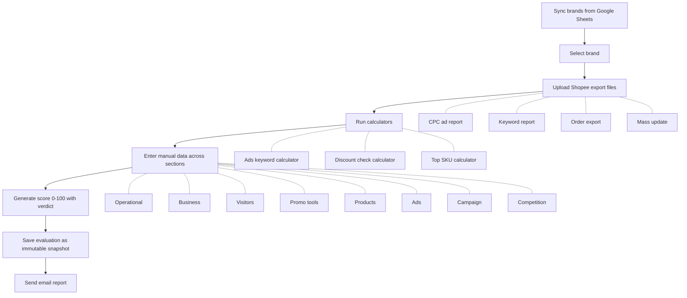

# Project Overview

## What is AHA SICU?

AHA SICU (Store ICU) is a brand health evaluation system for Shopee e-commerce stores. It provides a structured scoring framework that quantifies brand performance across four dimensions -- operational, business, content, and advertising -- producing a final score from 0 to 100 with an accompanying verdict.

## Who Uses It

Business Development (BD) teams at AHA Commerce use SICU to evaluate brand performance on Shopee. The system supports three roles:

| Role | Capabilities |
|------|-------------|
| **member** | List brands, run evaluations, view/save results |
| **leader** | All member capabilities + manage scoring rules, delete evaluations |
| **admin** | All leader capabilities + full account management (create/disable users, assign roles) |

Additionally, a synthetic **scheduler** role exists for automated service-account actions (e.g., Cloud Scheduler triggers).

## Core Workflow



### Workflow Steps

1. **Sync brands** -- Brand data is pulled from Google Sheets (VP sheet and 1st Meeting sheet) into the local database.
2. **Select brand** -- The BD user picks a brand to evaluate.
3. **Upload Shopee export files** -- Four file types are accepted: CPC ad report, keyword report, order export, and mass update. Files are stored in GCS (production) or locally (development).
4. **Run calculators** -- Three calculators process the uploaded files:
   - **Ads keyword calculator** -- analyzes CPC and keyword report data
   - **Discount check calculator** -- checks discount patterns from mass update data
   - **Top SKU calculator** -- identifies top-performing SKUs from order data
5. **Enter manual data** -- The evaluator fills in scores across eight sections: operational, business, visitors, promo tools, products, ads, campaign, and competition.
6. **Generate score** -- The system computes a weighted score (0--100) with a verdict based on configurable scoring rules.
7. **Save evaluation** -- The completed evaluation is persisted as an immutable snapshot.
8. **Send email report** -- An email summary is sent via SMTP (Gmail) to relevant stakeholders.

## Tech Stack

| Layer | Technology |
|-------|-----------|
| **Frontend** | React 19, TypeScript 5.9, Vite 7.2, Tailwind CSS 4.1 |
| **Backend** | Python 3.14, FastAPI, asyncpg, Alembic |
| **Database** | Cloud SQL PostgreSQL 18 |
| **Auth** | Firebase Authentication |
| **Infrastructure** | Terraform, GCP (Cloud Run, Cloud SQL, Firebase Hosting, Cloud Storage, Secret Manager, Cloud Scheduler) |
| **CI/CD** | GitHub Actions |

## Live Environments

| Environment | Frontend | Backend |
|-------------|----------|---------|
| **Production** | [aha-coms-sicu-prod.web.app](https://aha-coms-sicu-prod.web.app) | Cloud Run (asia-southeast2) |
| **Staging** | [aha-coms-sicu-dev.web.app](https://aha-coms-sicu-dev.web.app) | Cloud Run (asia-southeast2) |

CORS is configured to allow requests from both Firebase Hosting domains (`*.web.app` and `*.firebaseapp.com`) as well as local development servers (`localhost:5173`, `localhost:4173`).

## Project Structure

```
aha_sicu/
├── backend/           # FastAPI REST API (Python 3.14)
│   └── app/
│       ├── main.py            # Application entry point, lifespan, CORS, routers
│       ├── config.py          # Pydantic Settings (env-driven configuration)
│       ├── core/              # Auth, dependencies, exceptions, middleware, OIDC
│       ├── db/                # Connection pool (asyncpg), queries, migrations
│       └── modules/           # Domain modules (accounts, auth, brands, email,
│                              #   evaluations, rules, sync, upload)
├── frontend/          # React SPA (TypeScript)
├── infrastructure/    # Terraform IaC (GCP resources)
├── scripts/           # Utility scripts (user provisioning, role assignment)
├── smoke-tests/       # Playwright API smoke tests
├── docs/              # Project documentation
└── .github/workflows/ # CI/CD pipelines
```

### Backend Modules

The backend is organized into domain modules, each registered as a FastAPI router in `main.py`:

| Module | Purpose |
|--------|---------|
| `accounts` | User account management (admin-only CRUD) |
| `auth` | Authentication endpoints (login context) |
| `brands` | Brand listing and details |
| `email` | Email report generation and sending (SMTP) |
| `evaluations` | Evaluation CRUD, scoring, immutable snapshots |
| `rules` | Scoring rule configuration (leader/admin) |
| `sync` | Google Sheets sync (brand data import) |
| `upload` | File upload handling (GCS or local fallback) |

### Configuration

All configuration is environment-driven via Pydantic `BaseSettings` (`backend/app/config.py`). Key configuration groups:

- **Database** -- `DATABASE_URL` (local) or individual Cloud SQL components (`DB_USER`, `DB_PASSWORD`, `DB_NAME`, `CLOUD_SQL_INSTANCE`)
- **Firebase** -- Credentials via file path or inline JSON
- **SMTP** -- Gmail SMTP settings with `EMAIL_ENABLED` feature flag
- **Google Sheets** -- Credentials and sheet IDs for VP and 1st Meeting data sources
- **GCS** -- Upload bucket name (empty = local dev fallback)
- **OIDC** -- Cloud Run URL for audience validation, allowed scheduler service account emails

### Authentication

The system uses a dual-auth strategy (`backend/app/core/dependencies.py`):

1. **Firebase Authentication** -- Primary path for human users. Tokens are validated via Firebase Admin SDK. On first login, users are auto-created in the database with the default `member` role.
2. **Google OIDC** -- Fallback path for service accounts (Cloud Scheduler). Validated against the Cloud Run service URL audience. An optional allowlist restricts which service accounts are permitted.

Role-based access control is enforced via the `require_role()` dependency factory, which can be applied to any route.
