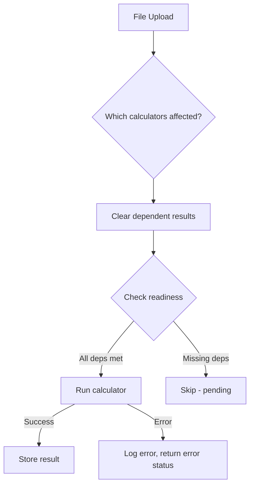
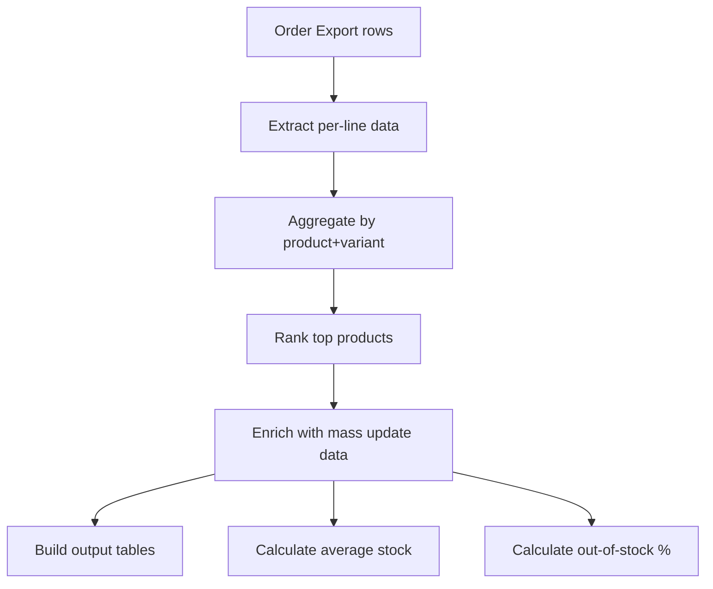
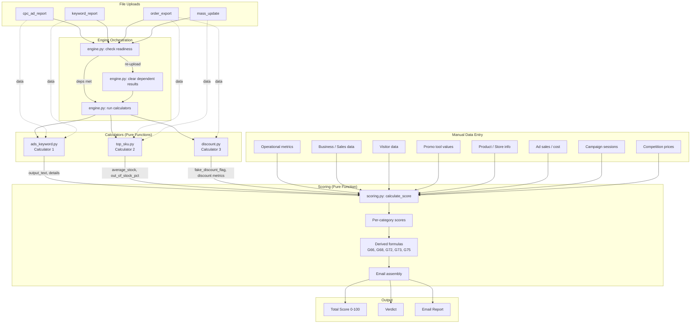

# Scoring Engine

The Scoring Engine evaluates brand health across multiple categories, producing a 0-100 score with a verdict. It combines manual data entry with automated calculator outputs to generate per-category scores, a total score, and a structured email report.

---

## Table of Contents

- [Architecture Overview](#architecture-overview)
- [Scoring Categories](#scoring-categories)
- [Verdict Thresholds](#verdict-thresholds)
- [Calculator Pipeline](#calculator-pipeline)
  - [Dependency Map](#dependency-map)
  - [Readiness Checks](#readiness-checks)
  - [Auto-Execution on Upload](#auto-execution-on-upload)
  - [Re-Upload Behavior](#re-upload-behavior)
- [Calculators](#calculators)
  - [Calculator 1: Ads Keyword](#calculator-1-ads-keyword)
  - [Calculator 2: Top SKU](#calculator-2-top-sku)
  - [Calculator 3: Discount Checker](#calculator-3-discount-checker)
- [Final Scoring](#final-scoring)
  - [Per-Category Scoring Logic](#per-category-scoring-logic)
  - [Derived Formulas](#derived-formulas)
  - [Email Assembly](#email-assembly)
- [Dynamic Rules](#dynamic-rules)
- [Data Flow](#data-flow)

---

## Architecture Overview

All scoring and calculator logic lives in pure functions with no I/O. The orchestration layer (`engine.py`) manages dependencies and triggers; each calculator and the final scorer accept parsed data and return structured results.

| File | Responsibility |
|---|---|
| `backend/app/calculators/engine.py` | Orchestration: dependency maps, readiness checks, auto-trigger |
| `backend/app/calculators/scoring.py` | Final scoring: 10 categories, G-column messages, email assembly |
| `backend/app/calculators/ads_keyword.py` | Calculator 1: CPC and keyword report analysis |
| `backend/app/calculators/top_sku.py` | Calculator 2: Top product ranking by revenue with stock enrichment |
| `backend/app/calculators/discount.py` | Calculator 3: Discount pattern analysis and fake discount detection |

---

## Scoring Categories

The scoring system evaluates 10 categories. Each category contributes a subscore; the sum produces the total score.

| # | Category | Max Score | Source |
|---|---|---|---|
| 1 | Operational (Kesehatan Operasional Toko) | 10 | Manual input |
| 2 | Business (Bisnis Analisis) | 20 | Manual input |
| 3 | Content (Tinjauan Pengunjung) | 5 | Manual input |
| 4 | Visitors (Tinjauan Pengunjung) | 5 | Manual input |
| 5 | Promo Tools (Promo Toko) | 15 | Manual input |
| 6 | Products (Jumlah Produk & Status Toko) | 15 | Manual input |
| 7 | Ads (Data Iklan) | 10 | Manual + Calculator 1 |
| 8 | Campaign (Partisipasi Campaign) | 10 | Manual input |
| 9 | Stock (Stok) | 10 | Calculator 2 |
| 10 | Discount | 5 | Calculator 3 |

**Maximum possible score: 100** (when all opportunity penalties are avoided and all point-earning metrics pass).

Note: Categories 7 (Ads), 8 (Campaign), and 5 (Promo Tools) use **opportunity scoring** -- points are added when metrics fail, representing missed opportunity. A perfect promo/ads score is 0 (no missed opportunities).

---

## Verdict Thresholds

The interpretation ranges stored in the `DEFAULT_RULES` determine the final verdict label:

| Score Range | Label | Verdict |
|---|---|---|
| 71 - 100 | Good Candidate | Pass |
| 41 - 70 | Needs Review | Fail |
| 0 - 40 | Not Recommended | Fail |

The verdict string (`F75`) is user-selected (not auto-computed from score). Available verdict values include special closing message variants: `"❌ Non Mall"`, `"❌ No Brand"`, `"❌ Opex"`, each producing a different closing message template.

---

## Calculator Pipeline

### Dependency Map

Each calculator declares which uploaded files and manual inputs it requires before it can run.

```
CALCULATOR_REQUIRED_FILES:
  ads_keyword  -> [cpc_ad_report, keyword_report]
  discount     -> [order_export]
  top_sku      -> [order_export, mass_update]

CALCULATOR_REQUIRED_MANUAL:
  ads_keyword  -> [total_products]
```

The reverse mapping (`FILE_TO_CALCULATORS`) tracks which calculators are affected when a specific file type is uploaded:

```
FILE_TO_CALCULATORS:
  cpc_ad_report  -> [ads_keyword]
  keyword_report -> [ads_keyword]
  order_export   -> [discount, top_sku]
  mass_update    -> [top_sku]
```

### Readiness Checks

`check_calculator_readiness(brand_id, conn)` inspects the database for each calculator and returns a status dict:

- **"ready"** -- all required files are uploaded and all manual inputs are present. The calculator can run.
- **"pending"** -- one or more dependencies are missing. The response includes `missing_files` and `missing_manual` lists.

The `total_products` manual input is checked by looking for `manual_data.products.productCount` in the evaluation inputs row.

### Auto-Execution on Upload

When a file is uploaded, `run_calculators_for_upload(brand_id, file_type, conn)` is called. It:

1. Looks up which calculators are affected by the uploaded `file_type` via `FILE_TO_CALCULATORS`.
2. Checks readiness for only those affected calculators.
3. Runs any that are now "ready".
4. Returns per-calculator status: `success`, `skipped` (with reason), or `error`.

`run_ready_calculators(brand_id, conn)` runs **all** calculators whose dependencies are satisfied (used for manual "run all" triggers).

### Re-Upload Behavior

`clear_dependent_results(brand_id, file_type, conn)` deletes existing calculator results for any calculator that depends on the re-uploaded file type. This ensures stale results are cleared before new calculations run.



---

## Calculators

### Calculator 1: Ads Keyword

**File:** `backend/app/calculators/ads_keyword.py`

**Required files:** `cpc_ad_report`, `keyword_report`
**Required manual inputs:** `total_products` (productCount)

**Purpose:** Analyzes CPC ad performance and keyword/placement data to produce a structured text output for the scoring email (inserted at row G53).

#### Sheet 1: CPC Ad Report (`calculate_sheet1`)

Processes the CPC ad report to produce three outputs:

**AK2 -- Ad Overview Summary:**
- Counts ads by status: Berjalan (active), Dijeda (paused), Berakhir (ended)
- Counts unique products in non-ended "Iklan Produk" ads (deduplicated by cleaned ad name -- text before first `[` is stripped)
- Calculates product participation percentage: `unique_products / total_products`

**AK3 -- Ad Type Breakdown (non-ended ads only):**
- Counts ads by type and placement: Search (Halaman Pencarian), Recommendation (Halaman Rekomendasi), All Placements (Semua Penempatan), Shop Ads (Iklan Toko)
- Tracks bidding mode split (Otomatis vs Manual) per type

**AK4 -- Recommendation Flags:**
- Product participation < 50% triggers a warning flag
- Active ad ratio < 50% triggers a warning flag
- Missing Iklan Toko triggers a flag

#### Sheet 2: Keyword/Placement Report (`calculate_sheet2`)

**Threshold Calculation (`_calculate_thresholds`):**

Computed from all rows (including shop-level):

| Threshold | Formula |
|---|---|
| AM6 | `ROUND(AVG(GMV where GMV > 0))` |
| AM7 | `MIN(ROUND(AVG(ROAS where ROAS > 0)), 10)` |
| AM9 | `ROUND(AVG(Cost where Cost > 0))` |
| AM10 | `MIN(ROUND(AVG(ROAS where ROAS > 0)), 3)` |

**AL2 -- TOP Ads (up to 5):**
- Primary filter: `GMV > AM6 AND ROAS > AM7`, sorted by GMV descending
- Fallback (if primary yields 0): `GMV > AM6/2 AND ROAS > MAX(AM7/2, 6)`
- Each entry displays: ad name, GMV, ROAS, bidding mode, ad type, placement, keyword

**AL5 -- BOTTOM Ads (up to 5):**
- Primary filter: `Cost > 100,000 AND Cost > AM9 AND ROAS < AM10 AND ROAS < 5`, sorted by cost descending
- Fallback: `Cost > 100,000 AND Cost > AM9 AND ROAS < MIN(ROUND(AM10*2), 5) AND ROAS < 5`
- English variant uses lower cost minimum (50,000) and ROAS cap (4)

**AL6-AL9 -- Bottom Flags:** Substring checks on the AL5 text detect patterns (automatic bidding, manual bidding, keyword issues) and emit warning messages.

**Combined output order:** AK2, AK3, AK4, AL2, AL3, AL5, AL6, AL7, AL8, AL9

---

### Calculator 2: Top SKU

**File:** `backend/app/calculators/top_sku.py`

**Required files:** `order_export`, `mass_update`

**Purpose:** Identifies top-selling products by revenue, enriches them with stock data, and produces metrics used by the Stock scoring category.

#### Processing Pipeline



**Step 1 -- Per-line extraction (`_extract_per_line`):**

Revenue formula per line item:

```
Revenue = (Harga Setelah Diskon * Jumlah)
        - (Voucher Ditanggung Penjual / Jumlah Produk di Pesan)
        - (Cashback Koin / Jumlah Produk di Pesan)
        + (Diskon Dari Shopee / Jumlah Produk di Pesan)
```

All price fields use Indonesian format (dots as thousands separators: `125.000` = 125000). The `_clean_price()` helper strips dots before parsing.

**Step 2 -- Aggregation:**
Groups line items by `"Nama Produk - Nama Variasi"` label, summing quantity and revenue.

**Step 3 -- Ranking (`_rank_top_products`):**
- Sorts by revenue descending
- Limit = `MAX(ROUND(unique_count * 0.20), 20)`
- If fewer than 20 unique products, returns all

**Steps 4-6 -- Mass Update Enrichment:**
- Builds lookup: `"Nama Produk - Nama Variasi"` -> `Kode Variasi` -> `Stok` (sum of all `Stok*` columns)
- Enriches each top product with variant code, selling price (max single-line revenue), and stock level

**Step 7 -- Stock Metrics:**
- `average_stock`: `ROUND(AVG(stock of all top products))`
- `out_of_stock_pct`: fraction of top products with `stock == 0`

These metrics feed directly into the Stock scoring category (rows 70-71).

---

### Calculator 3: Discount Checker

**File:** `backend/app/calculators/discount.py`

**Required files:** `order_export`

**Purpose:** Analyzes discount patterns across orders and detects potential fake discounts.

#### Processing Pipeline

**Step 1 -- Order Position (`_calculate_urutan`):**
Assigns each row a position within its order. Same order number as previous row increments the counter; new order resets to 1. Empty order numbers are skipped (position = 0).

**Steps 2-6 -- Line Item Calculation (`_calculate_line_items`):**

For each row with a valid position:

```
Voucher and Paket are only applied at position 1 (first item in order).

N (total_discount) = (Harga Awal - Harga Setelah Diskon) + Voucher + Paket
O (discount_pct)   = N / Harga Awal
P (total_paid)     = Harga Setelah Diskon - Voucher - Paket
```

Price fields use Indonesian format (dots as thousands separators), handled by `_clean_price()`.

**Step 7 -- Product Summary (`_build_product_summary`):**
Groups by exact product name. Per-product weighted average discount: `SUM(N) / SUM(Harga Awal)`.

**Step 8 -- TOP SKU Filter (`_filter_top_sku`):**
- Filter: `qty > AVG(qty) AND avg_discount_pct < 100%`
- Sort by qty descending
- Limit: `ROUND(unique_products * 0.20)` (no minimum floor, unlike Calculator 2)

#### Outputs

| Output | Formula |
|---|---|
| % Diskon TOP SKU | `SUM(N where P > 0) / SUM(P)` |
| Range | `ROUNDUP(MIN(top_sku_avg_disc), 3) ~ ROUNDUP(MAX(top_sku_avg_disc), 3)` |
| Voucher % | `SUM(voucher) / SUM(harga_setelah_diskon)` |
| Paket Diskon % | `SUM(paket) / SUM(harga_setelah_diskon)` |
| Fake Discount Flag | `True` if `SUM(N) / SUM(P) > 20%` |

The fake discount flag feeds into the Discount scoring category (row 73).

---

## Final Scoring

**File:** `backend/app/calculators/scoring.py`

**Entry point:** `calculate_score()` -- a pure function that takes manual data, calculator results, template type, verdict, and optional dynamic rules, returning a `ScoringResult`.

### Per-Category Scoring Logic

#### 1. Operational (rows 7-11, max 10 pts)

| Row | Metric | Pass Condition | Pass Score | Fail Score |
|---|---|---|---|---|
| 7 | Unfulfilled Order Rate | <= 1.0% | +4 | -(value) |
| 8 | Late Shipment Rate | <= 1.0% | +3 | -(value) |
| 9 | Preparation Time | <= 1 day | +3 | -((value-1)*100) |
| 10 | Chat Response Rate | >= 95% | info only | info only |
| 11 | Overall Rating | >= 4.7 | info only | info only |

Rows 10-11 produce verdict/message output but contribute no score.

#### 2. Business (rows 13-20, max 20 pts)

| Row | Metric | Pass Condition | Pass Score |
|---|---|---|---|
| 13 | Current Month Sales | `avg_6mo < current * 1.10` | +10 |
| 14-18 | Past 5 Months Sales | -- | info only |
| 19 | 6-Month Average | `avg > 100,000,000 IDR` | +10 |
| 20 | Conversion Rate | >= 3% | info only |

The trend multiplier derives from `threshold_pct`: `multiplier = (200 - threshold_pct) / 100`. Default `threshold_pct=90` yields multiplier `1.10`.

#### 3. Visitors (rows 26-29, max 5 pts)

| Row | Metric | Pass Condition | Pass Score |
|---|---|---|---|
| 26-27 | Total / Returning Visitors | -- | info only |
| 28 | % Returning Visitors | > 23% | +3 |
| 29 | Total Followers | > 50,000 | +2 |

#### 4. Promo Tools (rows 31-43, max 15 pts -- opportunity)

Evaluates 11 promo tools against benchmark percentages of current month sales:

| Tool | Benchmark |
|---|---|
| Promo Toko | 8% |
| Paket Diskon | 16% |
| Kombo Hemat | 1% |
| Flash Sale Toko Saya | 1% |
| Voucher | 84% |
| Shopee Live | 15% |
| Game Toko | 1% |
| Brand Membership | 1% |
| Gratis Ongkir XTRA | > 0 (any usage) |
| Chat Broadcast | 1% |
| Program Afiliasi | 18% |

Per-tool verdict logic:
- Value = 0: fail (not used)
- Promo Toko with value/sales >= 50%: fail (too dependent)
- Value >= benchmark% * sales: pass
- Otherwise: fail

Summary rows:
| Row | Metric | Fail Condition | Opportunity Points |
|---|---|---|---|
| 42 | Usage Rate | <= 80% of tools used | +5 |
| 43 | Effectiveness Rate | <= 90% of tools effective | +10 |

#### 5. Products (rows 45-46, max 15 pts)

| Row | Metric | Pass Condition | Pass Score |
|---|---|---|---|
| 45 | Product Count | >= 35 | +5 |
| 46 | Store Status | Shopee Mall = +10, Star+ = +5, other = 0 | varies |

#### 6. Ads (rows 48-53, max 10 pts -- opportunity)

| Row | Metric | Condition | Score |
|---|---|---|---|
| 48 | Ad Sales | -- | info only |
| 49 | Ad Cost | -- | info only |
| 50 | ROI (adSales/adCost) | >= 9.0 (non-fashion) | pass=0, fail=+5 opportunity |
| 51 | GMV Ratio (adSales/sales) | < 84% | pass=+5, fail=0 |
| 52 | Cost Ratio (adCost/sales) | 5%-10% range | info only |
| 53 | Ads Check Up | Calculator 1 output | text only |

#### 7. Campaign (rows 55-57, max 10 pts -- opportunity)

| Row | Metric | Condition | Score |
|---|---|---|---|
| 55-56 | Nominated / Available Sessions | -- | info only |
| 57 | Participation Rate | > 90% | pass=0, fail=+10 opportunity |

#### 8. Competition (rows 60-63, max 0 pts)

No score contribution. Evaluates up to 3 products for price competitiveness:
- Competitive if `selling_price <= market_price * 1.10`

#### 9. Stock (rows 70-71, max 10 pts)

Source: Calculator 2 (`top_sku.details`). If Calculator 2 has not run, the category is marked `available=False` with score 0.

| Row | Metric | Condition | Score |
|---|---|---|---|
| 70 | Average Stock | >= 24: +10, >= 12: +5, < 12: -5 | tiered |
| 71 | Out-of-Stock % | > 10% of top products have 0 stock | penalty: -5 |

#### 10. Discount (row 73, max 5 pts)

Source: Calculator 3 (`discount.details`). If Calculator 3 has not run, the category is marked `available=False` with score 0.

| Row | Metric | Condition | Score |
|---|---|---|---|
| 73 | Fake Discount Flag | No flag: +5, Flag present: 0 | binary |

### Derived Formulas

After per-category scoring, the engine computes several derived values:

**G68 -- Marketing Cost Estimation:**
```
low  = (range_min * discount_pct) + voucher_pct + paket_pct + ad_cost_ratio + 0.05
high = (range_max * discount_pct) + voucher_pct + paket_pct + ad_cost_ratio + 0.05
```
Where `range_min`, `range_max`, `discount_pct`, `voucher_pct`, `paket_pct` are parsed from Calculator 3 output, and `ad_cost_ratio = ad_cost / current_month_sales`.

**G72 -- Recommended Marketing Percentage:**
Complex formula with Fashion adjustment:
```
avg = average of low and high marketing cost estimates (without the +0.05)
base = ROUNDDOWN(avg - 0.03, 2)
upper_limit = 0.20 (non-fashion) or 0.25 (fashion)
floor = 0.12 (non-fashion) or 0.15 (fashion)
minimum = 0.10

result = MAX(MAX(MIN(MIN(base, upper_limit), g68_left), minimum), floor)
```
With a ceiling-based fallback branch when the capped value does not exceed the ceiling of G68's left percentage.

**G73 -- Marketing Budget Text:**
Suppressed for fail verdicts. Displays the clamped percentage (10%-25% range) as a marketing budget recommendation.

**G66 -- Conclusion Summary:**
Multi-line text assembling observations: sales range, operational quality, promo effectiveness, campaign participation, stock issues, and discount range.

**G75 -- Closing Message:**
Selected from verdict-specific templates. Each template contains `{store_name}` placeholders. Different closing messages exist for: pass, fail, Non Mall, No Brand, and Opex verdicts.

### Email Assembly

The email body (`_assemble_email_body`) concatenates G-column messages from all categories in a fixed section order:

1. Operational performance
2. Sales performance
3. Visitor analysis
4. Promo tool usage (individual tools + summary rows 42-43)
5. Products and store status
6. Ads performance (rows 50-53)
7. Campaign participation
8. Competition analysis
9. Conclusion (G66)
10. Marketing estimation (G68)
11. Marketing budget (G73)
12. Closing message (G75)

Email subject: `"AHA Store Internal Check Up (Store ICU) - {store_name} {period}"`

---

## Dynamic Rules

Scoring thresholds and message templates are stored in the `scoring_rules` database table. Rules are organized by template (`fashion` / `non_fashion`) and can be edited by leader/admin users via:

```
PUT /api/v1/rules/{template}
```

The rules JSONB structure mirrors the `DEFAULT_RULES` dict in `scoring.py`, organized by category:

```json
{
  "operational": {
    "unfulfilled_order_rate": { "threshold": 1.0, "points": 4, "comparison": "lte", "message_pass": "...", "message_fail": "..." },
    "late_shipment_rate": { ... },
    "preparation_time": { ... },
    "chat_response_rate": { ... },
    "overall_rating": { ... }
  },
  "business": { ... },
  "visitors": { ... },
  "promo_tools": { ... },
  "products_status": { ... },
  "ads": { ... },
  "campaign": { ... },
  "stock": { ... },
  "discount": { ... },
  "marketing": { ... },
  "competition": { ... },
  "interpretation": { ... }
}
```

When `rules=None` is passed to `calculate_score()`, the `DEFAULT_RULES` constants are used as fallback. Each scoring function reads thresholds and points from rules via `_get_rule_value()` with hardcoded defaults matching the migration seed data.

The `comparison` field in rules is **descriptive metadata only** -- comparison operators are hardcoded in each scoring function because the comparison semantics are structural to the scoring logic, not a business-configurable parameter. Only thresholds, points, and message templates are dynamic.

---

## Data Flow


